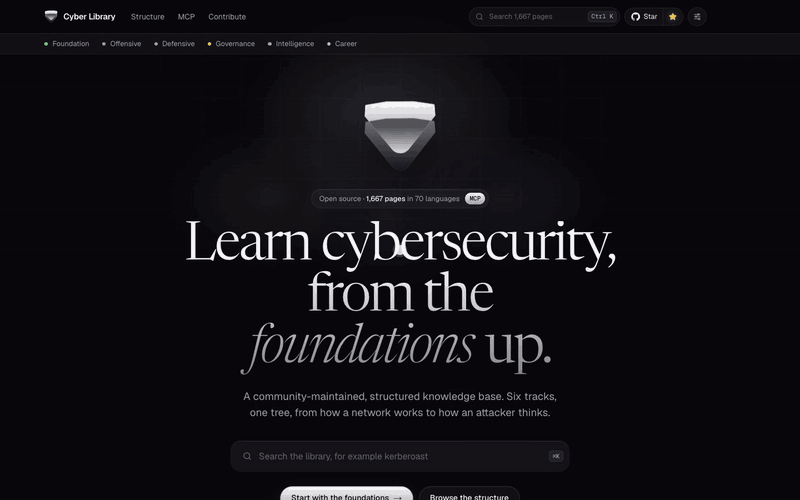
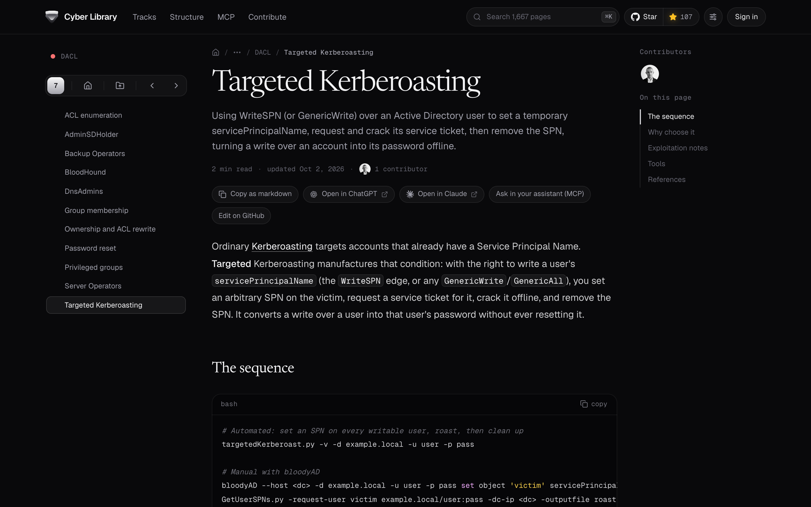
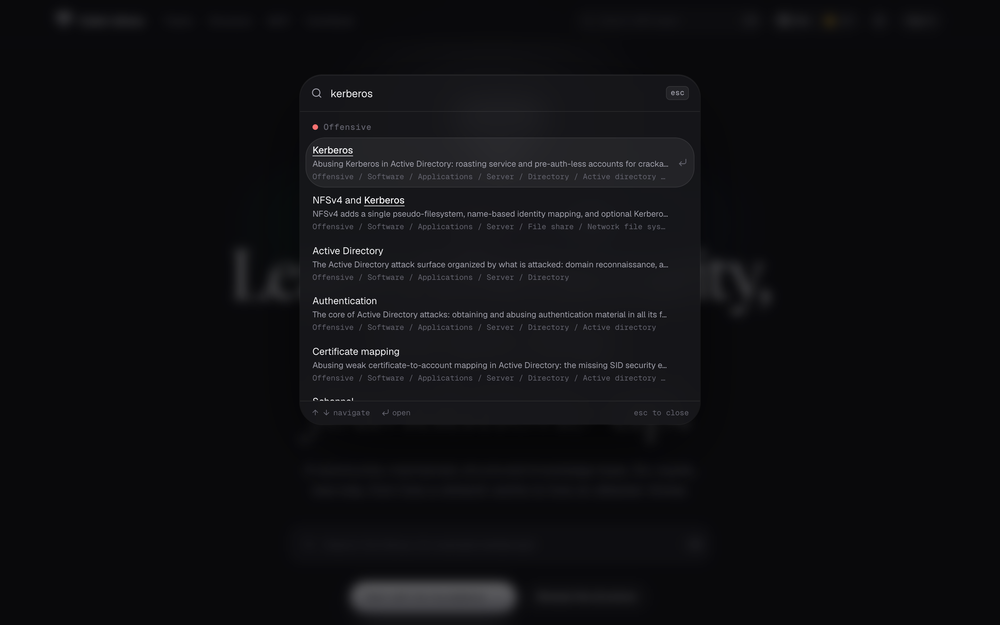
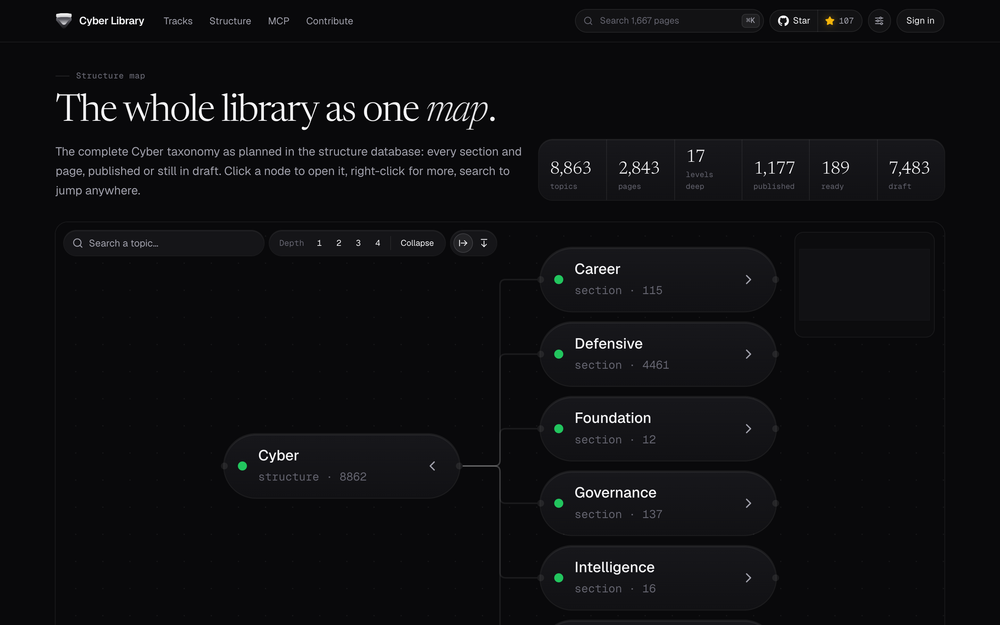
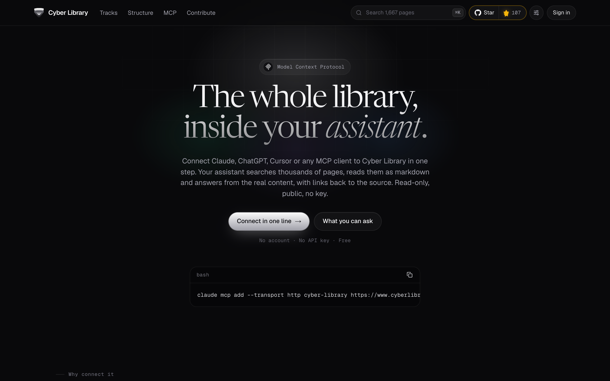

<div align="center">

<a href="https://www.cyberlibrary.com">
  <picture>
    <source media="(prefers-color-scheme: dark)" srcset="assets/logo-dark.svg">
    
  </picture>
</a>

<h1>Cyber Library</h1>

**Learn cybersecurity, from the foundations up.**<br/>
A structured, community-maintained knowledge base: six tracks, one tree, from how a network works to how an attacker thinks.

[](https://github.com/Cyber-Courses/Cyber-Library/releases)
[](https://github.com/Cyber-Courses/Cyber-Library/stargazers)
[](https://github.com/Cyber-Courses/Cyber-Library/wiki)
[](https://www.cyberlibrary.com)
[](https://www.cyberlibrary.com/en/mcp)
[](https://discord.gg/a9XwRKxdHf)

[**Read the library →**](https://www.cyberlibrary.com) &nbsp;·&nbsp; [**Browse the structure**](https://www.cyberlibrary.com/en/structure) &nbsp;·&nbsp; [**Connect your assistant**](https://www.cyberlibrary.com/en/mcp)

<br/>

⭐ **If the library helps you, star the repo.** Stars help other learners find it.

<br/>

<a href="https://www.cyberlibrary.com">
  <picture>
    <source type="image/webp" srcset="assets/demo/demo.webp">
    
  </picture>
</a>

<sub>Search with <kbd>⌘</kbd> <kbd>K</kbd>, read an article, move through the tracks and the sidebar, explore the structure map.</sub>

</div>

## Why it exists

Security knowledge is scattered across blog posts, slide decks and tool READMEs. Cyber Library puts it in one tree, so every technique sits next to the ones that share its mental model, with real commands, the mechanism behind them, and links to primary sources.

- **1,600+ pages, 70 languages.** Plain Markdown, published to [cyberlibrary.com](https://www.cyberlibrary.com).
- **Structure first.** Every page is planned as a topic in a shared taxonomy before it is written.
- **Deep, not wide.** Technique pages show the full chain: how it works, how it is exploited, the tools, and the references.
- **Made for people and for assistants.** Copy any page as Markdown, open it in ChatGPT or Claude, or query the whole library through the [MCP server](https://www.cyberlibrary.com/en/mcp).

## Inside the library

<table>
  <tr>
    <td width="50%" valign="top">
      <a href="https://www.cyberlibrary.com/en/docs/offensive/software/applications/server/directory/active-directory/dacl/targeted-kerberoasting"></a>
      <br/><b>Read</b><br/>Focused articles with runnable commands, a table of contents, and one-click export to Markdown, ChatGPT or Claude.
    </td>
    <td width="50%" valign="top">
      <a href="https://www.cyberlibrary.com"></a>
      <br/><b>Search</b><br/>Press <kbd>⌘</kbd> <kbd>K</kbd> anywhere to jump to any of the 1,600+ pages, with its place in the tree.
    </td>
  </tr>
  <tr>
    <td width="50%" valign="top">
      <a href="https://www.cyberlibrary.com/en/structure"></a>
      <br/><b>Explore</b><br/>The whole taxonomy as one interactive map: 8,800+ topics, 17 levels deep, published and planned.
    </td>
    <td width="50%" valign="top">
      <a href="https://www.cyberlibrary.com/en/mcp"></a>
      <br/><b>Ask your assistant</b><br/>A public, read-only MCP server: Claude, ChatGPT, Cursor or any MCP client can search and read the library.
    </td>
  </tr>
</table>

## Use it in your assistant in 30 seconds

A public, read-only MCP server. No account, no API key, nothing to run.

**Claude Code**, one line:

```bash
claude mcp add --transport http cyber-library https://www.cyberlibrary.com/api/mcp
```

**Cursor**: [one-click install](https://cursor.com/install-mcp?name=cyber-library&config=eyJ1cmwiOiJodHRwczovL3d3dy5jeWJlcmxpYnJhcnkuY29tL2FwaS9tY3AifQ%3D%3D), or add this to `.cursor/mcp.json` (Windsurf takes the same block in `mcp_config.json`):

```json
{ "mcpServers": { "cyber-library": { "url": "https://www.cyberlibrary.com/api/mcp" } } }
```

**VS Code and GitHub Copilot**: [one-click install](https://vscode.dev/redirect/mcp/install?name=cyber-library&config=%7B%22type%22%3A%22http%22%2C%22url%22%3A%22https%3A%2F%2Fwww.cyberlibrary.com%2Fapi%2Fmcp%22%7D), or add this to `.vscode/mcp.json`:

```json
{ "servers": { "cyber-library": { "type": "http", "url": "https://www.cyberlibrary.com/api/mcp" } } }
```

**Claude Desktop and claude.ai**: Settings, Connectors, Add custom connector, paste `https://www.cyberlibrary.com/api/mcp`.<br/>
**ChatGPT**: Settings, Connectors, Advanced, turn on Developer mode, then create a connector with the same URL.<br/>
**Stdio-only clients**: bridge it with `npx -y mcp-remote https://www.cyberlibrary.com/api/mcp`.

Then ask: *"Explain how Kerberoasting works and link me the page."* Your assistant gets six tools (`search_library`, `get_page`, `list_topics`, `get_outline`, `search_planned_topics`, `get_planned_subtree`) and cites the page URLs. Full setup for every client is on [cyberlibrary.com/mcp](https://www.cyberlibrary.com/en/mcp).

## Sections

| Section | Focus |
|---------|-------|
| [Foundation](../foundation) | History, ethics, risk, and the human side of security |
| [Offensive](../offensive) | Ethical hacking, testing, and adversarial simulation |
| [Defensive](../defensive) | Monitoring, incident response, and resilience |
| [Governance](../governance) | Policy, compliance, and executive-level security |
| [Intelligence](../intelligence) | Threat intelligence and OSINT |
| [Career](../career) | Roles, skills, certifications, and growth |

The content is plain Markdown, generated from a shared taxonomy and published to [cyberlibrary.com](https://www.cyberlibrary.com). Pages are written in a consistent house style: offensive topics explain the vulnerability and how it is exploited, with real commands and references.

## Browse locally

```bash
git clone https://github.com/Cyber-Courses/Cyber-Library.git
cd Cyber-Library
```

Open the Markdown in your editor, or point your own static-site pipeline at it.

## Contribute

- **[CONTRIBUTING.md](CONTRIBUTING.md)**: propose a topic, write or fix a page, translate, and how review works. Looking for a first task? See the [good first issues](https://github.com/Cyber-Courses/Cyber-Library/issues?q=is%3Aissue+is%3Aopen+label%3A%22good+first+issue%22).
- **[Collaboration wiki](https://github.com/Cyber-Courses/Cyber-Library/wiki)**: how to propose and submit content, the writing style guide, and the review flow.
- **[Content dashboard](https://github.com/orgs/Cyber-Courses/projects/1)**: backlog, in progress, and published work.
- **Issues**: pick a template under `.github/ISSUE_TEMPLATE/` for a content correction, a new-topic request, a translation issue, a site bug, or a wiki change.
- **Chat**: questions and quick help on [Discord](https://discord.gg/a9XwRKxdHf).

New pages are tracked as topics in the taxonomy first, then written; see the wiki for the full flow.

## Star history

<a href="https://www.star-history.com/#Cyber-Courses/Cyber-Library&Date">
  <picture>
    <source media="(prefers-color-scheme: dark)" srcset="https://api.star-history.com/svg?repos=Cyber-Courses/Cyber-Library&type=Date&theme=dark">
    
  </picture>
</a>

---

<div align="center">

Part of the Cyber family: **[Cyber Library](https://www.cyberlibrary.com)** · **[Cyber CTF](https://www.cyberctf.org)** · **[Cyber Courses](https://www.cybercourses.com)** · **[Cyber Bench](https://www.cyberbench.app)**

Read at **[cyberlibrary.com](https://www.cyberlibrary.com)** · Contribute via the **[wiki](https://github.com/Cyber-Courses/Cyber-Library/wiki)** · Chat on **[Discord](https://discord.gg/a9XwRKxdHf)**

</div>
