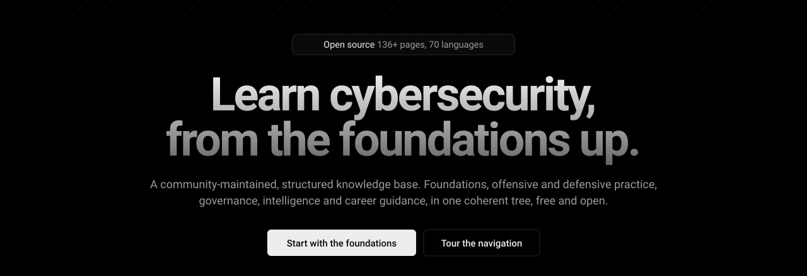

<div align="center">



<br/>

[](https://github.com/Cyber-Courses/Cyber-Library/releases)
[](https://github.com/Cyber-Courses/Cyber-Library/stargazers)
[](https://github.com/Cyber-Courses/Cyber-Library/wiki)
[](https://www.cyberlibrary.com)
[](https://discord.gg/a9XwRKxdHf)

**A structured, community-maintained knowledge base for cybersecurity.**<br/>
Foundations, offensive and defensive practice, governance, intelligence, and careers, in one place.

[**Read the library →**](https://www.cyberlibrary.com)

</div>

---

## Sections

| Section | Focus |
|---------|-------|
| [Foundation](../foundation) | History, ethics, risk, and the human side of security |
| [Offensive](../offensive) | Ethical hacking, testing, and adversarial simulation |
| [Defensive](../defensive) | Monitoring, incident response, and resilience |
| [Governance](../governance) | Policy, compliance, and executive-level security |
| [Intelligence](../intelligence) | Threat intelligence and OSINT |
| [Career](../career) | Roles, skills, certifications, and growth |

The content is plain Markdown, generated from a shared taxonomy and published to [cyberlibrary.com](https://www.cyberlibrary.com). Pages are written in a consistent house style: offensive topics explain the vulnerability and how it is exploited, and link across to the defensive side.

## Browse locally

```bash
git clone https://github.com/Cyber-Courses/Cyber-Library.git
cd Cyber-Library
```

Open the Markdown in your editor, or point your own static-site pipeline at it.

## Contribute

- **[Collaboration wiki](https://github.com/Cyber-Courses/Cyber-Library/wiki)**: how to propose and submit content, the writing style guide, and the review flow.
- **[Content dashboard](https://github.com/orgs/Cyber-Courses/projects/1)**: backlog, in progress, and published work.
- **Issues**: pick a template under `.github/ISSUE_TEMPLATE/` for a content correction, a new-topic request, a translation issue, a site bug, or a wiki change.
- **Chat**: questions and quick help on [Discord](https://discord.gg/a9XwRKxdHf).

New pages are tracked as topics in the taxonomy first, then written; see the wiki for the full flow.

## Star history

<a href="https://www.star-history.com/#Cyber-Courses/Cyber-Library&Date">
  
</a>

---

<div align="center">

Read at **[cyberlibrary.com](https://www.cyberlibrary.com)** · Contribute via the **[wiki](https://github.com/Cyber-Courses/Cyber-Library/wiki)** · Chat on **[Discord](https://discord.gg/a9XwRKxdHf)**

</div>
