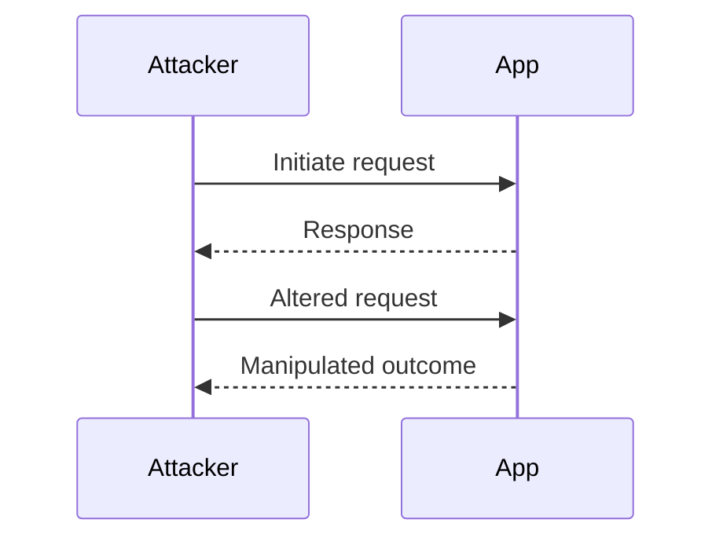

# Workflow

## Context

The objective of this article is to enable the exploitation of business logic vulnerabilities through workflow abuse in web applications. This involves manipulating the logical flow of operations within an application to achieve unauthorized outcomes, focusing on flaws within the application logic that allow unintended actions or information disclosure.

## Theory

### Business Logic Vulnerability in Workflows

Business logic vulnerabilities occur when an application’s logic is flawed, allowing for unintended actions or information disclosure. These flaws manifest when business rules can be manipulated to perform operations beyond their intended scope. Such vulnerabilities can often be exploited by an attacker who thoroughly understands the workflow and seeks to abuse it for malicious purposes.

### Workflow Abuse Techniques

Workflow abuse involves exploiting the logical flow of operations within an application. Attackers identify key steps in a workflow and manipulate the order or parameters to bypass security checks. By doing so, they can achieve unauthorized outcomes, such as unauthorized access, data manipulation, or financial fraud.

### Parallel Effects and Race Conditions

Race conditions occur when an application’s operations are executed concurrently, leading to unintended state changes. Attackers exploit these conditions by triggering multiple requests simultaneously, aiming to disrupt the synchronization of the application’s operations. This can lead to scenarios where actions are prematurely executed or improperly validated, resulting in unauthorized actions.

### Trust Boundaries and Flow Integrity

Trust boundaries are critical points in a workflow where control transitions between trusted and untrusted contexts. Vulnerabilities arise from the mismanagement of state or data integrity across these boundaries. Attackers exploit these weaknesses to manipulate the control flow, resulting in unauthorized actions or access.

<!-- topic-resource-references:start -->
## Links
- [CWE-840 Business Logic Errors](https://cwe.mitre.org/data/definitions/840.html)
- [OWASP WSTG 4.10 Business Logic Testing](https://owasp.org/www-project-web-security-testing-guide/stable/4-Web_Application_Security_Testing/10-Business_Logic_Testing/README)
<!-- topic-resource-references:end -->
