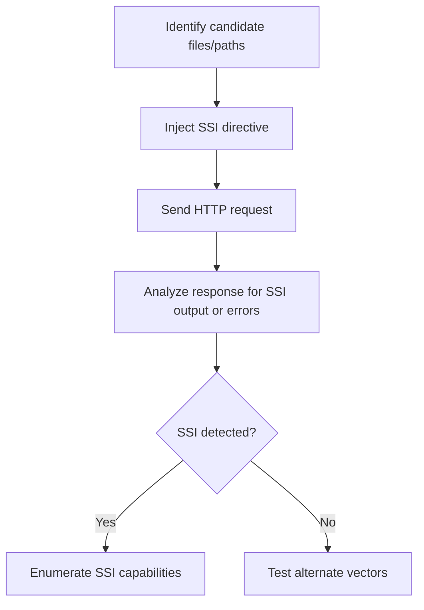

# Detection & Reconnaissance

## Context

The objective of this guide is to equip operators with the skills necessary for detecting and enumerating Server Side Includes (SSI) support and potential injection points within web server environments. This is achieved through various reconnaissance techniques. Readers are assumed to have knowledge of Server Side Includes, web server configuration, HTTP response codes, and the basics of Server Side Include Injection.

## Theory

### SSI Support Detection Fundamentals

Server Side Includes (SSI) allow for the inclusion of dynamic content into web pages via server-parsed directives. Detecting the presence of SSI immediately informs you about potential vulnerabilities that can be exploited. The primary focus of detection is on identifying the processing behavior of SSI from server responses. Such vulnerabilities only present a risk if the server can parse and execute SSI directives present within user-accessible files.

### Reconnaissance Vectors for SSI

To determine SSI support, attackers can probe the server by uploading or accessing files containing known SSI directives. This often involves analyzing server responses, looking for signs of executed SSI directives or indicative error messages. Attackers typically assume they have the capability to upload or interact with files that the server might parse as SSI.

### Server-Specific SSI Indicators

SSI support can be enabled through modules like Apache's `mod_include` and the nginx SSI module. These server-specific indicators can sometimes cause servers to expose SSI parsing for unintended file extensions or directories due to misconfiguration. Identifying protocol weaknesses through error messages or reflected SSI outputs will be critical in determining if SSI has been processed, even in cases where it wasn't exploited successfully.

### SSI Directive Testing and Response Analysis

Operators can inject benign SSI directives into the server and analyze the outputs or errors in the responses. To improve detection accuracy, it is recommended to try multiple file extensions (.shtml, .stm, .shtm) and use various HTTP methods. The following flowchart outlines this process:



## Practice

### Manual SSI Support Detection via File Extension Probing

- **Step 1**: Execute the following command to request a file with a typical SSI-enabled extension.
  
  ```bash
  curl -i http://target/suspect.shtml
  ```

- **Step 2**: Inject a benign SSI directive into a potentially susceptible file or parameter.

  ```html
  <!--#echo var="DATE_LOCAL" -->
  ```

- **Step 3**: Upload or submit this SSI directive to the server, for example, within a POST request.

  ```bash
  curl -i -X POST -d 'content=<!--#echo var="DATE_LOCAL" -->' http://target/upload
  ```

- **Step 4**: Access the uploaded file to trigger SSI processing.

  ```bash
  curl -i http://target/uploaded_file.shtml
  ```

- **Outcome**: Review the HTTP response for evaluated SSI output or standard error messages that indicate SSI parsing. Look specifically for rendered date/time outputs or SSI error strings.

### Automated SSI Error Message Enumeration

- **Step**: Use a script to probe several extensions for SSI error messages:

  ```bash
  for ext in shtml shtm stm; do
    curl -s http://target/test.$ext -d '<!--#echo var="UNDEFINED_VAR" -->' | grep -i 'ssi'
  done
  ```

- **Outcome**: This automation aids in discovering SSI error messages across common file extensions, helping identify vulnerabilities.

### Server Fingerprinting for SSI Module Detection

- **Step 1**: Execute the following command to inspect HTTP headers for information about server type and version.

  ```bash
  curl -I http://target/
  ```

- **Step 2**: Analyze the 'Server' header to determine if the server software is Apache or nginx, including any hints of the SSI modules used.

- **Outcome**: This process allows for the fingerprinting of server software, which helps in inferring the likelihood of SSI support.

## Tools

- **curl**

By following these methodologies, an operator can effectively detect and conduct reconnaissance on SSI vulnerabilities within a web server environment.