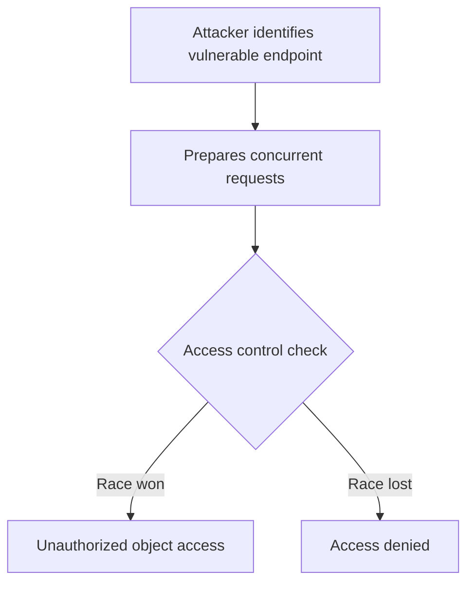

# Race Condition IDOR

## Context

The objective of this article is to demonstrate how to exploit Insecure Direct Object References (IDOR) via race conditions to bypass access controls and access unauthorized resources in web applications. This involves leveraging timing issues and concurrent requests to manipulate object state or permissions before the appropriate access control checks are enforced. This guide assumes knowledge of race conditions, insecure direct object references, concurrency, and access control mechanisms.

## Theory

### Race Condition IDOR Fundamentals

Race Condition IDOR exploits timing issues within access control checks, allowing unauthorized access to protected objects. The crux lies in the time disparity between the object access check and its use. Concurrent requests exploit this gap, manipulating object states or permissions before the access control logic is enforced. TOCTOU (Time-of-Check to Time-of-Use) flaws illustrate this vulnerability model, occurring when object access is checked and used in separate, non-atomic operations.

### Attack Surface and Scenarios

A common attack sequence involves sending multiple parallel requests to access or modify objects before the access control logic can synchronize these actions. This is particularly prevalent in scenarios where object state changes, such as ownership transfers or permission updates, are not managed safely in a transactional manner. Web servers and APIs that do not employ locking or atomic operations for their access routines are particularly vulnerable to these race conditions.

### Attacker Mindset and Exploitation Logic

The attacker must identify endpoints where object access and permission changes are processed asynchronously or across separate requests. By strategically leveraging timing, attackers can bypass access checks through a combination of legitimate and malicious request racing. The logical flow can be represented as follows:



## Practice

### Concurrent Request IDOR Exploitation via Burp Suite Intruder

- **Identify a target endpoint** where object access is controlled by a parameter (e.g., `user_id`, `file_id`). Focus on endpoints where object state or permissions may change.
- **Launch Burp Suite** to intercept and automate requests: 

    ```bash
    burpsuite
    ```

- **Intercept a legitimate request** to the target endpoint and send it to Intruder.
- **Configure Intruder** to use the 'Pitchfork' or 'Cluster Bomb' attack type with multiple threads to simulate concurrent access attempts.
- **Set payload positions** for object identifiers and session tokens as necessary to test multiple objects or users in parallel.
- **Initiate the attack** and monitor for unauthorized access or data leakage in responses.

Outcome: The attacker gains access to objects not authorized for their session due to a race condition.

### Manual Race Condition IDOR Exploitation with curl and GNU parallel

- **Craft a valid request** to the vulnerable endpoint with the target object identifier. Use a known object ID for testing.
- Execute concurrent requests with `curl` and `GNU parallel`:

    ```bash
    seq 1 20 | parallel -j20 curl -b session=ATTACKER_SESSION 'https://target/app/resource?id=VICTIM_ID'
    ```

- **Analyze responses** for unauthorized data or successful object access, checking for data leakage or access to a victim's resource.

Outcome: Manual concurrent requests result in unauthorized object access if a race condition is present.

### TOCTOU Exploitation via Permission Change Race

- **Identify an endpoint** where object permissions can be changed (e.g., share/unshare, transfer ownership). Look for endpoints with asynchronous permission logic.
- Send permission change and access requests in parallel:

    ```bash
    curl -b session=ATTACKER_SESSION 'https://target/app/resource?id=VICTIM_ID&action=share' &
    curl -b session=ATTACKER_SESSION 'https://target/app/resource?id=VICTIM_ID'
    ```

- **Repeat the process** to increase the chance of winning the race, as race conditions are probabilistic in nature, requiring multiple attempts.
- **Review server responses** for unauthorized access or privilege escalation, noting evidence of a successful race exploitation.

Outcome: The attacker accesses or modifies objects during a permission state transition, bypassing access controls.

## Tools

- **Burp Suite**
- **curl**
- **GNU parallel**