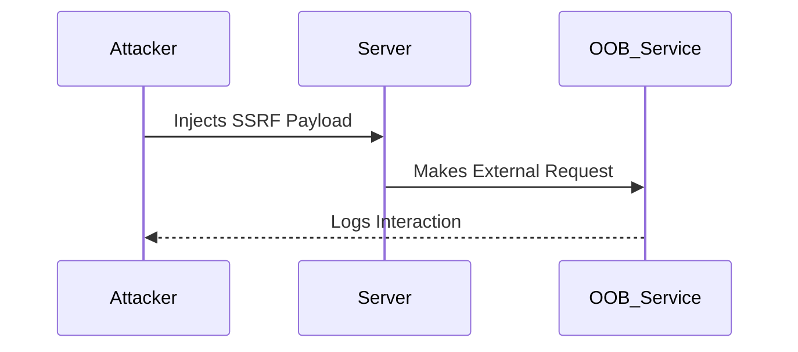

# Tools

## Context

This article focuses on equipping you with operational knowledge of specialized tools used for detecting, exploiting, and automating Server-Side Request Forgery (SSRF) attacks in web server environments. It assumes you are familiar with the structure and manipulation of HTTP requests, the DNS resolution process, web server architecture, and core SSRF attack principles and vectors.

## Theory

### Role of Tooling in SSRF Operations

Tools are integral to SSRF operations as they automate the delivery of SSRF payloads, detection, and monitoring of out-of-band (OOB) interactions. Specialized SSRF tools enable the crafting of payloads suitable for a variety of protocols, including HTTP, Gopher, and FTP. Out-of-band tools, in particular, are crucial for detecting blind SSRF vulnerabilities by monitoring DNS or HTTP callbacks.

### Out-of-Band SSRF Detection and DNS Interaction

Out-of-Band (OOB) SSRF refers to scenarios where server requests are not directly observable in the application but trigger external interactions. Blind SSRF requires external monitoring—for example, using DNS or HTTP—to confirm exploitation. This typically involves injecting a payload that causes the server to make external requests, which can then be logged by an external service.



### Payload Reflection and Protocol Support

Payload reflection involves SSRF tools generating protocol-specific payloads for the target application. Tools like Gopherus are designed to automate the crafting of payloads for advanced exploitation techniques using protocols such as Gopher, Redis, and SMTP.

## Practice

### Using Burp Collaborator for OOB SSRF Detection

- Open Burp Suite and activate the Burp Collaborator client. This tool provides unique domains to monitor for OOB interactions.
- Insert the Burp Collaborator payload URL into the parameter that is susceptible to SSRF. If the application is vulnerable, this triggers a server request to the Collaborator domain.
- Monitor the Collaborator client for DNS, HTTP, or SMTP interactions. Any observed interaction confirms SSRF exploitation.

### Automating SSRF Payload Generation with Gopherus

- Launch Gopherus by executing the following command:
  ```bash
  python3 gopherus.py
  ```
  This command opens the Gopherus menu for payload generation.
- Select the desired protocol (e.g., Gopher, Redis, SMTP) and input the target details. Gopherus will automatically craft the protocol-specific payload.
- Inject the generated payload into the vulnerable SSRF vector, initiating a server-side interaction with the specified protocol.

### Enumerating SSRF Vulnerabilities with ssrfmap

- Use `ssrfmap` to automate the detection of SSRF vulnerabilities by executing:
  ```bash
  python3 ssrfmap.py -r request.txt -p url
  ```
  This command automates the injection of SSRF payloads into the provided target endpoints and analyzes responses for indications of vulnerability.

### Leveraging dnslog.cn for Blind SSRF

- Register and obtain a unique DNS domain from `dnslog.cn`, which offers DNS-based OOB interaction monitoring.
- Inject this unique domain into the parameter that may be affected by SSRF. Any server-side requests to this domain will be logged by `dnslog.cn`.
- Check the `dnslog.cn` dashboard for incoming DNS queries, which indicate that an SSRF vulnerability has been successfully exploited.

### Using r3dir.me for HTTP-based OOB SSRF

- Generate a unique URL with `r3dir.me` for monitoring HTTP requests.
- Inject this URL into an SSRF vector. `r3dir.me` captures any HTTP requests made by the server to this URL.
- Monitor the `r3dir.me` dashboard for logs of HTTP requests, which will confirm the presence of an SSRF vulnerability if logged entries exist.

## Tools

- **Burp Collaborator**
- **Gopherus**
- **ssrfmap**
- **dnslog.cn**
- **r3dir.me** 