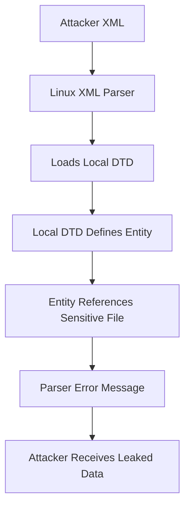

# Linux Local DTD

## Context

This article demonstrates how to exploit error-based XML External Entity (XXE) vulnerabilities using local Document Type Definition (DTD) files on Linux systems. It assumes you have a working understanding of XML structure, DTD file syntax and entity declarations, as well as general error-based XXE exploitation techniques.

## Theory

### Linux-Specific DTD File Exposure

Local DTD files are system DTDs accessible to XML parsers on Linux. They are often used by system components and are prevalent in Linux distributions. These DTDs include those used by fontconfig, scrollkeeper, and SVG processing systems. If an XML parser is configured to allow external entity resolution, an attacker can reference local DTDs to trigger error-based data leaks from the system.

### Local Entity Injection via DTDs

Attackers can craft XML documents that reference local DTD files. These DTDs define entities that manipulate the parser to produce error messages containing sensitive file content. The use of local DTDs can also help bypass input filters intended to block direct file entity references, making these attacks more difficult to thwart.

### Common Linux DTD Targets

- **fontconfig DTD**: Found at `/etc/fonts/fonts.dtd`, used by font configuration utilities.
- **scrollkeeper DTD**: Located at `/usr/share/xml/scrollkeeper/dtds/scrollkeeper-omf.dtd`, utilized by documentation systems.
- **SVG DTD**: Available at `/usr/share/xml/svg/svg.dtd`, employed by SVG processing libraries.

### Error-Based Data Exfiltration via DTDs

To exfiltrate data, a local DTD can define a parameter entity that resolves to a sensitive file, thereby causing an error output that leaks its content.



## Practice

### Exploiting Error-Based XXE with Linux Local DTD

- **Identify Accessible Local DTD Files**: Determine which local DTD files are accessible on the target Linux system, such as `fonts.dtd` and `svg.dtd`. These files are generally world-readable and used by system XML parsers.

- **Craft XML Payload**: Use a payload that involves local DTD inclusion followed by error-based data exfiltration:
  
  ```xml
  <?xml version="1.0"?>
  <!DOCTYPE root [
    <!ENTITY % dtd SYSTEM "file:///etc/fonts/fonts.dtd">
    %dtd;
    <!ENTITY % file SYSTEM "file:///etc/passwd">
    <!ENTITY % eval "<!ENTITY &#x25; error SYSTEM 'file:///nonexistent/%file;'>">
    %eval;
  ]>
  <root/>
  ```

- **Submit Payload**: Send the crafted XML payload to the vulnerable application endpoint.

- **Analyze Error Output**: Monitor the application's error messages for leaked content from files such as `/etc/passwd`. The leaks occur because the parser expands the entities defined within the DTD.

The successful execution of these steps should result in the exposure of sensitive file contents via error messages triggered by local DTD processing.

## Tools

- **Burp Suite**
- **curl**