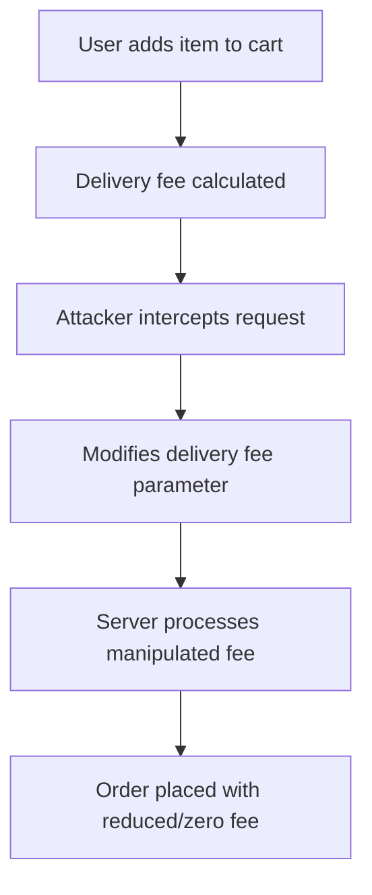

# Delivery Fee Manipulation

## Context

This article demonstrates how attackers can identify and exploit delivery fee manipulation vulnerabilities in web applications. These exploits allow attackers to reduce shipping costs, potentially achieving free delivery. This guide assumes you have intermediate knowledge of HTTP requests, web application architecture, and parameter handling, as well as a solid understanding of business logic errors.

## Theory

### Delivery Fee Logic in E-Commerce Applications

In e-commerce applications, delivery fee logic is crucial for calculating shipping costs. These fees are often determined by various factors, such as cart contents, destination, and any promotional discounts. The logic used for this calculation is typically implemented on the client-side or validated on the server-side through a set of business rules. A vulnerability arises when applications fail to properly validate these fee calculations, allowing attackers to alter delivery fee parameters, resulting in unjustified reductions or even zero-cost shipping.

### Parameter Manipulation Techniques

Parameter manipulation is an offensive technique where attackers modify HTTP request values to influence and change application behavior. In the context of delivery fee manipulation, attackers can intercept and modify the delivery fee parameters in HTTP requests sent to the server. When the server lacks robust validation mechanisms, it may accept these tampered values, effectively allowing the attacker to manipulate shipping costs.

### Business Logic Exploitation and Impact

Business logic flaws occur when an application's workflow does not enforce intended operational rules effectively. By exploiting delivery fee logic flaws, attackers can achieve unauthorized outcomes, like free or negative-cost shipping. This can have severe financial implications for businesses relying on accurate delivery charge calculations.



## Practice

### Manual Delivery Fee Parameter Tampering via Proxy

This technique involves manually intercepting and altering delivery fee parameters using interception proxies like Burp Suite or OWASP ZAP.

- **Intercept the HTTP request**: Use a web proxy tool such as Burp Suite or OWASP ZAP to intercept the HTTP request during the checkout process.
  
    ```bash
    # Example setup command for Burp Suite
    # Start Burp Suite and configure your browser to proxy through it.
    ```

- **Identify the delivery fee parameter**: Examine the intercepted request to locate the delivery/shipping fee parameter within the request payload.
  
- **Modify the parameter**: Change the delivery fee parameter to `0` or any minimal value.
  
    ```json
    {
        "delivery_fee": 0
    }
    ```

- **Forward the modified request**: Send the adjusted request to the server.
  
- **Verify the outcome**: Check if the order is processed with the altered delivery fee, confirming successful exploitation.

### Automated Delivery Fee Manipulation with Custom Script

Automate the process of exploiting delivery fee vulnerabilities with a custom Python script using the `requests` library.

- **Script for exploitation**: The script logs into the target site, adds an item to the cart, and exploits the delivery fee parameter during the checkout process.

    ```python
    import requests
    
    session = requests.Session()
    # Authenticate and add item to cart (details omitted)
    checkout_url = 'https://targetsite.com/api/checkout'
    payload = {
        'cart_id': '12345',
        'delivery_fee': 0
    }
    resp = session.post(checkout_url, json=payload)
    print(resp.status_code, resp.text)
    ```

- **Verify response**: Review the server's response to ensure the order was successfully placed with the manipulated delivery fee.

## Tools

- **Burp Suite**
- **OWASP ZAP**
- **requests (Python)**

This comprehensive guide outlines methods for exploiting delivery fee manipulation vulnerabilities, providing both manual and automated approaches for effective web application testing.