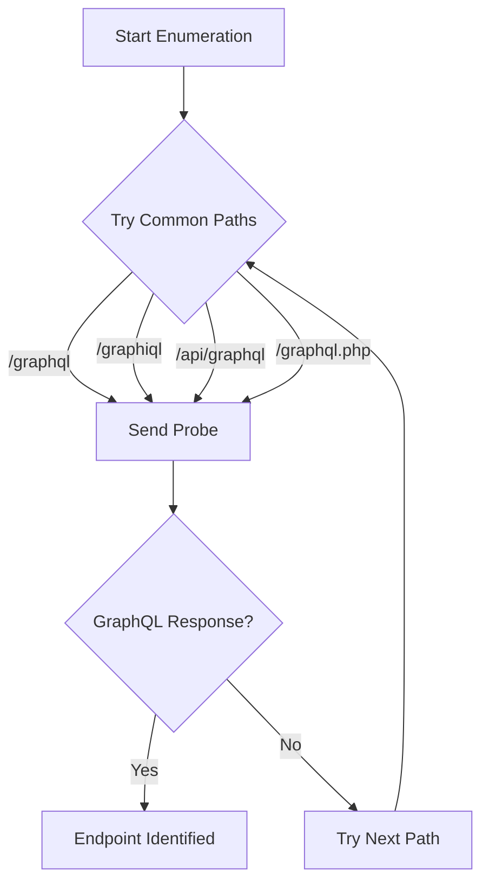

# Common GraphQL Endpoints

## Context

Understanding common GraphQL endpoints is crucial for offensive operators focused on identifying and exploiting GraphQL services. This knowledge supports systematic discovery and validation of these endpoints, a critical preliminary stage in offensive operations involving GraphQL. It's assumed that readers have a foundational understanding of GraphQL protocol and HTTP request crafting and analysis.

## Theory

### GraphQL Endpoint Discovery Fundamentals

GraphQL endpoints serve as the access point for queries and mutations in a GraphQL setup, using the HTTP(S) protocol to convey requests and responses. These endpoints are often found at predictable paths, making them prime targets for enumeration in offensive cybersecurity operations. The process typically involves attempting known endpoints and probing each for responses indicative of a GraphQL service.

### Common GraphQL Endpoint Patterns

Vendors and developers often deploy GraphQL services at standardized paths, especially when following popular frameworks and best practices. While POST requests with JSON payloads are the norm for communicating with these endpoints, GET requests are sometimes supported. By focusing on known common paths, attackers can effectively streamline their reconnaissance efforts, reducing the noise generated during exploratory actions.

### Endpoint Fuzzing and Verification Logic

A tactical approach to endpoint discovery involves sending tailored requests to potential endpoint paths and scrutinizing the server responses for GraphQL-specific error signatures. This process can be complicated by protective measures like authentication barriers or non-standard naming conventions, which may conceal endpoints. The flowchart below illustrates the logical sequence for endpoint enumeration:



## Practice

### Manual GraphQL Endpoint Enumeration

Manual enumeration remains a foundational technique for discovering GraphQL endpoints. The following are key manual checks:

- Probe the default GraphQL endpoint:

    ```bash
    curl -X POST https://target.tld/graphql -H 'Content-Type: application/json' --data '{"query":"{__typename}"}'
    ```

- Test a common alternative endpoint:

    ```bash
    curl -X POST https://target.tld/api/graphql -H 'Content-Type: application/json' --data '{"query":"{__typename}"}'
    ```

- Check for an exposed GraphiQL IDE endpoint:

    ```bash
    curl -X POST https://target.tld/graphiql -H 'Content-Type: application/json' --data '{"query":"{__typename}"}'
    ```

- Probe a versioned GraphQL endpoint:

    ```bash
    curl -X POST https://target.tld/v1/graphql -H 'Content-Type: application/json' --data '{"query":"{__typename}"}'
    ```

- Test a PHP-based GraphQL endpoint:

    ```bash
    curl -X POST https://target.tld/graphql.php -H 'Content-Type: application/json' --data '{"query":"{__typename}"}'
    ```

By sending these requests, operators aim to identify GraphQL-specific responses that confirm the presence of a service.

### Automated GraphQL Endpoint Fuzzing

Fuzzing streamlines endpoint discovery by automating requests across a spectrum of potential paths. This is particularly effective with a curated wordlist:

```bash
ffuf -w common-graphql-endpoints.txt -u https://target.tld/FUZZ -X POST -H 'Content-Type: application/json' -d '{"query":"{__typename}"}' -mc 200,400,500
```

This command leverages `ffuf` to test multiple endpoint variations, analyzing HTTP status codes (200, 400, and 500) indicative of potential GraphQL services. Automating this process significantly enhances the efficiency and scope of reconnaissance efforts.

## Tools

- **curl**
- **ffuf**