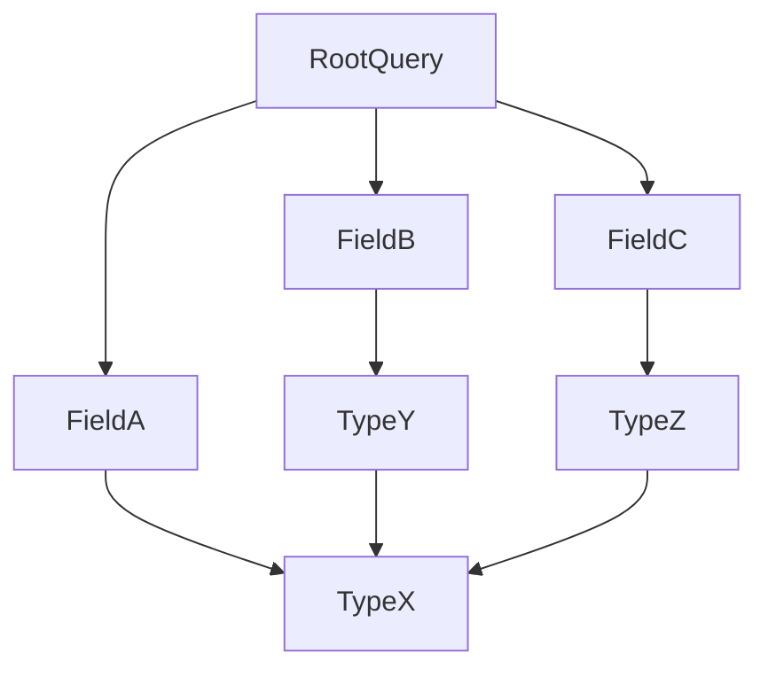

# List Path To Reach A Type

## Context

The primary objective of this guide is to equip operators with the skills to enumerate and list all possible query paths in a GraphQL schema leading to a specific type. This capability supports targeted exploitation and enhances understanding of the schema. Readers are expected to have prior knowledge of GraphQL schema structure, query syntax, and basic injection and enumeration techniques.

## Theory

### GraphQL Type Hierarchy and Path Relationships

A GraphQL path is understood as a sequence of fields starting from a root query and leading to a specific type. This network of paths is established through connected types via fields. For offensive purposes, it's critical to grasp these interconnections, as attackers can leverage type paths to identify fields or relationships ripe for exploitation, enabling data extraction or injection.

### Schema Navigation for Path Discovery

The process of enumerating all paths to a particular type can unveil hidden or nested attack surfaces. The attack sequence involves three critical steps:

1. Enumerate schema fields and types.
2. Map the relationships between these fields and types.
3. Trace all potential paths that lead to the target type.



This diagram illustrates a simplified example of how paths can be traced in a GraphQL schema to reach a target type from various root fields.

### Practical Use Cases for Path Enumeration

Understanding all existing paths to a specific type enables focused attacks and the bypassing of field-level protections. Attackers can identify the shortest or least-controlled routes to sensitive types and abuse them efficiently.

## Practice

### Enumerate All Query Paths to a Target Type Using Automated Tooling

To efficiently discover all paths leading to a specified type, operators can utilize automated tools:

- Employ the `graphql-path-enum` tool to systematically identify query paths:
  
  ```bash
  graphql-path-enum --endpoint https://target/graphql --type TargetType
  ```

- The output will provide a list of paths, each showing a unique route from a root field to the designated target type:

  ```
  /user/posts/comments/author
  /user/profile/author
  /admin/users/author
  ```

The immediate outcome of this automation is a comprehensive understanding of the query paths accessible to the target type, facilitating subsequent exploitation strategies.

### Manual Path Tracing via Schema Introspection

When automation is not an option, schema introspection offers a manual approach to uncovering paths:

- Initiate schema retrieval via a GraphQL query using `curl`:

  ```bash
  curl -X POST https://target/graphql -H 'Content-Type: application/json' --data '{"query":"{ __schema { types { name fields { name type { name kind ofType { name } } } } } }"}'
  ```

- Analyze the returned schema JSON to locate fields that return or contain the target type. This involves manually mapping field relationships to expose all possible paths.

The manual enumeration allows operators to plan exploitation by thoroughly understanding the paths, even without automated assistance.

## Tools

- **graphql-path-enum**
- **curl**