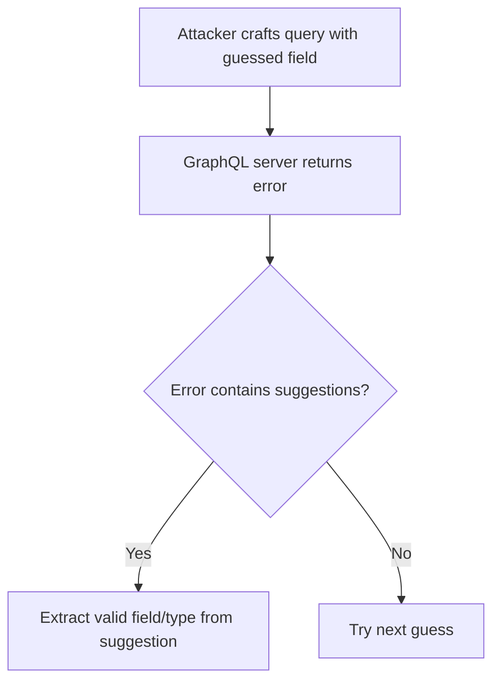

# Enumerate Database Schema via Suggestions

## Context

In this guide, we will explore how to enumerate a GraphQL database schema by leveraging suggestion and typo feedback mechanisms. This method is particularly useful when GraphQL introspection is disabled, yet you still need to extract schema information. To follow along, you should already be familiar with basic GraphQL query and mutation syntax, the structure of GraphQL schema and its types, and have a foundational understanding of GraphQL injection and enumeration concepts.

## Theory

### GraphQL Suggestions and Typo Feedback

GraphQL servers have a feature that suggests corrections for mistyped fields or types. These suggestions can inadvertently reveal parts of the schema. When a user makes a typo in a query, the server's error response may contain suggestions for valid field names or types.

This is particularly significant when introspection is not available, as it allows an attacker to gather schema information through error feedback. The vulnerability model here centers on the autocomplete and typo correction functionalities, which, if not properly configured, can expose internal schema names via error messages.

### Schema Enumeration via Brute-Force Suggestions

One effective method to enumerate a schema in a GraphQL environment with introspection disabled is to send queries with guessed field or type names and analyze the server’s error response for suggestions. 

Here’s a simple attack sequence:

1. Send a query with a guessed field or type name.
2. Receive an error message from the server.
3. Check the error message for suggestions.
4. If suggestions are provided, extract and verify the valid field or type.
5. If no suggestion is provided, repeat the process with the next guess.



### Threat Surface: Autocomplete and Error Disclosure

The main threat here arises from error messages that are overly detailed in their feedback—messages intended for developer usability can lead to schema discovery if they include suggestions. There's an inherent trust assumption that these messages will only be seen by trusted clients, but this isn't always the case.

## Practice

### Manual Schema Enumeration via Typo Suggestions

In a manual enumeration process, you can exploit typo suggestions to gather schema information:

- **Craft and Send Query**: Use a tool like `curl` to send a GraphQL query with an intentional typo in a field or type name.

    ```bash
    curl -X POST http://target/graphql -H 'Content-Type: application/json' --data '{"query":"{ usres { id } }"}'
    ```

- **Observe Server Response**: Look for error messages suggesting the correct field or type.

    ```
    {
      "errors": [
        {
          "message": "Cannot query field 'usres' on type 'Query'. Did you mean 'users'?"
        }
      ]
    }
    ```

- **Iterate with Guesses**: Continue the process with different guesses, potentially using a wordlist to further uncover valid schema elements.

The outcome of this process is the discovery of valid schema elements, exploiting suggestion feedback to bypass introspection restrictions.

### Automated Brute-Force Schema Enumeration via Suggestions

Automated tools can expedite this enumeration process by guessing and processing feedback in bulk:

- **Execute Automated Script**: Use a script like `graphql_suggest_enum.py` to automate the submission of queries with guessed names.

    ```bash
    python graphql_suggest_enum.py --url http://target/graphql --wordlist fields.txt
    ```

- **Analyze Output**: The tool will output discovered schema elements based on server suggestions.

    ```
    Found valid field: users
    Found valid field: posts
    ```

By leveraging these automated methods, you can efficiently discover schema fields and types through suggestion feedback.

## Tools

- **curl**
- **graphql_suggest_enum.py**
- **python**