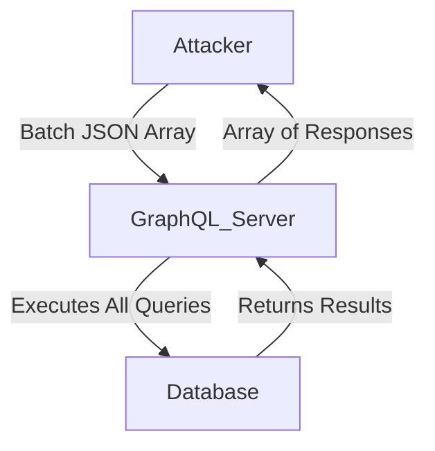

# JSON List Based Batching

## Context

GraphQL JSON List-Based Batching is an offensive technique that leverages the capability of sending multiple GraphQL queries or mutations simultaneously in a single request. This tactic optimizes attack strategies by batching queries in JSON array format, potentially bypassing security controls due to inefficient monitoring and logging on the server-side. It is essential to have prior knowledge of GraphQL schema structures, JSON syntax, and basic HTTP request mechanisms to effectively employ this technique.

## Theory

### JSON List-Based Batching in GraphQL

JSON List-Based Batching exploits the feature of batching multiple GraphQL requests in a single HTTP call. By crafting a JSON array of queries or mutations, attackers can submit several operations together, allowing for parallel execution. This method increases efficiency and stealth in offensive operations:

  - **Definition**: This technique involves composing a list of GraphQL queries as a JSON array, submitting them via a POST request.
  - **Core Principle**: Facilitates sending multiple queries at once, enhancing efficiency by processing them in parallel.
  - **Attack Sequence**: 
    1. Craft a JSON array containing multiple query objects.
    2. Send the array as a POST request to the GraphQL endpoint.
    3. Receive an array of corresponding responses.

### Batch Request Handling and Security Implications

Batch requests can introduce significant security vulnerabilities if not handled correctly. The server's ability to process all queries within a batch without individual rate limiting or authorization checks can be exploited:

  - **Vulnerability Model**: APIs that accept JSON batches may fail to perform rate limiting or granular authorization checks on individual queries.
  - **Protocol Weakness**: Batching can hide malicious activities by obfuscating them within legitimate batch requests due to lack of validation and logging.
  - **Filter Bypass Logic**: Batching can evade Web Application Firewalls (WAF) or monitoring that is tuned to detect single-query requests.

### Concurrent Query Execution and Attack Optimization

Simultaneously executing multiple queries optimizes the extraction of data and accelerates brute-force attacks:

  - **Core Principle**: Parallel processing of queries can significantly speed up data harvesting.
  - **Attack Sequence**:
    1. Enumerate a list of sensitive queries.
    2. Bundle these queries into a single batch request.
    3. Submit the batch request for concurrent execution.

### Visualization: Batch Request Flow



This diagram illustrates the flow of a JSON list-based batch request, where the attacker submits a batch to the GraphQL server, which then processes the queries and returns a batch of results.

## Practice

### Manual JSON List-Based Batch Query Injection

This technique involves manually crafting and sending a JSON list-based batch request to the target GraphQL server:

- **Step 1**: Prepare a JSON array containing multiple GraphQL query objects. Each object should represent a distinct query or mutation for execution.
  
- **Example Payload**:
  ```json
  [
    {"query": "{ user(id: 1) { email } }"},
    {"query": "{ user(id: 2) { email } }"}
  ]
  ```

- **Step 2**: Submit this array using an HTTP POST request.
  
- **Command**:
  ```bash
  curl -X POST https://target/graphql -H 'Content-Type: application/json' --data '[{"query": "{ user(id: 1) { email } }"}, {"query": "{ user(id: 2) { email } }"}]'
  ```

- **Step 3**: Observe the array of responses directly related to each query.

- **Expected Output**:
  ```json
  [
    {"data": {"user": {"email": "user1@example.com"}}},
    {"data": {"user": {"email": "user2@example.com"}}}
  ]
  ```

### Automated Batch Query Enumeration with GraphQLmap

Utilize tools like GraphQLmap for automated execution of batch queries:

- **Command**:
  ```bash
  graphqlmap -u https://target/graphql --batch --batch-size 5 --enum-users
  ```

This command automates the enumeration of user records in batch format, facilitating efficient data exfiltration through grouped query submissions.

## Tools

- **curl**
- **GraphQLmap**