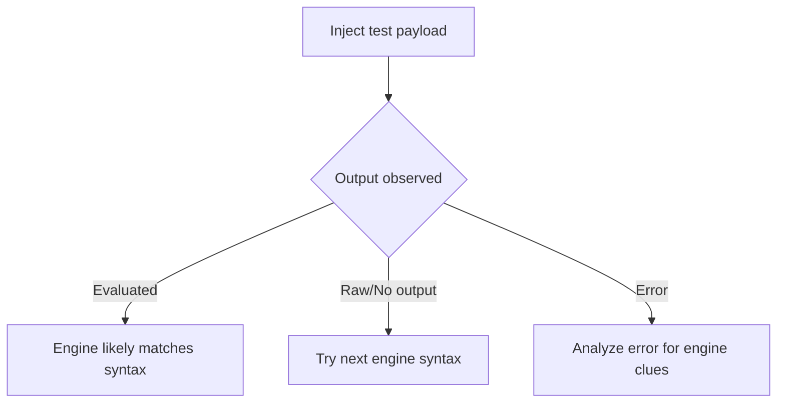

# Enumerate the Template Engine

## Context

The objective of enumerating the template engine is to identify which specific template engine is employed by a web application prone to Server Side Template Injection (SSTI). Understanding the particular engine in use allows for the precise crafting of payloads for further exploitation. This guide assumes that you're familiar with the general concepts of template engines, web application architecture, and basic SSTI principles.

## Theory

### Purpose of Template Engine Enumeration

Template engine enumeration involves the process of discovering the type of template engine that a web application uses. Gaining this insight is critical because each template engine has unique syntax and capabilities. Knowledge of the engine type allows attackers to tailor payloads for specific exploitation, potentially leading to arbitrary code execution.

### Template Engine Syntax Fingerprinting

Template engines differ significantly in their syntax for tasks such as variable interpolation, logic implementation, and function calls. By injecting syntax specific to each template engine and observing the application's response, you can infer which engine is being used. This process involves sending a set of test payloads and analyzing whether they are executed correctly, result in an error, or are rendered raw.

### Common Template Engine Syntax Patterns

A variety of popular template engines exist, each with their distinct syntax:

- **Jinja2, Twig, ERB**: Use curly braces or angle bracket syntax like `{{7*7}}` or `<%= 7*7 %>`.
- **FreeMarker, Velocity**: Use dollar signs with curly braces `${7*7}`.
- **Smarty, Handlebars**: Use simple curly braces or double curly braces `{7*7}`, `{{7}}`.
- **Others like Mustache, Thymeleaf, Dust.js, Pug, and Jade** also have specific syntaxes.

These differences form the basis for fingerprinting template engines.

### Behavioral Indicators and Error Messages

Template engines can inadvertently disclose their identity through error messages or behaviors. For example, injecting malformed syntax can trigger unique stack traces or error messages, often including the engine's name, which aids in identification.

### Engine Fingerprinting Workflow

The process of engine enumeration can be visualized as follows:



The workflow entails injecting specific syntax and interpreting the resulting application behavior to identify the template engine.

## Practice

### Manual Template Engine Enumeration via Syntax Probing

To manually determine the template engine, inject different syntax patterns and observe the output:

- **Jinja2, Twig, or similar**: 
  ```http
  {{7*7}}
  ```
- **FreeMarker, Velocity, or similar**:
  ```http
  ${7*7}
  ```
- **ERB or similar**:
  ```http
  <%= 7*7 %>
  ```
- **Smarty or similar**:
  ```http
  {7*7}
  ```
- **Handlebars, Mustache, or similar**:
  ```http
  {{7}}
  ```
- **Pug/Jade or custom engines**:
  ```http
  [[7*7]]
  ```

Use the following command to test payloads and analyze responses:
```bash
curl -X POST -d 'input={{7*7}}' https://target/app
```
Repeat the process for each syntax, documenting which ones are executed, appear raw, or trigger errors.

### Automated Template Engine Fingerprinting with tplmap

Automated tools like tplmap can streamline this process significantly. Use tplmap to probe the template engine automatically:

```bash
tplmap -u 'https://target/app?input=INJECT_HERE'
```

An example output from tplmap might indicate:
```text
Engine fingerprinted: Jinja2 (Python)
```

This automation allows quick and reliable enumeration of the template engine, enabling focused exploitation efforts.

## Tools

- **tplmap**
- **curl**