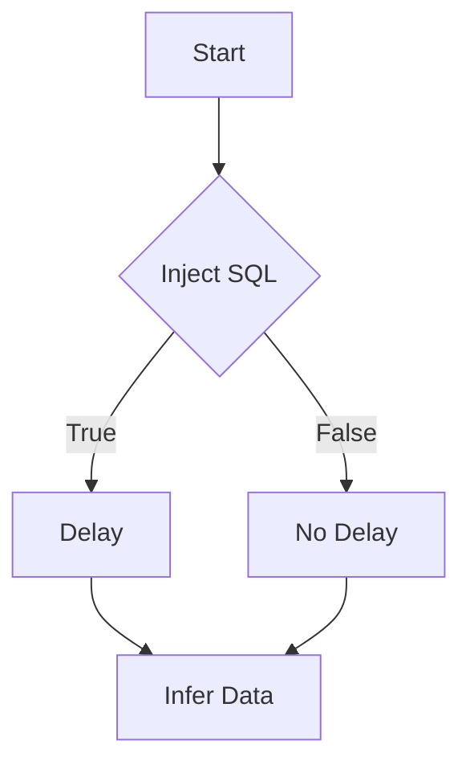

# Time-based Blind

## Context

In this article, we will delve into the technique of exploiting time-based blind SQL injection in MariaDB. This form of SQL injection allows attackers to infer information from a database by analyzing time delays in responses. It is used when direct feedback from SQL queries is unavailable, making it invaluable for information extraction in seeming data-inaccessible environments. To fully benefit from this guide, readers should have an understanding of SQL query execution, how database response times work, and conditional logic. Familiarity with MariaDB Blind SQL Injection techniques is also advised.

## Theory

### Time-based Blind SQL Injection in MariaDB

Time-based blind SQL injection is a method that leverages SQL queries to deduce information by assessing the time taken for the database response. This technique is particularly useful when exploitation does not immediately display results, as it exploits the time delay resulting from conditional logic in SQL injections.

The vulnerability model behind this technique is based on crafting queries that introduce purposeful delays when certain conditions are met (true/false conditions), thereby revealing sensitive data. Attackers inject SQL payloads into an input channel that cause the database to delay its responses based on the conditional logic applied, allowing them to extract information implicitly.

### Conditional Delay Logic

The core principle of conditional delay logic in time-based SQL injection is using functions like `SLEEP()` to introduce significant delays that signal conditional outcomes. Attackers need to craft their SQL payloads smartly to bypass input validation, ensuring that these time-based conditions are executed by the database.

For instance, a query injected as `SELECT IF(1=1, SLEEP(5), 0);` will pause execution for 5 seconds if the condition `1=1` is true, thereby allowing the attacker to infer this condition based on the delay.

### Timing Attack Mechanics

The mechanics of a timing attack are based on exploiting the predictable execution time of SQL functions, allowing attackers to infer data indirectly. Due to implementation flaws, most databases, including MariaDB, do not differentiate between immediate and delayed responses, which is a significant protocol weakness.

A typical sequence of a timing attack can be visualized as follows:



## Practice

### Extracting Data via Time-based Blind SQL Injection

In time-based blind SQL injection, the steps involve crafting SQL statements where condition satisfaction triggers a delay. Here are key steps to execute such an attack manually:

- **Test Conditional Delay:**
    - Execute:
      ```sql
      SELECT IF(1=1, SLEEP(5), 0);
      ```
    - Interpretation: This tests whether a simple condition (`1=1`, which is always true) results in a delay, indicating successful execution of conditional logic.

- **Identify Current Database:**
    - Execute:
      ```sql
      SELECT IF((SELECT database())='target_db', SLEEP(5), 0);
      ```
    - Interpretation: This checks if the current database matches 'target_db'. A delay indicates true, confirming the database name.

- **Determine User Length:**
    - Execute:
      ```sql
      SELECT IF((SELECT LENGTH(user())=5), SLEEP(5), 0);
      ```
    - Interpretation: Checks if the length of the current user’s name is 5. A delay confirms the length.

- **Confirm First Character of User:**
    - Execute:
      ```sql
      SELECT IF((SELECT SUBSTRING(user(), 1, 1))='a', SLEEP(5), 0);
      ```
    - Interpretation: Tests if the first character of the current user’s name is 'a'. A delay indicates the condition is true.

These commands allow an attacker to infer data from the database based solely on the time taken for the operations, thus achieving sensitive data access through meticulous timing differences.

## Tools

- **sqlmap**
- **Burp Suite**

By using these tools, potential exploits can be automated and analyzed for time-based differences, streamlining the process of a time-based blind SQL injection attack.