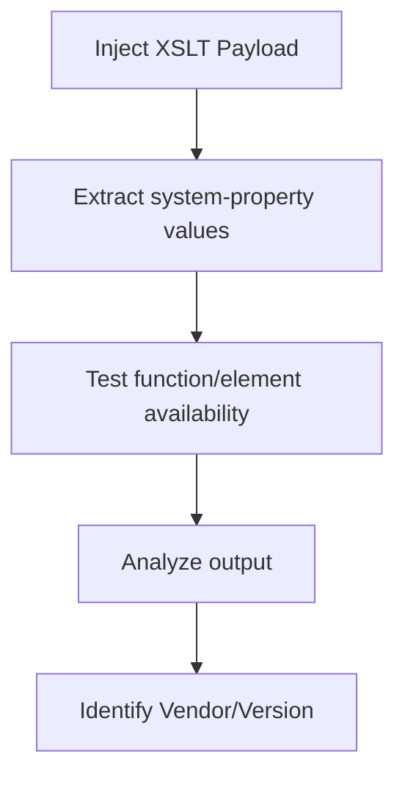

# Determine the Vendor and Version

## Context

The aim of determining the vendor and version of an XSLT processor is to fingerprint the processing engine through injection attacks. This enables attackers to tailor their exploits more effectively according to specific processor properties. To undertake this technique, you should already be familiar with XSLT processing concepts, XML structure and syntax, HTTP request crafting, and general XSLT injection methods.

## Theory

### XSLT Processor Identification via Injection

XSLT processors have the capability to expose critical information such as their vendor and version through system properties and built-in functions. By identifying the exact engine used, attackers can select targeted payloads that exploit known vulnerabilities specific to that engine's version.

Injected XSLT can exploit this vulnerability by accessing processor metadata, effectively leaking environment details which can be used to further infiltration goals.

### Key XSLT Properties and Functions for Fingerprinting

The properties `system-property('xsl:vendor')`, `system-property('xsl:version')`, and `system-property('xsl:vendor-url')` are pivotal in revealing processor details. Furthermore, functions like `function-available()` and `element-available()` allow for testing the presence of engine-specific features, further aiding in accurate identification.

Different XSLT processors offer unique implementations of these functions and elements, allowing for distinctions among them and enabling precise targeting in subsequent attacks.

### Engine Fingerprinting Workflow

The workflow for engine fingerprinting involves executing a sequence of XSLT payloads designed to extract system properties and test feature availability:

- Inject XSLT payloads to extract relevant system properties.
- Analyze the output to identify vendor/version signatures.
- Correlate the findings with known public documentation to confirm processor identity.



## Practice

### Extract XSLT Processor Metadata via system-property

- **Inject to retrieve the processor vendor string:**

  ```xml
  <xsl:value-of select="system-property('xsl:vendor')"/>
  ```

- **Inject to retrieve the processor version:**

  ```xml
  <xsl:value-of select="system-property('xsl:version')"/>
  ```

- **Inject to retrieve the processor's vendor URL:**

  ```xml
  <xsl:value-of select="system-property('xsl:vendor-url')"/>
  ```

  After executing these payloads, the application response should reveal the processor's vendor and version information.

### Detect Engine-Specific Features with function-available() and element-available()

- **Test for EXSLT support (common in `libxslt`, Saxon):**

  ```xml
  <xsl:value-of select="function-available('exslt:node-set')"/>
  ```

- **Test for Microsoft XSLT processor features:**

  ```xml
  <xsl:value-of select="element-available('msxsl:script')"/>
  ```

- **Test for Saxon-specific function:**

  ```xml
  <xsl:value-of select="function-available('saxon:evaluate')"/>
  ```

  The presence or absence of these features will help narrow down the processor type and provide further insight into the application environment.

### Correlate Output with Known Vendor Signatures

- Compare the values extracted to known public XSLT processor documentation and fingerprint databases. 

  By matching the output to known signatures, you can confirm the processor's identity, paving the way for tailoring exploits to known vulnerabilities in that particular XSLT engine.

## Tools

- **Burp Suite**
- **curl**
- **xsltproc**