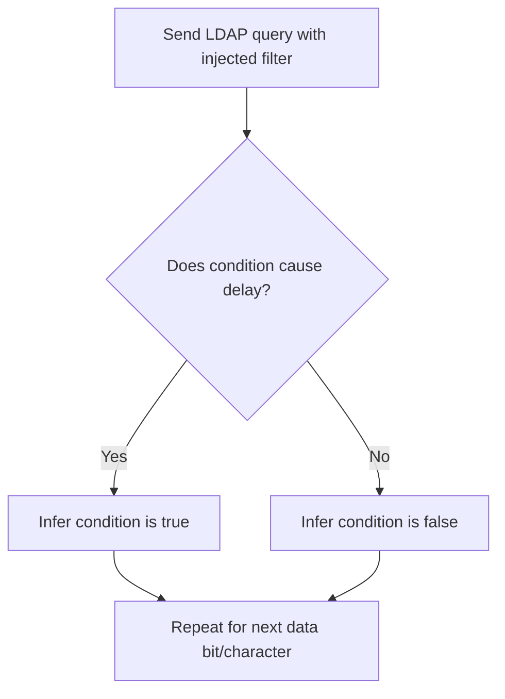

# Time-Based Blind Injection

## Context

Time-Based Blind Injection is an offensive technique used to exploit LDAP (Lightweight Directory Access Protocol) vulnerabilities via response delays. This method targets how web applications interact with LDAP servers, leveraging timing responses when unsafe input concatenation affects LDAP queries. This guide assumes knowledge of the LDAP protocol, web server interactions, and general LDAP injection concepts.

## Theory

### Time-Based Blind LDAP Injection Fundamentals

Time-Based Blind LDAP Injection exploits the timing of LDAP query responses to infer data from the backend without needing direct output visibility. Attackers craft payloads that trigger response delays when certain conditions are met, allowing them to deduce true or false outcomes based on query execution time.

This vulnerability arises when user inputs are unsafely integrated into LDAP queries. Attackers can manipulate filters to alter the query logic, causing delays that signal a true condition, enabling them to infer data.

### LDAP Delay Mechanisms and Exploitable Functions

Some LDAP servers or application logic allow queries with complex or resource-intensive filters, such as wildcards or nested filters, that induce observable delays. Though LDAP lacks built-in sleep functions, attackers exploit these time-consuming queries or manipulate application-layer timeouts to induce delays.

### Attacker Workflow: Timing-Based Data Extraction

The workflow for extracting data using timing-based methods involves several steps:
1. **Identify an injectable parameter** within the web application that affects an LDAP query, such as a username field in a login form.
2. **Inject a conditional filter into the query** to create a delay if the condition is true.
3. **Measure response time** to determine if the condition causes a significant query delay.
4. **Iterate the process** to extract data bit by bit or character by character.



## Practice

### Manual Time-Based Blind LDAP Injection via Web Application

To exploit LDAP vulnerabilities manually through a web application, follow these steps:

- **Identify a web parameter** that reflects in the LDAP query and can be exploited. Typically, this involves parameters affecting LDAP search filters like usernames in login forms.

- **Inject a payload** to test responses:
  ```xml
  *)(&(objectClass=*)(|(cn=admin*)(!(cn=nonexistent))))
  ```
  This payload injects a complex filter into the LDAP query, causing delays if 'admin' is a valid entry.

- **Measure the response time** for your payload:
  ```bash
  time curl -X POST -d 'username=*)(&(objectClass=*)(|(cn=admin*)(!(cn=nonexistent))))&password=test' https://target-app/login
  ```
  Note the time it takes for the server to respond compared to baseline conditions.

- **Compare response times** to discern true or false conditions by varying your filter. A notable delay often indicates the condition is true.

- **Craft a control payload** for testing:
  ```xml
  *)(&(objectClass=*)(|(cn=nonexistent*)(!(cn=admin))))
  ```
  This serves to test false conditions where the result should be faster.

- **Measure baseline response time** for the control payload:
  ```bash
  time curl -X POST -d 'username=*)(&(objectClass=*)(|(cn=nonexistent*)(!(cn=admin))))&password=test' https://target-app/login
  ```
  Compare these timings to those from potentially true condition tests.

- **Iterate with different filters** to extract sensitive data by automating or scripting if large-scale extraction is needed.

### Outcome

By interpreting LDAP query delays, attackers can extract sensitive information from the backend system. Through methodical timing, data is pieced together, often requiring automation to manage more extensive data sets.

## Tools

- **curl**
- **Burp Suite**
