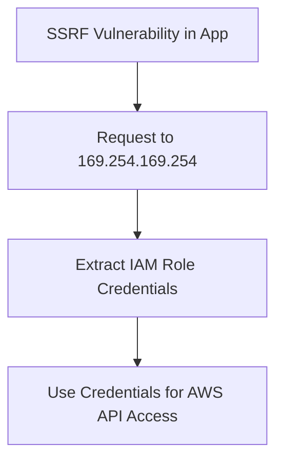

# Elastic Beanstalk

## Context

This article explores how to exploit Server-Side Request Forgery (SSRF) vulnerabilities in AWS Elastic Beanstalk environments. The primary objective is to demonstrate how attackers can access instance metadata and leverage IAM credentials to perform further actions within the AWS cloud environment. It assumes intermediate knowledge of cloud service models, HTTP request structures, and metadata service endpoints, as well as familiarity with SSRF and cloud metadata service exploitation techniques.

## Theory

### Elastic Beanstalk Metadata Service Exposure

Elastic Beanstalk is a service provided by AWS that simplifies the deployment and management of applications. These applications run on EC2 instances, each equipped with access to the AWS instance metadata service located at `http://169.254.169.254`. This service can expose sensitive information, which includes IAM role credentials assigned to the instance. If a web application hosted on Elastic Beanstalk is vulnerable to SSRF, it is possible for attackers to relay requests to this metadata service, potentially gaining unauthorized access to privileged information.

### IAM Roles and Privilege Implications

In AWS Elastic Beanstalk environments, EC2 instances are generally assigned an IAM role, such as `aws-elasticbeanstalk-ec2-role`, which provides the necessary permissions for application operations. If an attacker manages to extract these credentials through SSRF, the compromised credentials could then be used to access AWS APIs, S3 buckets, or even escalate privileges within the AWS account.

### SSRF Exploitation Flow in Elastic Beanstalk

The exploitation typically follows a sequence where the attacker identifies an SSRF vulnerability, targets the metadata service endpoint, extracts IAM role credentials, and then leverages these credentials for further actions within the AWS environment.



## Practice

### SSRF to Extract Elastic Beanstalk IAM Role Credentials

- **Identify an SSRF injection point in the Elastic Beanstalk-hosted application.**  
  Locate a user-controllable URL parameter or HTTP header that can be manipulated to trigger server-side requests.

- **Target the IAM role credentials endpoint via SSRF.**  
  ```plaintext
  http://169.254.169.254/latest/meta-data/iam/security-credentials/aws-elasticbeanstalk-ec2-role
  ```
  Aim to relay requests from the application to the IAM role credential endpoint through SSRF.

- **Send a crafted request to the SSRF endpoint with the above payload.**  
  Use a proxy tool or direct HTTP request to inject the metadata URL into the vulnerable application endpoint.

- **Successful exploitation returns temporary AWS credentials:**
  ```json
  {
    "Code" : "Success",
    "LastUpdated" : "...",
    "Type" : "AWS-HMAC",
    "AccessKeyId" : "AKIA...",
    "SecretAccessKey" : "...",
    "Token" : "...",
    "Expiration" : "..."
  }
  ```

- **Use the extracted credentials to enumerate accessible S3 buckets:**
  ```bash
  aws s3 ls --profile beanstalk-creds
  ```

The above steps demonstrate how an attacker can gain AWS IAM credentials, leading to potential privilege escalation or unauthorized access to AWS resources.

## Tools 

- **Burp Suite**
- **awscli**
- **curl** 

This article outlines the process of exploiting SSRF in AWS Elastic Beanstalk environments, offering a practical guide to understand the risk and consequences associated with this vulnerability. The ability to extract IAM credentials can lead to significant unauthorized access within AWS, emphasizing the importance of securing applications against SSRF.