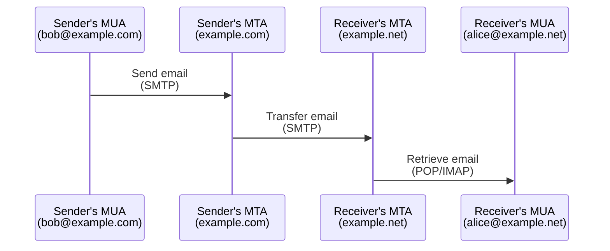
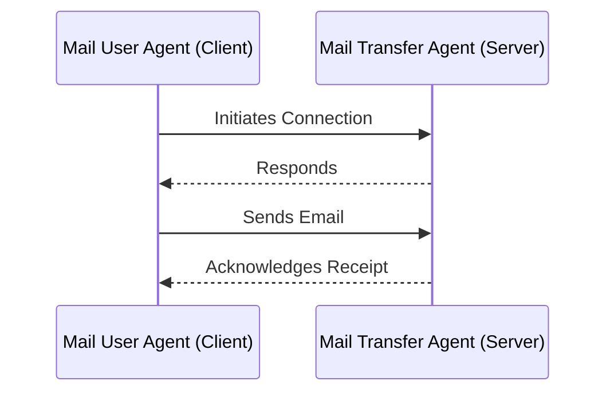
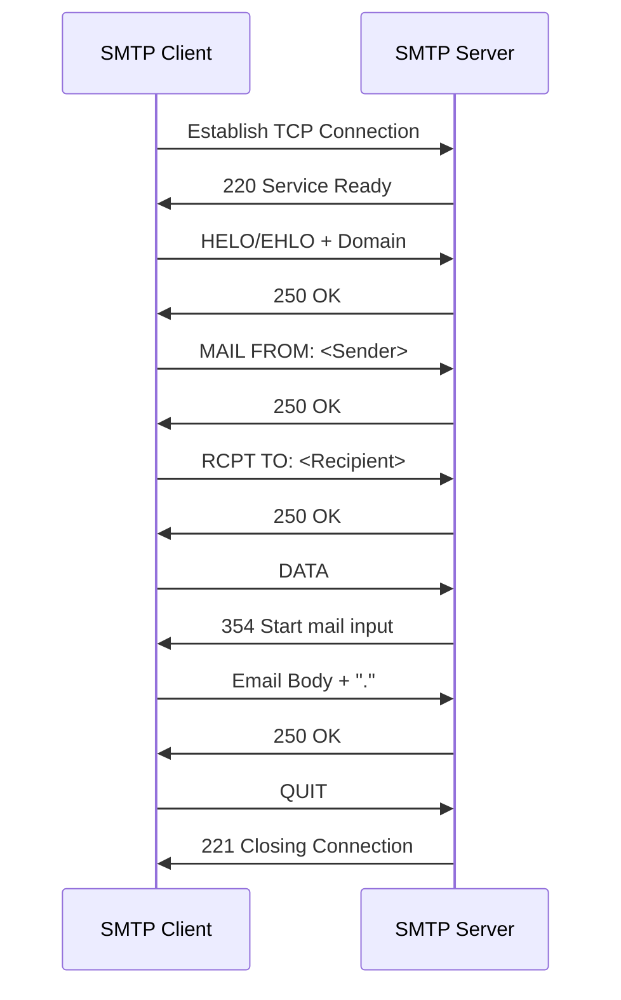

# SMTP

> Port : 25, 587, 465, 2525
> 

---

### 🔗 Related

---

[SPF](SPF%20e3a84a5151a84808af5d92a64684ede6.md) 

[DMARC](DMARC%207025cbba1ee24855ba123c426a6e4852.md) 

[DKIM](DKIM%2003edc10419844addbf53bd9dc1b2663c.md) 

[DSN Report](DSN%20Report%20c3d3c8d2919c40ed98576800c02638e8.md) 

### 👁️ Enummeration

---

[SMTP Banner Grabbing](SMTP%20Banner%20Grabbing%20267db8711ffc4ce2a358a576fe5b16c2.md) 

[SMTP Open Relay](SMTP%20Open%20Relay%204fcb96c41f0f4d5e89d72ee633418778.md) 

[SMTP NTLM Auth information disclosure](SMTP%20NTLM%20Auth%20information%20disclosure%20504897caea334a5d9d15b8d44034e509.md) 

[SMTP Internal server name](SMTP%20Internal%20server%20name%20fd453c40aeee486aa69c8876af591e40.md) 

[SMTP Commands Enumeration](SMTP%20Commands%20Enumeration%20976e24bf12c9490b889d06bdfc8747c6.md) 

### ⚔️ Attacks

---

[SMTP MitM](SMTP%20MitM%20ac0ee504dd714f9db32f18a61379be50.md) 

[SMTP Data Exfiltration](SMTP%20Data%20Exfiltration%2089c27b6e7bd842d081f930cf96bf682b.md) 

[SMTP bruteforce](SMTP%20bruteforce%2027311cc2563546d1ba3f7f17fc596530.md) 

[Enumerate SMTP Users](Enumerate%20SMTP%20Users%200ff66d69dcf54c37b7a8e744993b632e.md) 

### 🛡️ Defense

---

[S/MIME](S%20MIME%20e63aa988275145b195c2b49eb2dbbbae.md) 

[SMTPS](SMTPS%20452802902f764a88ad9bea70059f73b0.md) 

[BIMI](BIMI%20831c0f97975743c5b967c949fffb9ff9.md) 

[Docker Mailserver](Docker%20Mailserver%204fe55dcfabd145ccbb81ec2de6b5d0c7.md) 

[Postfix : Remove sensitive headers](Postfix%20Remove%20sensitive%20headers%20cda0e030300048e8a136473ea813dab3.md) 

# 👉 Overview

---

### What ?

SMTP, or Simple Mail Transfer Protocol, is a protocol that is used for sending e-mail messages between servers. Most e-mail systems that send mail over the Internet use SMTP to send messages from one server to another. The messages can then be retrieved with an e-mail client using either [POP](POP%204304e78be0a1418c9ed3e5a8b2f87b3e.md) or [IMAP](IMAP%2068b3a833251346399c563ccbcde36568.md). In essence, SMTP provides a set of codes that simplify the communication of email messages between email servers. It's a type of shorthand that allows a server to break up different parts of a message into categories the other server can understand.

### Why ?

SMTP is vital to the operation of the internet, particularly for the transmission of email. It enables the sending and receiving of email messages across different networks and systems. Without SMTP, communication through email would not be possible on the scale we see today. Understanding SMTP is therefore crucial for anyone working in IT or cybersecurity, as it forms the foundation for any work with email systems or related applications.

### How ?

SMTP works through a process of commands and responses between the client and the server. The process begins with the client initiating a [TCP](TCP%20e237e940825340f89297e91c6ff158ec.md) (Transmission Control Protocol) connection with the server. Once the connection is established, the client sends a series of commands, to which the server responds with numeric codes indicating status. Once the email is delivered and the transmission is complete, the client terminates the connection. SMTP uses port 25 by default, but emails sent via [SSL](SSL%2093c19bec959145f4973fc11d6c691577.md)/[TLS](TLS%20b60055d7432b4c2a9fbc2df5bd7f0084.md), a method of encrypting SMTP, often use port 465 or 587.

### When ?

SMTP was first defined by RFC 821 in 1982, and it has been updated several times since to the current standard, SMTP UTF8, defined in RFC 6531 in 2012. SMTP has been at the heart of email communication since the early days of the internet, and it continues to serve as a fundamental protocol in the world of digital communication.

# ⚙️ Technical Explanations

---

SMTP communication consists of a client-server architecture, where the client is typically the email sender's Mail User Agent (MUA) and the server is the Mail Transfer Agent (MTA).

Here's a detailed breakdown of the SMTP communication process:

1. **Establishing the Connection**: The SMTP client (sender's MUA) starts the process by establishing a TCP connection with the SMTP server (receiver's MTA) on the designated port (often port 25).
2. **SMTP Greetings**: Once the connection is established, the SMTP server sends a 220 "service ready" reply to the client, which responds with a HELO (or EHLO for Extended SMTP) command and its domain.
3. **Mail Transaction:** Following the successful exchange of greetings, the client starts a mail transaction. It sends the MAIL FROM command with the sender's email address, which the server acknowledges with a 250 "OK" reply. The client then sends the RCPT TO command with the recipient's email address, which is also acknowledged by the server.
4. **Email Body Transmission**: After the server has accepted the sender and recipient details, the client sends the DATA command to signal that it's ready to send the email body. The server replies with a 354 "start mail input" reply, after which the client sends the email body, ending with a line containing just a period (.). The server then acknowledges the successful receipt of the email body with a 250 reply.
5. **Terminating the Connection**: The client can then send a QUIT command to terminate the connection, to which the server responds with a 221 "closing connection" reply.

SMTP's simplicity, ease of implementation, and ability to work across a variety of systems has made it the de facto protocol for email transmission. However, it's worth noting that SMTP is inherently insecure as it transmits messages in plain text, making it vulnerable to eavesdropping. Therefore, it's often used with other protocols like SSL/TLS for encryption and SPF, DKIM, and DMARC for email authentication and integrity checks.

Remember that SMTP is primarily for sending email. For retrieving and storing received mail, other protocols like IMAP (Internet Message Access Protocol) or POP3 (Post Office Protocol version 3) are employed.
